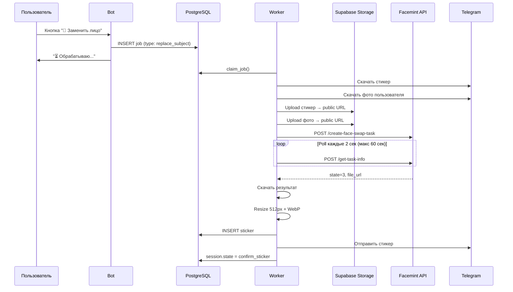

# Замена лица в стикере через Facemint API

## Контекст

Текущий флоу «Заменить лицо» (`replace_subject`) использует Gemini. Проблемы:

1. **Safety filters** — Gemini часто отказывает при замене лиц (блокирует генерацию)
2. **Нестабильное качество** — результат зависит от промпта, стиля, настроения модели
3. **Дорого** — два вызова Gemini (анализ фона + генерация), ~$0.04-0.08 за стикер
4. **Медленно** — 10-20 секунд (анализ фона + генерация + rembg)

**Цель:** заменить Gemini на Facemint API для флоу «Заменить лицо». Facemint — специализированная модель для face swap, не имеет safety filters на лица.

---

## Текущий флоу (Gemini)

```
Пользователь нажимает "🔄 Заменить лицо" на стикере
    ↓
Есть фото пользователя?
    ├── Да → startGeneration(replace_subject)
    └── Нет → state: wait_edit_photo → пользователь шлёт фото → кнопка "Заменить лицо"
    ↓
Worker:
    1. Скачать стикер (last_sticker_file_id) — Image 1
    2. Скачать фото пользователя (current_photo_file_id) — Image 2
    3. Gemini 2.0 Flash: анализ фона стикера (описание)
    4. Gemini 2.5 Flash Image: генерация нового стикера
       - Промпт: "Recreate Image 1, update character inspired by Image 2"
       - Два image input: стикер + фото
    5. rembg: удаление фона
    6. Resize → WebP → отправить
```

### Проблемы текущего подхода

| Проблема | Частота | Влияние |
|----------|---------|---------|
| Gemini блокирует генерацию (safety) | ~20-30% запросов | Пользователь не получает результат |
| Стиль стикера не сохраняется | ~30% | Результат выглядит как другой стикер |
| Лицо не похоже на пользователя | ~20% | Разочарование пользователя |
| Фон меняется/теряется | ~15% | Нужен rembg, теряются детали |

---

## Новый флоу (Facemint)

```
Пользователь нажимает "🔄 Заменить лицо" на стикере
    ↓
Есть фото пользователя?
    ├── Да → startGeneration(replace_subject)
    └── Нет → state: wait_edit_photo → пользователь шлёт фото → кнопка "Заменить лицо"
    ↓
Worker:
    1. Скачать стикер (last_sticker_file_id)
    2. Скачать фото пользователя (current_photo_file_id)
    3. Upload оба в Supabase Storage → public URLs
    4. Facemint API: POST /create-face-swap-task
       - media_url: стикер (PNG/WebP)
       - swap_list: [{ to_face: фото пользователя }]
    5. Polling: POST /get-task-info → ждать state=3
    6. Скачать результат (file_url)
    7. Resize → WebP → отправить
```



---

## Что меняется, что остаётся

### Без изменений (index.ts)

- Кнопка `replace_face:{stickerId}` — тот же callback
- Логика проверки фото (есть/нет → `wait_edit_photo`)
- `startGeneration(ctx, user, session, lang, { generationType: "replace_subject", ... })`
- Создание job, progress message, paywall — всё то же

### Изменения (worker.ts)

| Было (Gemini) | Стало (Facemint) |
|----------------|-------------------|
| Gemini 2.0 Flash: анализ фона | **Убираем** — не нужен |
| Gemini 2.5 Flash Image: генерация | **Facemint API**: face swap |
| Два image input в base64 | Upload в Storage → URLs |
| Промпт 50+ строк | Параметры API (5 полей) |
| rembg после генерации | **Опционально** — Facemint сохраняет фон стикера |
| Retry 3 попытки Gemini | Retry 3 попытки Facemint |

### Изменения (новые файлы)

- `src/lib/facemint.ts` — клиент Facemint API (общий с gift sticker flow)

---

## Facemint API для статичных изображений

### Создание задачи

```
POST https://api.facemint.io/api/create-face-swap-task
Header: x-api-key: <FACEMINT_API_KEY>
```

```json
{
  "type": "image",
  "media_url": "https://storage.example.com/sticker.png",
  "resolution": 1,
  "enhance": 1,
  "nsfw_check": 0,
  "face_recognition": 0.8,
  "face_detection": 0.25,
  "watermark": "",
  "callback_url": "",
  "start_time": 0,
  "end_time": 0,
  "swap_list": [
    {
      "from_face": "",
      "to_face": "https://storage.example.com/user-photo.png"
    }
  ]
}
```

- `type: "image"` — статичный стикер
- `from_face: ""` — заменить все лица (в стикере обычно одно)
- `to_face` — фото пользователя
- `resolution: 1` (480p) — достаточно для 512px стикера
- `enhance: 1` — улучшение качества лица

### Цена

**$0.002 за изображение** (включая face enhancement).

Сравнение с Gemini:

| | Gemini (текущий) | Facemint (новый) |
|---|---|---|
| Стоимость | ~$0.04-0.08 | **$0.002** |
| Вызовов API | 2 (анализ + генерация) | 1 |
| Safety blocks | ~20-30% | 0% |
| Время | 10-20 сек | ~3-8 сек |

**Экономия: ~20-40x дешевле, без блокировок.**

---

## Изменения в коде

### 1. `src/lib/facemint.ts` (новый файл, общий с gift flow)

```typescript
const FACEMINT_BASE_URL = "https://api.facemint.io/api";

interface CreateTaskParams {
  type: "image" | "gif" | "video";
  media_url: string;
  swap_list: Array<{ from_face: string; to_face: string }>;
  resolution?: number;
  enhance?: number;
  watermark?: string;
  callback_url?: string;
  start_time?: number;
  end_time?: number;
  nsfw_check?: number;
  face_recognition?: number;
  face_detection?: number;
}

interface TaskResult {
  id: string;
  state: -1 | 0 | 1 | 2 | 3;
  price: number;
  process: number;
  result: {
    file_url: string;
    thumb_url: string;
  };
}

async function createFaceSwapTask(params: CreateTaskParams): Promise<string>;
async function getTaskInfo(taskId: string): Promise<TaskResult>;
async function waitForTask(taskId: string, timeoutMs?: number, pollIntervalMs?: number): Promise<TaskResult>;
```

### 2. `src/worker.ts` — ветка `replace_subject`

```typescript
if (generationType === "replace_subject") {
  const facemintEnabled = await getAppConfig("facemint_replace_face_enabled", "false");
  
  if (facemintEnabled === "true") {
    // === Facemint path ===
    
    // 1. Скачать стикер (уже скачан выше как fileBuffer)
    // 2. Скачать фото пользователя
    const identityPhotoFileId = session.current_photo_file_id;
    const photoPath = await getFilePath(identityPhotoFileId);
    const photoBuffer = await downloadFile(photoPath);
    
    // 3. Upload в Supabase Storage
    const stickerUrl = await uploadTempFile(fileBuffer, `facemint/${job.id}/sticker.png`);
    const photoUrl = await uploadTempFile(photoBuffer, `facemint/${job.id}/face.png`);
    
    // 4. Facemint API
    const taskId = await facemint.createFaceSwapTask({
      type: "image",
      media_url: stickerUrl,
      swap_list: [{ from_face: "", to_face: photoUrl }],
      resolution: 1,
      enhance: 1,
      watermark: "",
      nsfw_check: 0,
      face_recognition: 0.8,
      face_detection: 0.25,
    });
    
    // 5. Ждать результат
    await updateProgress(5);
    const result = await facemint.waitForTask(taskId, 60_000, 2_000);
    
    if (result.state !== 3) {
      throw new Error(`Facemint task failed: state=${result.state}`);
    }
    
    // 6. Скачать результат
    const resultBuffer = await fetch(result.result.file_url).then(r => r.buffer());
    
    // 7. Далее — стандартный пайплайн: resize → WebP → отправить
    generatedBuffer = resultBuffer;
    // ... (продолжение стандартного flow)
    
  } else {
    // === Legacy Gemini path (текущий код) ===
    // ... без изменений ...
  }
}
```

### 3. Feature flag в `app_config`

```sql
INSERT INTO app_config (key, value) VALUES
  ('facemint_replace_face_enabled', '"false"')
ON CONFLICT (key) DO NOTHING;
```

Позволяет:
- Включить Facemint на test-боте, оставив Gemini на prod
- Быстро откатить на Gemini если Facemint сломается
- A/B тест: часть пользователей через Facemint, часть через Gemini

---

## Вопрос: нужен ли rembg после Facemint?

### Текущий flow (Gemini)

Gemini генерирует **новое изображение** с фоном (magenta или оригинальный). Поэтому rembg обязателен — нужно вырезать фон для стикера.

### Новый flow (Facemint)

Facemint **модифицирует существующее изображение** — заменяет только лицо, остальное (включая прозрачность) сохраняется.

**Если входной стикер уже без фона (WebP с alpha):**
- Facemint должен сохранить прозрачность → rembg **не нужен**
- Нужно проверить на smoke test

**Если прозрачность теряется:**
- Добавить rembg после Facemint (как сейчас)
- Или: конвертировать стикер в PNG с белым фоном → Facemint → rembg

**Решение:** проверить на smoke test, добавить условный rembg.

---

## Upload в Supabase Storage

Facemint требует public URLs для media и face. Нужна утилита для временного upload:

```typescript
async function uploadTempFile(buffer: Buffer, path: string): Promise<string> {
  const { data, error } = await supabase.storage
    .from("temp")  // отдельный bucket с auto-cleanup
    .upload(path, buffer, {
      contentType: "image/png",
      upsert: true,
    });
  
  const { data: urlData } = supabase.storage
    .from("temp")
    .getPublicUrl(path);
  
  return urlData.publicUrl;
}
```

**Bucket `temp`:**
- Public read access
- Auto-cleanup: файлы старше 1 часа удаляются (cron или Supabase lifecycle policy)
- Или: удалять файлы после получения результата от Facemint

---

## Миграция

### `sql/124_facemint_replace_face.sql`

```sql
-- Feature flag: Facemint для replace_face (по умолчанию выключен)
INSERT INTO app_config (key, value) VALUES
  ('facemint_replace_face_enabled', '"false"')
ON CONFLICT (key) DO NOTHING;

-- API key хранится в env, не в БД
```

> Миграция минимальная — основные изменения в коде worker'а. Новых состояний и колонок не нужно: переиспользуем существующий `replace_subject` flow полностью.

---

## Сравнение: Gemini vs Facemint для replace_face

| Параметр | Gemini (текущий) | Facemint (новый) |
|----------|------------------|-------------------|
| **Стоимость** | ~$0.04-0.08 | **$0.002** |
| **Скорость** | 10-20 сек | **3-8 сек** |
| **Safety blocks** | ~20-30% | **0%** |
| **Качество лица** | Стилизованное (в стиле стикера) | **Реалистичное** (face swap) |
| **Сохранение стиля стикера** | Пытается, но нестабильно | **Идеально** (меняет только лицо) |
| **Сохранение фона** | Нужен rembg | Сохраняется (нужен smoke test) |
| **Зависимости** | Gemini API | Facemint API + Supabase Storage URLs |
| **Offline/self-hosted** | Нет | Нет (только cloud) |

### Ключевое отличие в результате

- **Gemini**: перерисовывает весь стикер, пытаясь сохранить стиль и вставить черты лица. Результат — новый стикер, "вдохновлённый" фото пользователя.
- **Facemint**: заменяет только область лица, всё остальное остаётся пиксель-в-пиксель. Результат — тот же стикер, но с лицом пользователя.

Для пользователя Facemint даёт более предсказуемый и "вау" результат: стикер узнаваем, лицо — их.

---

## Порядок реализации

### Phase 0: Smoke test

- [ ] Получить API key на facemint.io
- [ ] Скачать статичный стикер (WebP → PNG)
- [ ] Upload стикер + фото на public URL
- [ ] Вызвать API через curl
- [ ] Проверить:
  - [ ] Качество face swap на cartoon стикере
  - [ ] Качество на реалистичном стикере
  - [ ] Сохраняется ли прозрачность (alpha channel)
  - [ ] Скорость обработки
  - [ ] Находит ли лицо на маленьком стикере (512px)
- [ ] Задокументировать результаты

### Phase 1: Реализация

- [x] `src/lib/facemint.ts` — клиент API (общий с gift sticker flow)
- [x] Утилита загрузки входных файлов в Supabase Storage для Facemint (реализована в worker)
- [ ] Bucket `temp` в Supabase Storage (public, auto-cleanup)
- [ ] Env: `FACEMINT_API_KEY`
- [x] Миграция: `sql/124_facemint_replace_face.sql` (feature flag)
- [x] Worker: ветка Facemint в `replace_subject` (за feature flag)
- [x] Условный rembg после Facemint (для Facemint path используется preserve background, без rembg)
- [ ] Тест на test-боте

### Phase 2: Раскатка

- [ ] Включить `facemint_replace_face_enabled=true` на test
- [ ] Тестирование: 10+ стикеров разных стилей (cartoon, anime, realistic)
- [ ] Сравнить качество с Gemini
- [ ] Включить на prod
- [ ] Мониторинг: стоимость, скорость, ошибки

### Phase 3: Cleanup

- [ ] Удалить legacy Gemini path для replace_subject (после стабилизации)
- [ ] Удалить анализ фона через Gemini 2.0 Flash
- [x] Обновить `docs/architecture/02-worker.md`

---

## Решения, требующие обсуждения

1. **Общая миграция с gift sticker flow?**
   - Оба flow используют Facemint API и `src/lib/facemint.ts`
   - Можно объединить в одну миграцию `sql/124_facemint.sql`
   - Или разделить: `124_facemint_replace_face.sql` + `125_gift_face_swap.sql`

2. **Bucket для temp файлов**
   - Вариант A: отдельный bucket `temp` с auto-cleanup
   - Вариант B: использовать существующий `stickers` bucket с подпапкой `temp/`
   - Вариант C: signed URLs вместо public (безопаснее, но сложнее)

3. **Fallback на Gemini**
   - Если Facemint не нашёл лицо → попробовать Gemini?
   - Или просто сообщить пользователю об ошибке?
   - Рекомендация: сообщение об ошибке (проще, Gemini тоже может не справиться)

4. **Нужен ли rembg?**
   - Зависит от smoke test
   - Если Facemint сохраняет alpha → не нужен (экономия ~2 сек)
   - Если теряет → нужен (как сейчас)
