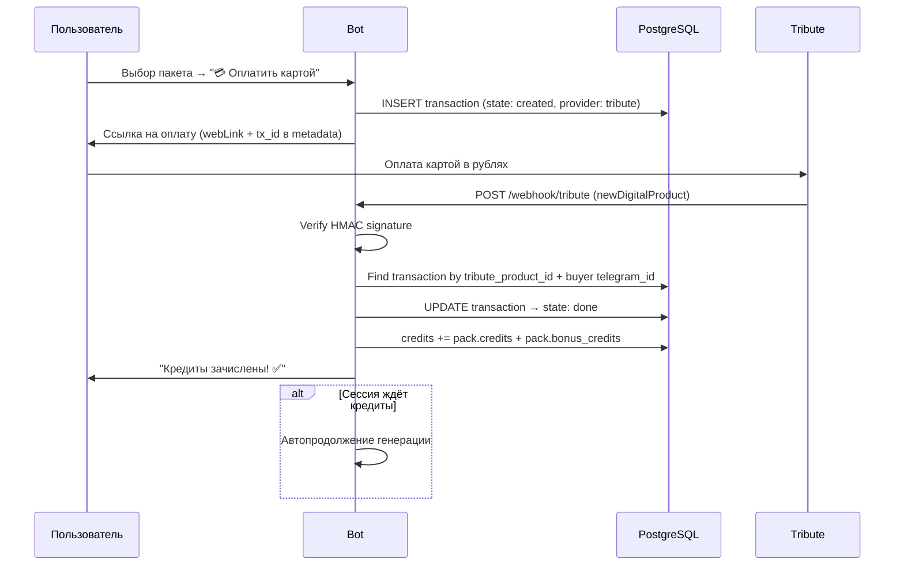

# Оплата в рублях через Tribute

## Контекст

Текущая оплата — только через Telegram Stars (`XTR`). Для RU-пользователей это неудобно: Stars покупаются через App Store / Google Play с комиссией 30%, либо через десктоп-клиент по карте. Конверсия страдает.

**Цель:** дать RU-пользователям возможность оплатить **картой в рублях** прямо из бота через Tribute, без ухода в App Store.

Старый подход через ЮKassa (`docs/rub-payments.md`) не реализован. Tribute выбран как более простой вариант: не нужен ИП/ООО, есть готовое API и вебхуки.

---

## Как работает Tribute (факты из доки)

### Digital Products

- Создатель заводит digital product в Tribute Dashboard.
- Цена: EUR, RUB или фиксированная в Stars.
- Флаги: `acceptCards` (оплата картой), `starsAmountEnabled` (оплата Stars).
- Каждый продукт получает `link` (deep link в Telegram) и `webLink` (web-страница для оплаты картой).
- При покупке пользователю отдаётся контент (текст/файл) — для нас это формальность (отдаём «ваучер» / текстовое подтверждение).

### Способы оплаты для покупателя

| Способ | Откуда | Валюта |
|--------|--------|--------|
| Telegram Stars | Внутри Telegram через `link` | Stars |
| Банковская карта | Через `webLink` в браузере | RUB / EUR |

Источник: [How to pay for a digital product with a card](https://wiki.tribute.tg/for-subscribers/kak-oplatit-cifrovoi-tovar-kartoi)

### Webhook API

- Событие `newDigitalProduct` — POST на наш webhook URL.
- Заголовок `trbt-signature` — HMAC-SHA256 тела запроса, подписан API-ключом.
- Retry policy: 5 мин → 15 мин → 30 мин → 1 ч → 10 ч.
- Событие `digitalProductRefund` — при возврате.

Источник: [Webhooks](https://wiki.tribute.tg/for-content-creators/api-documentation/webhooks)

### Products API

- `GET /api/v1/products` — список товаров.
- `GET /api/v1/products/{id}` — конкретный товар (содержит `link`, `webLink`).
- `POST /api/v1/products/purchases/{purchaseId}/cancel` — рефанд (только Stars-покупки).
- Авторизация: заголовок `Api-Key`.

Источник: [Products API](https://wiki.tribute.tg/for-content-creators/api-documentation/products)

### Выплаты создателю

- Минимальный порог: 3 000 ₽ / 100 € / 100 USDT.
- Выплата 2 раза в месяц (или on-demand).
- RUB → на карту или @wallet.
- Stars → конвертируются в USDT по курсу Telegram.
- Комиссия Tribute: **10%**.

Источник: [Payouts](https://wiki.tribute.tg/for-content-creators/payouts)

---

## Архитектура

### Текущий флоу (Stars) — без изменений

```
Пользователь → [pack_9_98] → sendInvoice(XTR) → pre_checkout → successful_payment → credits
```

### Новый флоу (Tribute RUB)



### Ключевой принцип

Tribute — **альтернативный платёжный провайдер**, а не замена Stars. Вся логика зачисления кредитов, paywall, автопродолжения — общая. Различается только способ приёма платежа.

---

## Маппинг пакетов → Tribute Products

Для каждого основного пакета создаём digital product в Tribute Dashboard:

| Пакет | Кредиты | Итого | Цена Stars | Цена RUB | Tribute Product |
|-------|---------|-------|------------|----------|-----------------|
| 🎁 Попробуй | 9 +8 | **17** | 98⭐ | ~102₽ | `tribute_try` |
| ⭐ Старт | 17 | 17 | 150⭐ | ~156₽ | `tribute_start` |
| 💎 Поп | 32 | 32 | 350⭐ | ~364₽ | `tribute_pop` |
| 👑 Про | 112 | 112 | 1000⭐ | ~1040₽ | `tribute_pro` |
| 🚀 Макс | 256 | 256 | 2250⭐ | ~2340₽ | `tribute_max` |

> Цены в RUB уже есть в `CREDIT_PACKS[].price_rub`. Используем их как базу для Tribute.

### Контент digital product

Tribute требует контент, который получит покупатель. Отправляем текстовое сообщение:
```
✅ Оплата принята! Кредиты будут зачислены автоматически в боте @photo2sticker_bot.
```

---

## Изменения в БД

### Миграция `sql/124_tribute_payment.sql`

```sql
-- Provider field: stars (default) or tribute
ALTER TABLE transactions 
  ADD COLUMN IF NOT EXISTS provider varchar(16) DEFAULT 'stars';

-- Tribute-specific fields
ALTER TABLE transactions
  ADD COLUMN IF NOT EXISTS tribute_product_id integer,
  ADD COLUMN IF NOT EXISTS tribute_purchase_id integer;

-- Index for webhook lookup
CREATE INDEX IF NOT EXISTS idx_transactions_tribute_purchase 
  ON transactions (tribute_purchase_id) 
  WHERE tribute_purchase_id IS NOT NULL;

-- App config: Tribute product IDs mapping
INSERT INTO app_config (key, value) VALUES
  ('tribute_products', jsonb_build_object(
    'try',   jsonb_build_object('product_id', 0, 'web_link', '', 'link', ''),
    'start', jsonb_build_object('product_id', 0, 'web_link', '', 'link', ''),
    'pop',   jsonb_build_object('product_id', 0, 'web_link', '', 'link', ''),
    'pro',   jsonb_build_object('product_id', 0, 'web_link', '', 'link', ''),
    'max',   jsonb_build_object('product_id', 0, 'web_link', '', 'link', '')
  ))
ON CONFLICT (key) DO NOTHING;
```

> `product_id`, `web_link`, `link` заполняются после создания товаров в Tribute Dashboard.

---

## Изменения в коде

### 1. Config (`src/config.ts`)

```typescript
tributeApiKey: process.env.TRIBUTE_API_KEY || "",
tributeWebhookPath: "/webhook/tribute",
```

### 2. Tribute webhook endpoint

Новый HTTP endpoint (Express / встроенный в telegraf webhook server):

```
POST /webhook/tribute
```

Логика:
1. Прочитать raw body.
2. Вычислить HMAC-SHA256(body, TRIBUTE_API_KEY).
3. Сравнить с заголовком `trbt-signature`.
4. Если событие `newDigitalProduct`:
   - Извлечь `productId`, `purchaseId`, `buyer.telegramId` (или аналогичное поле).
   - Найти пакет по `productId` → `app_config.tribute_products`.
   - Найти пользователя по `telegram_id`.
   - Создать transaction (`provider: 'tribute'`, `tribute_purchase_id`).
   - Идемпотентность: проверить `tribute_purchase_id` уникальность.
   - Начислить кредиты (та же логика, что в `successful_payment`).
   - Отправить пользователю сообщение в бот.
   - Автопродолжение если сессия в paywall.
5. Если событие `digitalProductRefund`:
   - Лог + алерт в admin-канал.
   - **Не** списывать кредиты автоматически (ручная обработка).
6. Ответить `200 OK`.

### 3. UI: кнопка «Оплатить картой» в sendBuyCreditsMenu

Для `lang === "ru"` добавить inline-кнопку с URL на Tribute webLink:

```typescript
if (lang === "ru") {
  // Для каждого пакета — две кнопки в ряд: Stars + RUB
  for (const pack of availablePacks) {
    const totalCredits = getPackTotalCredits(pack);
    const tributeProduct = tributeProducts[packKey];
    buttons.push([
      Markup.button.callback(
        `${totalCredits} шт — ${pack.price}⭐`,
        `pack_${pack.credits}_${pack.price}`
      ),
      Markup.button.url(
        `${totalCredits} шт — ${pack.price_rub}₽`,
        tributeProduct.web_link
      ),
    ]);
  }
}
```

**Альтернативный вариант (проще):** сначала показать выбор способа оплаты, потом список пакетов. Аналогично тому, что описано в `docs/rub-payments.md`.

### 4. Общая функция зачисления кредитов

Вынести из `successful_payment` в общую функцию, чтобы использовать и для Stars, и для Tribute:

```typescript
async function creditUserAfterPayment(params: {
  userId: string;
  telegramId: number;
  transactionId: string;
  pack: CreditPack;
  provider: 'stars' | 'tribute';
  ctx?: Context; // может быть null для webhook
}): Promise<void> {
  // Начисление кредитов
  // has_purchased = true
  // Яндекс.Метрика конверсия
  // Alert в admin-канал
  // Автопродолжение генерации
}
```

### 5. Яндекс.Метрика

Конверсии отправляются так же — по факту зачисления кредитов. Provider не влияет на логику Метрики.

---

## Тексты

| Ключ | RU | EN |
|------|----|----|
| `payment.choose_method` | Выберите способ оплаты: | Choose payment method: |
| `btn.pay_stars` | ⭐ Telegram Stars | ⭐ Telegram Stars |
| `btn.pay_card` | 💳 Карта (рубли) | 💳 Card (rubles) |
| `payment.tribute_success` | ✅ Оплата картой прошла!\n\nНачислено: {amount} кредитов\nНовый баланс: {balance} кредитов | ✅ Card payment successful!\n\nAdded: {amount} credits\nNew balance: {balance} credits |

---

## Экономика

### Комиссии

| Провайдер | Комиссия | Кто платит |
|-----------|----------|------------|
| Telegram Stars | ~30% (Apple/Google) или 0% (десктоп) | Покупатель (цена Stars выше) |
| Tribute (карта) | **10%** | Создатель (из выручки) |

### Маржа при Tribute

```
Выручка ₽ = Цена RUB × 0.9 (после комиссии Tribute 10%)
Себестоимость ₽ = (Кредиты_итого / 10) × 15₽

Пример: Старт (17 кредитов, 156₽)
  Выручка = 156 × 0.9 = 140.4₽
  Себестоимость = (17/10) × 15 = 25.5₽
  Маржа = (140.4 - 25.5) / 25.5 × 100 = 450%
```

Маржа сопоставима со Stars — Tribute даже выгоднее за счёт фиксированной 10% комиссии vs ~30% Apple.

---

## Ограничения и риски

### Подтверждённые ограничения

1. **Рефанд через API** — только для Stars-покупок. Картовые рефанды — через Tribute Dashboard вручную.
2. **Выплаты** — 2 раза в месяц, минимум 3000₽. Первые деньги придут не сразу.
3. **Контент** — Tribute требует отдать покупателю digital content. Отправляем текстовое подтверждение.
4. **Модерация** — Tribute может отклонить digital product (статус `pending` → `rejected`).

### Требует проверки (smoke test)

1. **Payload webhook `newDigitalProduct`** — какие именно поля приходят? Есть ли `buyer.telegramId`?
2. **Связка покупки с пользователем** — как маппить Tribute buyer на нашего `users.telegram_id`?
3. **Metadata / custom payload** — можно ли передать `transaction_id` при создании покупки, чтобы связать?
4. **Мульти-покупки** — если пользователь купит один product дважды, получим два webhook'а?
5. **Таймауты** — сколько времени между оплатой и webhook (критично для UX автопродолжения)?

### Митигация рисков

| Риск | Митигация |
|------|-----------|
| Webhook не пришёл | Retry policy Tribute (до 10ч). Manual reconciliation через `GET /products`. |
| Двойное зачисление | Идемпотентность по `tribute_purchase_id`. |
| Рефанд после использования кредитов | Алерт в admin-канал, ручное решение. |
| Tribute заблокировал аккаунт | Stars продолжают работать как fallback. |

---

## Порядок реализации

### Phase 0: Smoke test (до кода)

- [ ] Создать аккаунт creator в Tribute
- [ ] Создать 1 тестовый digital product (цена 1₽)
- [ ] Включить API key + задать webhook URL (ngrok для теста)
- [ ] Купить продукт самому, получить webhook
- [ ] Проверить payload: есть ли `telegram_id` покупателя, `purchase_id`, `product_id`
- [ ] Задокументировать реальный payload в этом документе

### Phase 1: Backend

- [ ] Миграция `sql/124_tribute_payment.sql`
- [ ] Env: `TRIBUTE_API_KEY`
- [ ] Config: `tributeApiKey`, `tributeWebhookPath`
- [ ] Webhook handler: signature verify + `newDigitalProduct` + `digitalProductRefund`
- [ ] Общая функция `creditUserAfterPayment()` (рефакторинг из `successful_payment`)
- [ ] Идемпотентность по `tribute_purchase_id`
- [ ] Отправка сообщения пользователю после зачисления
- [ ] Автопродолжение генерации (reuse логика paywall)

### Phase 2: UI

- [ ] Создать digital products в Tribute для всех пакетов
- [ ] Заполнить `app_config.tribute_products` реальными ID и ссылками
- [ ] Кнопка «💳 Карта (рубли)» в `sendBuyCreditsMenu` для `lang === "ru"`
- [ ] Тексты: `payment.choose_method`, `btn.pay_card`, `payment.tribute_success`

### Phase 3: Monitoring

- [ ] Alert в admin-канал при Tribute-платеже
- [ ] Alert при рефанде
- [ ] Логирование webhook'ов
- [ ] Abandoned cart для Tribute (пользователь кликнул ссылку, но не оплатил — сложнее отследить)

### Phase 4: Обновление документации

- [ ] `docs/architecture/05-payment.md` — добавить Tribute-секцию
- [ ] `docs/architecture/08-deployment.md` — env vars

---

## Решения, требующие обсуждения

1. **UI: два столбца (Stars + RUB) или двухшаговый выбор?**
   - Два столбца компактнее, но может запутать.
   - Двухшаговый (выбор метода → пакеты) понятнее, но лишний клик.

2. **Один webhook endpoint или отдельный сервис?**
   - Проще: добавить route в текущий bot server.
   - Правильнее: отдельный Express app (изоляция, свой порт).

3. **Скидочные пакеты через Tribute?**
   - Создавать отдельные products для каждой скидки — много ручной работы.
   - Вариант: только основные пакеты через Tribute, скидки — только Stars.

4. **Привязка покупки к конкретной сессии**
   - Stars: `invoice_payload` содержит `transaction_id` — прямая связь.
   - Tribute: webhook приходит асинхронно, связь только через `telegram_id` + `product_id`.
   - Решение: при webhook'е искать активную сессию в paywall-стейте (аналог текущей логики).
