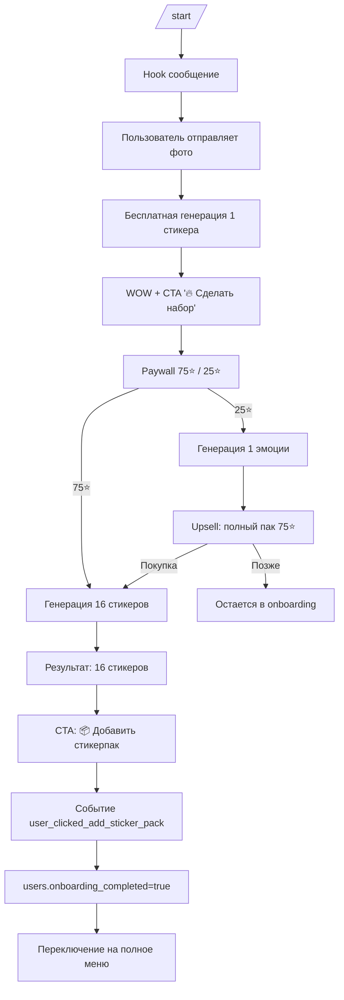
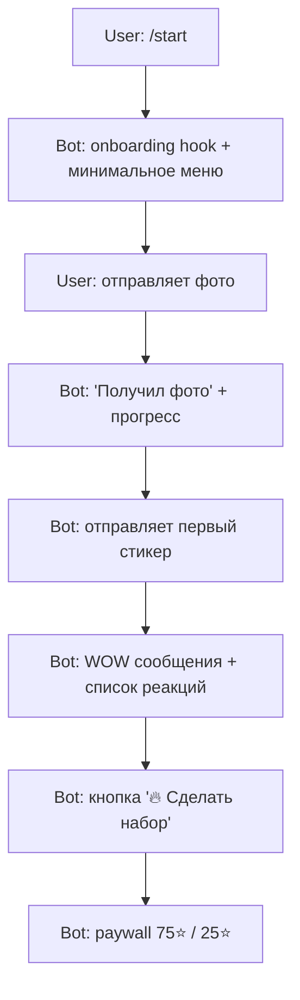
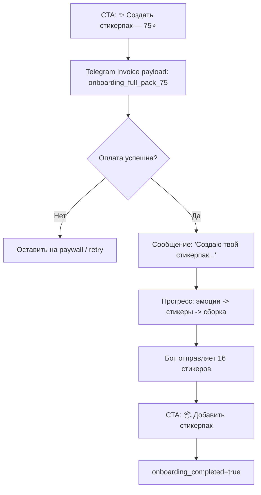
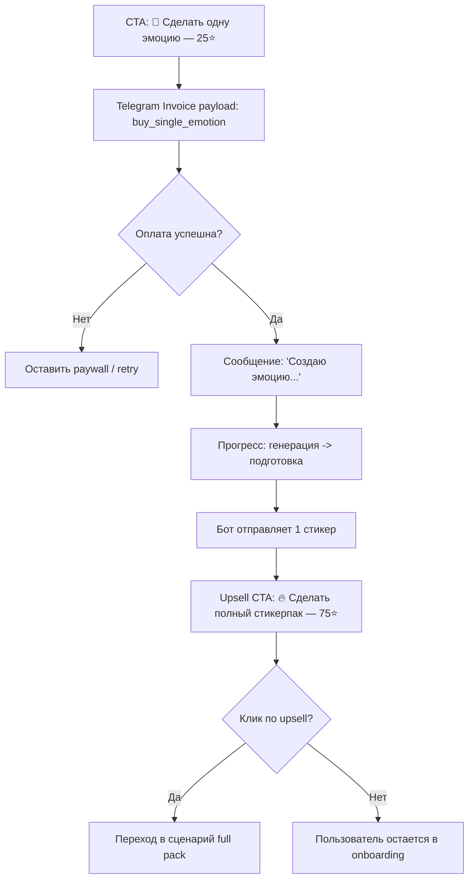
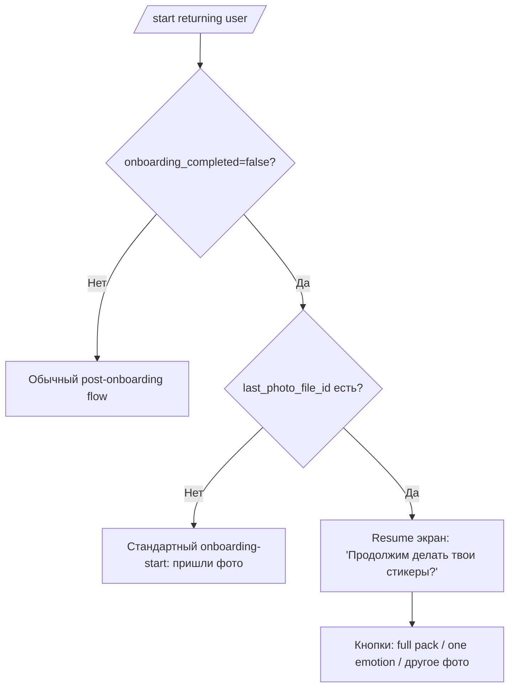
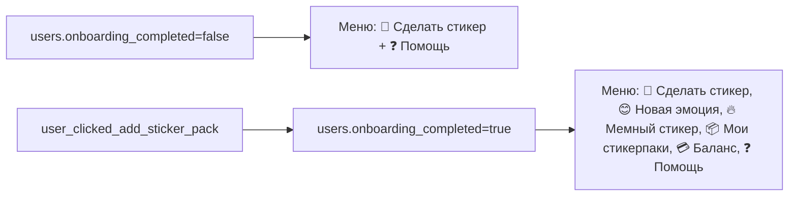
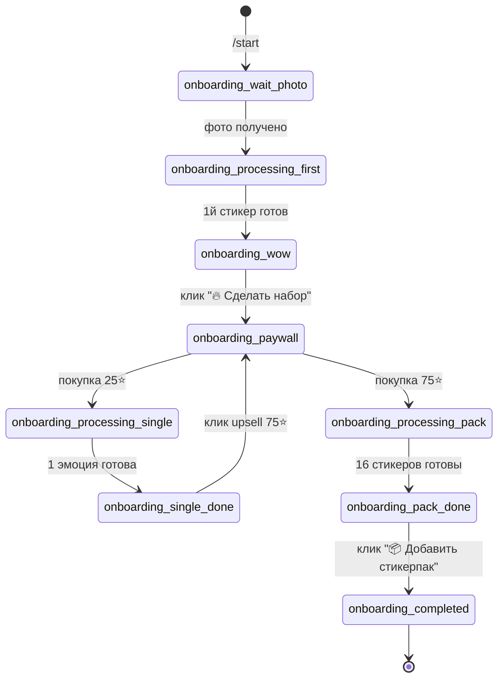

# 09-03 New Onboarding Flow (Single Sticker -> 16 Sticker Pack)

## Goal

Сделать новый onboarding для новых пользователей с простой воронкой:

`HOOK -> WOW -> MULTIPLY VALUE -> PAY -> PACK`

Принципы:

1. 1 бесплатный результат (первый стикер).
2. 1 paywall.
3. 1 основной апселл: полноценный набор эмоций (16 стикеров) + создание Telegram sticker pack.

## Где сейчас живет onboarding

Source of truth по текущему entrypoint и состояниям:

- `/start` в `src/index.ts` сейчас по умолчанию ведет в pack-flow (`wait_pack_carousel`).
- single-flow проходит через состояния `wait_photo -> wait_style -> processing -> confirm_sticker`.
- paywall в single-flow: `wait_first_purchase` (новый пользователь) и `wait_buy_credit`.
- после генерации стикера UI уже умеет показывать действия (`change_emotion`, `add_to_pack`, и т.д.).

Документация текущего состояния:

- `docs/architecture/01-api-bot.md` — команды, состояния, callback-кнопки.
- `docs/architecture/05-payment.md` — платежная логика и пакеты кредитов.

## Новый onboarding (продуктовый флоу)

## Шаг 1 — `/start`

Сообщение:

> Я превращу твое фото в Telegram-стикеры 😎
>
> Можно сделать:  
> 😂 реакции  
> 🔥 мемные ответы  
> 😎 стильные эмоции
>
> Пришли любое фото — сделаю первый стикер бесплатно 👇

## Шаг 2 — пользователь отправляет фото

Сообщение:

> Получил фото 👍
>
> Создаю стикер...

Псевдопрогресс:

- 🧠 Анализирую лицо
- 🎨 Создаю стиль
- ✨ Рисую стикер

Ожидание: 6-10 секунд.

## Шаг 3 — WOW момент

Сообщение 1:

- Бот отправляет готовый стикер.

Сообщение 2:

> Вот твой первый стикер 😄

Сообщение 3:

> Я могу сделать из твоего фото еще реакции:
>
> 😂 смех  
> 😡 злость  
> 🥰 любовь  
> 🤯 шок  
> 😎 крутой  
> 😭 плач

Сообщение 4:

> Хочешь полный набор реакций?

Кнопка:

- `🔥 Сделать набор`

## Paywall

Сообщение:

> Я сделаю полноценный Telegram-стикерпак из твоего фото.
>
> В него войдут реакции:
>
> 😂 😡 🥰 🤯 😎 😭  
> 🤔 🥳 😴 😍 😤 🙃  
> 😱 🤫 🤣 😅
>
> Всего 16 стикеров.
>
> Их можно сразу добавить в Telegram и отправлять друзьям.

Кнопки:

- `✨ Создать стикерпак — 75 ⭐`
- `🙂 Сделать одну эмоцию — 25 ⭐`

## После оплаты

Сообщение:

> Создаю твой стикерпак...

Прогресс:

- 🎨 Генерирую эмоции
- ✨ Подготавливаю стикеры
- 📦 Собираю стикерпак

## Результат

- Бот отправляет 16 стикеров.

## Завершение onboarding

Сообщение:

> Готово 🔥
>
> Я сделал для тебя набор реакций.

Следующее сообщение:

> Добавить их в Telegram?

Кнопка:

- `📦 Добавить стикерпак`

## Схемы user flow (детально)

Ниже те же требования, но в формате схем, чтобы быстрее согласовать UX и реализацию.

### 1) High-level onboarding map

### 2) Детальный сценарий для нового пользователя

### 3) Ветка оплаты: полный пак (75 ⭐)

### 4) Ветка оплаты: одна эмоция (25 ⭐) + upsell

### 5) Returning user c незавершенным onboarding

### 6) Переключение меню (до/после onboarding)

### 7) State map (предлагаемый, если фиксируем onboarding-состояния)

## Встраивание в текущую архитектуру (план реализации)

### 1) Entry point

Принятое решение:

- полностью переключить `/start` с `wait_pack_carousel` на новый single-onboarding.

### 2) Session states

Минимально-инвазивно можно переиспользовать текущие состояния:

- `assistant_wait_photo` или `wait_photo` для ожидания первого фото;
- `processing` для бесплатной первой генерации;
- `confirm_sticker` для показа WOW момента и кнопки апселла;
- `wait_first_purchase` для paywall.

Опционально (если нужно прозрачнее в аналитике) добавить отдельные onboarding-state:

- `onboarding_wait_photo`
- `onboarding_wow`
- `onboarding_paywall`
- `onboarding_pack_ready`

### 2.1) Menu strategy (ключ к фокусу)

Пока `users.onboarding_completed = false` показываем только минимальное меню:

- `📸 Сделать стикер`
- `❓ Помощь`

Что скрываем до завершения onboarding:

- `баланс`
- `кредиты`
- `изменить стиль`
- `заменить лицо`
- `создать пак`

Причина: ранний показ валюты и большого набора действий повышает когнитивное трение и снижает конверсию в первую целевую покупку.

Поведение кнопки `📸 Сделать стикер`:

- во время onboarding ведет в тот же стартовый сценарий ("Пришли фото — сделаю стикер");
- после onboarding не исчезает и остается постоянной точкой входа.

### 3) Callback и UX-кнопки

Новые callback-идентификаторы (предложение):

- `onb_make_pack` — CTA после WOW (`🔥 Сделать набор`).
- `onb_buy_pack_stars` — оплата полного пака (16) через Stars.
- `onb_buy_one_emotion_stars` — альтернатива: 1 эмоция через Stars.
- `onb_add_stickerpack` — финальный CTA (`📦 Добавить стикерпак`).

### 4) Псевдопрогресс

Переиспользовать существующий механизм прогресса (`sendProgressStart` + update/edit message),
но с onboarding-текстами:

- "Анализирую лицо"
- "Создаю стиль"
- "Рисую стикер"

### 5) Payments / Telegram Stars

Paywall и покупка в onboarding должны работать через Telegram Stars.

Принятое решение:

- пользователь видит прямую цену в Stars прямо в CTA-кнопках:
  - `✨ Создать стикерпак — 75 ⭐`
  - `🙂 Сделать одну эмоцию — 25 ⭐`
- для onboarding создаем отдельные платежные пакеты (отдельные SKU/rows), не смешиваем с обычными пакетами;
- рекомендуемые id:
  - `onboarding_full_pack_75`
  - `onboarding_single_emotion_25`
- в onboarding не использовать термины и элементы интерфейса:
  - `кредиты`
  - `💎`
  - `баланс`

### 6) Pack assembly

После оплаты запускать пакетную генерацию на 16 эмоций и далее вести в уже существующий
флоу создания Telegram sticker pack (`add_to_pack`/pack assembly logic), чтобы не дублировать инфраструктуру.

Ветка "🙂 Сделать одну эмоцию" после оплаты остается в том же onboarding-флоу (без выхода в общий single-flow).

### 6.1) Ветка `🙂 Сделать одну эмоцию`

Точка входа:

- кнопка paywall: `🙂 Сделать одну эмоцию — 25 ⭐`.

Шаг 1 — оплата:

- бот отправляет Telegram Stars invoice;
- `payload`: `buy_single_emotion`;
- `price`: `25 ⭐`.

Шаг 2 — генерация:

- сообщение: `Создаю эмоцию...`;
- прогресс:
  - `🎨 Генерирую эмоцию`
  - `✨ Подготавливаю стикер`.

Шаг 3 — результат:

- бот отправляет 1 стикер;
- сообщение:
  - `Готово 🙂`
  - `Вот твоя эмоция.`

Шаг 4 — upsell:

- сразу после результата показать:
  - `Хочешь полный набор реакций из своего фото?`
- кнопка:
  - `🔥 Сделать полный стикерпак — 75 ⭐`.

Итог ветки:

- `25 ⭐` -> `1 стикер` -> upsell в полный пак.

### 6.2) Поведение `📦 Мои стикерпаки`

Кнопка доступна только при `users.onboarding_completed = true`.

Экран списка паков:

- сообщение: `Твои стикерпаки:`;
- список (пример):
  - `😎 My reactions`
  - `😂 Meme pack`

Кнопки списка:

- `➕ Новый пак`
- `😊 Добавить эмоцию`
- `✏️ Редактировать`

Если пак один:

- сообщение:
  - `Пак: 😎 My reactions`
  - `В паке 16 стикеров.`
- кнопки:
  - `😊 Добавить эмоцию`
  - `🔥 Мемный стикер`
  - `✏️ Редактировать`

### 6.3) Returning users при `onboarding_completed = false`

Edge case:

- пользователь начал onboarding, но не завершил.

Условие:

- `onboarding_completed = false`
- `last_photo_file_id != null`

Поведение:

- бот продолжает onboarding;
- сообщение: `Продолжим делать твои стикеры?`
- кнопки:
  - `🔥 Сделать полный стикерпак`
  - `🙂 Сделать одну эмоцию`
  - `📸 Отправить другое фото`

Если фото нет:

- показывать стандартный старт:
  - `Пришли фото — сделаю стикер.`

После события `user_clicked_add_sticker_pack`:

- проставить `users.onboarding_completed = true`;
- переключить пользователя на полное меню.

Полное меню после onboarding:

- `📸 Сделать стикер`
- `😊 Новая эмоция`
- `🔥 Мемный стикер`
- `📦 Мои стикерпаки`
- `💳 Баланс`
- `❓ Помощь`

Старые продвинутые функции не показывать как top-level во время onboarding, а держать внутри flow редактирования:

- в карточке/паке: `😊 Добавить эмоцию`, `🔥 Сделать мем`, `✨ Изменить стиль`, `✏️ Редактировать`;
- в редактировании: `✏️ Текст`, `🔲 Обводка`, `🖼 Убрать фон`, `🧑 Заменить лицо`, `🎨 Изменить стиль`, `🏃 Движение`.

### 7) Analytics

Добавить события воронки:

- `onboarding_start_seen`
- `onboarding_photo_received`
- `onboarding_first_sticker_sent`
- `onboarding_pack_cta_clicked`
- `onboarding_paywall_seen`
- `onboarding_paid_pack`
- `onboarding_paid_one_emotion`
- `onboarding_pack_generated`
- `onboarding_stickerpack_created`
- `user_clicked_add_sticker_pack` (событие завершения onboarding)

## Implementation mapping by files

Ниже привязка требований к текущим точкам в коде, чтобы реализация была прямолинейной.

### `src/index.ts`

- `bot.start(...)`:
  - переключить default entry на onboarding-сценарий (вместо текущего action/pack поведения);
  - для пользователей с `users.onboarding_completed = true` оставлять post-onboarding маршрут.
- `getMainMenuKeyboard(lang, telegramId?)`:
  - добавить ветвление меню по `onboarding_completed`;
  - `false` -> минимальное меню (`📸 Сделать стикер`, `❓ Помощь`);
  - `true` -> полное меню (включая `📸 Сделать стикер` как постоянный пункт).
- `bot.hears(...)` для меню:
  - добавить обработчик `📸 Сделать стикер` как универсальный entrypoint (onboarding + post-onboarding);
  - добавить/переименовать обработчики для post-onboarding меню (`😊 Новая эмоция`, `🔥 Мемный стикер`, `📦 Мои стикерпаки`, `💳 Баланс`);
  - сохранить `❓ Помощь` в обоих режимах.
- текстовый роутер `bot.on("text")`:
  - обновить список `menuButtons`, чтобы новые подписи кнопок не падали в свободный text flow.
- callback на финальном шаге:
  - в `onb_add_stickerpack` записывать `users.onboarding_completed = true`;
  - отправлять/обновлять меню сразу после переключения статуса.
- блок оплаты (`sendInvoice`, `successful_payment`, `wait_first_purchase` / `wait_buy_credit`):
  - для onboarding использовать отдельные SKU (`onboarding_full_pack_75`, `onboarding_single_emotion_25`);
  - `onboarding_single_emotion_25` -> генерация 1 эмоции + upsell `75 ⭐`;
  - `onboarding_full_pack_75` -> генерация полного пака 16;
  - в onboarding-сообщениях и кнопках не показывать `кредиты` / `💎` / `баланс`.
- `bot.hears("📦 Мои стикерпаки")`:
  - разрешать только при `onboarding_completed=true`;
  - если `false`, не показывать кнопку и не давать попасть в экран через текст/обходной вызов.
- `bot.start(...)` для returning users:
  - если `onboarding_completed=false` и есть `last_photo_file_id`, показывать resume-экран onboarding (3 кнопки);
  - если фото нет, отправлять стандартный onboarding-start.

### `src/lib/texts.ts`

- добавить onboarding-ключи для:
  - `/start` hook-сообщения;
  - этапов прогресса;
  - WOW + upsell;
  - paywall (прямые цены в Stars);
  - завершения и CTA `📦 Добавить стикерпак`.
- добавить подписи для двух меню (onboarding и post-onboarding) в RU/EN.

### SQL / data model (`sql/*.sql`)

- новая миграция на `users.onboarding_completed boolean not null default false`;
- новые onboarding payment packages (отдельные rows/SKU для `75 ⭐` и `25 ⭐`);
- при необходимости индекс/фильтрация для аналитики по `onboarding_completed`.

### `docs/architecture/*` (после реализации)

- `docs/architecture/01-api-bot.md`:
  - обновить `/start`, меню, callback onboarding и состояние завершения.
- `docs/architecture/05-payment.md`:
  - зафиксировать onboarding paywall в Stars (`75 ⭐`, `25 ⭐`) без терминов кредитной модели в UI onboarding.
- `docs/architecture/04-database.md`:
  - добавить `users.onboarding_completed` и правило обновления по `user_clicked_add_sticker_pack`.

## Completeness audit (что уже ок / что еще нужно уточнить)

### Уже достаточно для старта разработки

- продуктовый флоу от `/start` до `📦 Добавить стикерпак`;
- правила показа меню до/после onboarding;
- триггер завершения (`user_clicked_add_sticker_pack`) и запись `users.onboarding_completed = true`;
- прямые цены Stars в onboarding CTA (`75 ⭐`, `25 ⭐`);
- отдельные onboarding payment packages (full pack / single emotion);
- запрет терминов `кредиты`, `💎`, `баланс` внутри onboarding UI.

### Критичные пробелы (нужно зафиксировать перед кодом)

1. Exact callback contract: финальные имена callback и payload-формат (с `session_id:rev` или без) для защиты от stale нажатий.
2. Source of truth для `📦 Мои стикерпаки`: какие таблицы/поля считаем каноничными для списка (`sticker_set_name`, `link`, `count`), и как сортируем.
3. Политика для двойной покупки: что делать, если пользователь повторно нажал оплату на том же шаге (idempotency + dedupe invoice payload).

### Некритичные, но желательные уточнения

- RU/EN копирайт для новых меню и онбординг-текстов;
- лимиты ретраев и fallback-ветка, если генерация 16 стикеров частично упала;
- аналитика: куда отправляются события (только DB / плюс внешняя метрика), и правила дедупликации.

## Принятые решения

1. `/start` полностью переводим на новый onboarding.
2. В paywall onboarding показываем прямые цены в Stars (`75 ⭐` и `25 ⭐`) без слов `кредиты`, `💎`, `баланс`.
3. Для onboarding создаем отдельные платежные пакеты: полный пак `75 ⭐` и одна эмоция `25 ⭐`.
4. Ветка "🙂 Сделать одну эмоцию — 25 ⭐": invoice `buy_single_emotion` -> генерация 1 стикера -> upsell `🔥 Сделать полный стикерпак — 75 ⭐`.
5. Кнопка `📦 Мои стикерпаки` доступна только после `users.onboarding_completed = true`.
6. Для returning users с `onboarding_completed=false` и `last_photo_file_id != null` показываем resume-экран onboarding (3 кнопки), без сброса в общий flow.
7. Onboarding считается завершенным по событию `user_clicked_add_sticker_pack`, после чего выставляется `users.onboarding_completed = true`.
8. До завершения onboarding показываем только минимальное меню (`📸 Сделать стикер`, `❓ Помощь`), после завершения — полное меню.
9. Кнопка `📸 Сделать стикер` остается доступной всегда, в том числе после onboarding.

## Done Criteria (для будущей реализации)

- Новый пользователь проходит цепочку: `/start -> фото -> бесплатный стикер -> paywall -> оплата -> 16 стикеров -> добавить pack`.
- Воронка трекается аналитикой по всем ключевым шагам.
- При событии `user_clicked_add_sticker_pack` корректно проставляется `users.onboarding_completed = true`.
