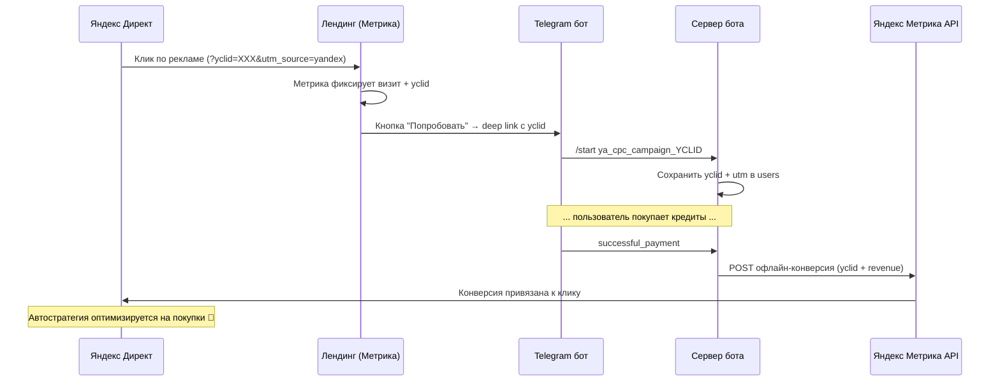

# Яндекс Директ — передача конверсий (покупок) для оптимизации кампаний

**Дата:** 2026-02-13
**Статус:** Требования

---

## Цель

Передавать данные о покупках (Telegram Stars) из бота в Яндекс Метрику,
чтобы Директ мог оптимизировать рекламные кампании на покупку,
а не просто на клики/переходы.

---

## Текущее состояние

### Что уже есть
- UTM-трекинг при регистрации: `utm_source`, `utm_medium`, `utm_campaign`, `utm_content`
- Парсинг start payload: `t.me/bot?start=ya_cpc_campaign1` → `{source: "ya", medium: "cpc", campaign: "campaign1"}`
- Сохранение UTM в таблицу `users` (миграция `048_utm_tracking.sql`)
- Обработка покупок через Telegram Stars (`successful_payment` в `index.ts`)
- Таблица `transactions` с полной историей платежей
- Автогенерация аватар-стикера для платного трафика (`utm_source=yandex, utm_medium=cpc`)

### Чего не хватает
- Нет сайта-прокладки (лендинга) с Яндекс Метрикой
- Нет передачи `yclid` (Яндекс Click ID) — ключевой идентификатор для связки
- Нет отправки офлайн-конверсий в Метрику после покупки
- Директ не знает о покупках → оптимизируется только на клики

---

## Архитектура решения



---

## Компоненты

### 1. Лендинг (сайт-прокладка)

**Минимальная страница:**
- Описание бота + примеры стикеров (3-5 примеров)
- CTA кнопка "Попробовать бесплатно" / "Создать стикер"
- Яндекс Метрика (счётчик + цели)

**Технически:**
- Статический HTML/CSS (GitHub Pages, Vercel, или отдельный контейнер на Dockhost)
- Яндекс Метрика JS-код на странице
- Кнопка формирует deep link с yclid

**Логика кнопки:**
```javascript
const params = new URLSearchParams(window.location.search);
const yclid = params.get('yclid') || '';
const utm_campaign = params.get('utm_campaign') || '';

// Формируем deep link
const startPayload = `ya_cpc_${utm_campaign}_${yclid}`;
document.getElementById('cta-button').href =
  `https://t.me/Photo_2_StickerBot?start=${startPayload}`;
```

**Метрика — цели:**

| Цель | Тип | Описание |
|------|-----|----------|
| `visit` | Автоматическая | Визит на лендинг |
| `click_bot` | JS-событие | Клик на кнопку "Открыть бот" |
| `purchase` | Офлайн-конверсия | Покупка кредитов (через API) |

### 2. Бот — сохранение yclid

**SQL миграция:**
```sql
ALTER TABLE users ADD COLUMN IF NOT EXISTS yclid text;
CREATE INDEX IF NOT EXISTS idx_users_yclid ON users(yclid);
```

**Обновить `parseStartPayload()` в `index.ts`:**

Текущий формат: `ya_cpc_campaign1`
Новый формат: `ya_cpc_campaign1_YCLID`

```
ya_cpc_valentines_7836492817364
 ^   ^      ^          ^
 |   |      |          └── yclid (последний сегмент, полностью числовой)
 |   |      └── campaign
 |   └── medium
 └── source
```

Парсинг: последний сегмент, который полностью числовой и длиной > 8 символов → yclid.

**Сохранение:**
- При регистрации нового пользователя: `users.yclid = parsed.yclid`
- При возвращении пользователя (если yclid пустой): обновить

### 3. Отправка офлайн-конверсий

**Когда:** в `successful_payment` хендлере, после зачисления кредитов.

**Условие:** `if (user.yclid)` — отправляем только для пользователей с Директа.

**API Яндекс Метрики (офлайн-конверсии):**

```
POST https://api-metrika.yandex.net/management/v1/counter/{counterId}/offline_conversions/upload
Authorization: OAuth {token}
Content-Type: application/x-csv-with-header

UserId,Target,DateTime,Price,Currency
{yclid},purchase,{datetime},{price_rub},RUB
```

**Реализация (`src/lib/yandex-metrika.ts`):**

```typescript
interface ConversionParams {
  yclid: string;
  target: string;       // "purchase"
  revenue: number;      // цена в рублях
  currency: string;     // "RUB"
  orderId: string;      // transaction.id
}

async function sendYandexConversion(params: ConversionParams): Promise<void> {
  const counterId = config.yandexMetrikaCounterId;
  const token = config.yandexMetrikaToken;
  if (!counterId || !token) return;

  const datetime = new Date().toISOString().replace('T', ' ').slice(0, 19);
  const csv = `UserId,Target,DateTime,Price,Currency\n${params.yclid},${params.target},${datetime},${params.revenue},${params.currency}`;

  await axios.post(
    `https://api-metrika.yandex.net/management/v1/counter/${counterId}/offline_conversions/upload`,
    csv,
    {
      headers: {
        'Authorization': `OAuth ${token}`,
        'Content-Type': 'application/x-csv-with-header',
      },
      timeout: 10000,
    }
  );
}
```

**Интеграция в `successful_payment`:**

```typescript
// После зачисления кредитов (строка ~6370 в index.ts)
if (user.yclid) {
  try {
    await sendYandexConversion({
      yclid: user.yclid,
      target: "purchase",
      revenue: pack.price_rub || pack.price,
      currency: "RUB",
      orderId: transaction.id,
    });
    console.log("[metrika] Conversion sent for yclid:", user.yclid);
  } catch (err: any) {
    console.error("[metrika] Failed to send conversion:", err.message);
    // Не блокируем основной flow
  }
}
```

### 4. Конфигурация

**Новые env-переменные (`config.ts`):**
```
YANDEX_METRIKA_COUNTER_ID=12345678
YANDEX_METRIKA_TOKEN=y0_AgAAAA...
LANDING_URL=https://photo2sticker.ru
```

**Получение OAuth-токена:**
1. Зарегистрировать приложение: https://oauth.yandex.ru/client/new
2. Права: `metrika:write`
3. Получить токен через OAuth flow

---

## Формат start payload (обновлённый)

| Формат | Пример | Что парсится |
|--------|--------|-------------|
| Текущий | `ya_cpc_valentines` | source=ya, medium=cpc, campaign=valentines |
| Новый | `ya_cpc_valentines_7836492817364` | + yclid=7836492817364 |
| Без campaign | `ya_cpc__1234567890` | campaign пустой, yclid=1234567890 |
| Без yclid | `ya_cpc_valentines` | как раньше, yclid=null |

**Правило:** последний сегмент после `_`, который полностью числовой и длиной > 8 → yclid.

---

## Этапы реализации

### Этап 1: Лендинг (1-2 дня)
- [ ] Создать HTML-страницу (описание + примеры + CTA)
- [ ] Добавить Яндекс Метрику (счётчик)
- [ ] Настроить цель `click_bot` (клик по кнопке)
- [ ] JS: извлечение yclid из URL → формирование deep link
- [ ] Захостить (GitHub Pages / Vercel / Dockhost)
- [ ] Получить домен (или использовать поддомен)

### Этап 2: Бот — сохранение yclid (0.5 дня)
- [ ] SQL миграция: `users.yclid`
- [ ] Обновить `parseStartPayload()` — извлекать yclid
- [ ] Сохранять yclid в users при регистрации
- [ ] Обновлять yclid для returning users (если пришли по новой ссылке)

### Этап 3: Отправка конверсий (1 день)
- [ ] Получить OAuth-токен Яндекс Метрики
- [ ] Создать `src/lib/yandex-metrika.ts`
- [ ] Добавить env: `YANDEX_METRIKA_COUNTER_ID`, `YANDEX_METRIKA_TOKEN`
- [ ] Интегрировать в `successful_payment` хендлер
- [ ] Логирование и алерты при ошибках отправки
- [ ] Тест на test-окружении

### Этап 4: Яндекс Директ — настройка кампании
- [ ] Создать кампанию с URL лендинга
- [ ] Связать Метрику с Директом
- [ ] Настроить автостратегию "Оптимизация конверсий"
- [ ] Начать с цели `click_bot`, переключить на `purchase` после 10-20 покупок

---

## Риски

| Риск | Вероятность | Митигация |
|------|-------------|-----------|
| Мало конверсий для автостратегии (<10/нед) | Высокая на старте | Начать с оптимизации на `click_bot` |
| yclid протухает (21 день) | Низкая | Отправлять конверсию сразу при покупке |
| Пользователь пришёл без лендинга (прямая ссылка) | Средняя | yclid не будет — нет конверсии, ок |
| Яндекс API офлайн-конверсий недоступен | Низкая | Retry + не блокировать основной flow |
| Лендинг снижает конверсию (лишний шаг) | Средняя | A/B тест: часть трафика на лендинг, часть напрямую |

---

## Метрики успеха

- Конверсии (цель `purchase`) появляются в Яндекс Метрике
- Директ видит связку клик → покупка
- CPA (стоимость покупки) снижается после 2-3 недель оптимизации
- ROI рекламы растёт

---

## Стоимость

| Компонент | Стоимость |
|-----------|-----------|
| Лендинг (хостинг) | 0₽ (GitHub Pages) или ~300₽/мес |
| Домен | ~500₽/год |
| Яндекс Метрика | Бесплатно |
| Яндекс Директ API | Бесплатно |
| Разработка | ~2-3 дня |
