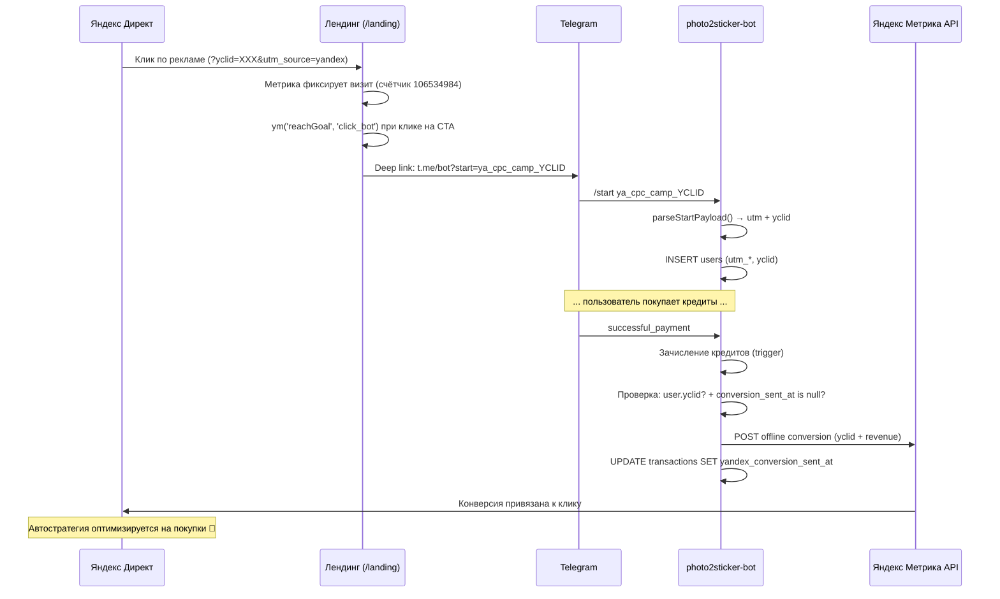

# Яндекс Директ — передача конверсий (покупок) для оптимизации кампаний

**Дата:** 2026-02-13
**Обновлён:** 2026-02-17
**Статус:** Требования (обновлено)

---

## Цель

Передавать данные о покупках (Telegram Stars) из бота в Яндекс Метрику,
чтобы Директ мог оптимизировать рекламные кампании на покупку,
а не просто на клики/переходы.

---

## Принцип ответственности

| Компонент | Зона ответственности |
|-----------|---------------------|
| **Landing** (сабмодуль `/landing`) | Capture + Transport: собирает `utm_*` + `yclid` из URL, формирует deep link, шлёт JS-цель `click_bot` |
| **photo2sticker-bot** (`src/`) | Storage + Dispatch: парсит payload, сохраняет `yclid` в `users`, отправляет offline conversion в Метрику при оплате |
| **Яндекс Директ** | Оптимизируется по целям Метрики (`click_bot` → затем `purchase`) |

Конверсии отправляются **только из бота** — единый контроль, логи, ретраи, идемпотентность.

---

## Текущее состояние

### Что уже есть
- Лендинг (`/landing` — git submodule) с Яндекс Метрикой (счётчик `106534984`)
- `buildTelegramStartLink()` в `landing/client/src/lib/utils.ts` — deep link с `utm_*`
- `TelegramButton` компонент — CTA кнопка
- UTM-трекинг при регистрации: `utm_source`, `utm_medium`, `utm_campaign`, `utm_content`
- Парсинг start payload: `t.me/bot?start=ya_cpc_campaign1` → `{source, medium, campaign, content}`
- Сохранение UTM в таблицу `users` (миграция `048_utm_tracking.sql`)
- Обработка покупок через Telegram Stars (`successful_payment` в `index.ts`)
- Таблица `transactions` с полной историей платежей
- Антидубль оплат (active tx lock + recovery path)

### Чего не хватает
- `yclid` не передаётся из лендинга в deep link
- `yclid` не сохраняется в `users`
- Нет JS-цели `click_bot` на клик по CTA
- Нет отправки офлайн-конверсий в Метрику после покупки
- Нет антидубля на уровне конверсий (повторная отправка)
- Директ не знает о покупках → оптимизируется только на клики

---

## Архитектура решения



---

## Компоненты

### 1. Лендинг — передача yclid в deep link

**Файл:** `landing/client/src/lib/utils.ts`

Обновить `buildTelegramStartLink()`:
- Читать `yclid` из `URLSearchParams`
- Формировать payload: `{source}_{medium}_{campaign}_{content}_{yclid}`
- При тримминге до 64 символов — приоритет: `source` > `medium` > `yclid` > `campaign` > `content`

```typescript
export function buildTelegramStartLink(): string {
  const params = new URLSearchParams(window.location.search);
  const source = params.get("utm_source") || "";
  const medium = params.get("utm_medium") || "";
  const campaign = params.get("utm_campaign") || "";
  const content = params.get("utm_content") || "";
  const yclid = params.get("yclid") || "";

  let startPayload = "web";
  if (source) {
    // Приоритет при тримминге: source > medium > yclid > campaign > content
    const parts = [source, medium];
    // Сначала добавляем campaign и content
    if (campaign || content || yclid) parts.push(campaign || "");
    if (content || yclid) parts.push(content || "");
    // yclid всегда последний
    if (yclid) parts.push(yclid);

    startPayload = parts
      .join("_")
      .replace(/[^A-Za-z0-9_\-]/g, "")
      .slice(0, 64);
  }

  return `https://t.me/Photo_2_StickerBot?start=${startPayload}`;
}
```

**Файл:** `landing/client/src/components/landing/TelegramButton.tsx`

Добавить `ym('reachGoal', 'click_bot')` при клике:

```tsx
<a
  href={telegramUrl}
  target="_blank"
  rel="noopener noreferrer"
  onClick={() => {
    try {
      if (typeof window !== "undefined" && (window as any).ym) {
        (window as any).ym(106534984, "reachGoal", "click_bot");
      }
    } catch {}
  }}
>
```

### 2. Бот — сохранение yclid

**SQL миграция** (`sql/089_yclid_tracking.sql`):

```sql
ALTER TABLE users ADD COLUMN IF NOT EXISTS yclid text;
CREATE INDEX IF NOT EXISTS idx_users_yclid ON users(yclid);
```

**Обновить `parseStartPayload()` в `src/index.ts`:**

Текущий формат: `ya_cpc_campaign1`
Новый формат: `ya_cpc_campaign1_YCLID`

```
ya_cpc_valentines_7836492817364
 ^   ^      ^          ^
 |   |      |          └── yclid (последний сегмент, полностью числовой, len > 8)
 |   |      └── campaign
 |   └── medium
 └── source
```

**Правило парсинга:** последний сегмент, полностью числовой и длиной > 8 → `yclid`.

```typescript
function parseStartPayload(payload: string): {
  source: string | null;
  medium: string | null;
  campaign: string | null;
  content: string | null;
  yclid: string | null;       // NEW
} {
  if (!payload) return { source: null, medium: null, campaign: null, content: null, yclid: null };

  const parts = payload.split("_");
  const knownSources = ["ya", "yandex", "gads", "google", "fb", "ig", "vk", "tg", "web"];
  const knownMediums = ["cpc", "cpm", "organic", "social", "referral"];

  if (parts.length >= 2 && knownSources.includes(parts[0]) && knownMediums.includes(parts[1])) {
    // Detect yclid: last segment, fully numeric, length > 8
    let yclid: string | null = null;
    const lastPart = parts[parts.length - 1];
    if (parts.length >= 3 && /^\d{9,}$/.test(lastPart)) {
      yclid = lastPart;
      parts.pop(); // remove yclid from parts for clean campaign/content parsing
    }

    return {
      source: parts[0],
      medium: parts[1],
      campaign: parts[2] || null,
      content: parts[3] || null,
      yclid,
    };
  }

  return { source: payload, medium: null, campaign: null, content: null, yclid: null };
}
```

**Сохранение в `bot.start`:**

```typescript
// Новый пользователь:
await supabase.from("users").insert({
  // ... existing fields ...
  yclid: utm.yclid,           // NEW
});

// Returning user (если yclid пустой):
if (startPayload && !user.yclid) {
  const utm = parseStartPayload(startPayload);
  if (utm.yclid) {
    updates.yclid = utm.yclid;
  }
}
```

### 3. Отправка офлайн-конверсий (на стороне бота)

**Когда:** в `successful_payment` хендлере, после зачисления кредитов.

**Условия отправки:**
- `user.yclid` — есть (пользователь с Директа)
- `transaction.price > 0` — реальная оплата (не бонусная)
- `transaction.yandex_conversion_sent_at IS NULL` — ещё не отправлялось

**SQL миграция** (в `sql/089_yclid_tracking.sql`):

```sql
-- Антидубль конверсий
ALTER TABLE transactions
  ADD COLUMN IF NOT EXISTS yandex_conversion_sent_at timestamptz,
  ADD COLUMN IF NOT EXISTS yandex_conversion_error text,
  ADD COLUMN IF NOT EXISTS yandex_conversion_attempts int DEFAULT 0;
```

**Модуль: `src/lib/yandex-metrika.ts`:**

```typescript
import axios from "axios";
import { config } from "../config";

interface ConversionParams {
  yclid: string;
  target: string;       // "purchase"
  revenue: number;      // цена в рублях
  currency: string;     // "RUB"
  orderId: string;      // transaction.id (для лога)
}

export async function sendYandexConversion(params: ConversionParams): Promise<void> {
  const counterId = config.yandexMetrikaCounterId;
  const token = config.yandexMetrikaToken;
  if (!counterId || !token) return;

  const datetime = new Date().toISOString().replace("T", " ").slice(0, 19);
  const csv = `UserId,Target,DateTime,Price,Currency\n${params.yclid},${params.target},${datetime},${params.revenue},${params.currency}`;

  await axios.post(
    `https://api-metrika.yandex.net/management/v1/counter/${counterId}/offline_conversions/upload`,
    csv,
    {
      headers: {
        Authorization: `OAuth ${token}`,
        "Content-Type": "application/x-csv-with-header",
      },
      timeout: 10000,
    }
  );
}
```

**Интеграция в `successful_payment`:**

```typescript
// После зачисления кредитов и отправки уведомления
if (user.yclid && transaction.price > 0) {
  try {
    const purchasedPack = CREDIT_PACKS.find(
      (p) => Number(p.credits) === Number(transaction.amount) && Number(p.price) === Number(transaction.price)
    );
    const priceRub = purchasedPack?.price_rub || Math.round(transaction.price * 1.04); // fallback

    await sendYandexConversion({
      yclid: user.yclid,
      target: "purchase",
      revenue: priceRub,
      currency: "RUB",
      orderId: transaction.id,
    });

    await supabase
      .from("transactions")
      .update({
        yandex_conversion_sent_at: new Date().toISOString(),
        yandex_conversion_attempts: (transaction.yandex_conversion_attempts || 0) + 1,
      })
      .eq("id", transaction.id);

    console.log("[metrika] Conversion sent for yclid:", user.yclid, "tx:", transaction.id);
  } catch (err: any) {
    console.error("[metrika] Failed to send conversion:", err.message);

    await supabase
      .from("transactions")
      .update({
        yandex_conversion_error: err.message?.slice(0, 500),
        yandex_conversion_attempts: (transaction.yandex_conversion_attempts || 0) + 1,
      })
      .eq("id", transaction.id);

    // Не блокируем основной flow — алерт в канал
    sendAlert({
      type: "metrika_error",
      message: `[Metrika] Conversion failed for tx ${transaction.id}: ${err.message}`,
    }).catch(() => {});
  }
}
```

### 4. Конфигурация

**Новые env-переменные (`config.ts`):**

```
YANDEX_METRIKA_COUNTER_ID=106534984
YANDEX_METRIKA_TOKEN=y0_AgAAAA...
```

> `LANDING_URL` не нужен — лендинг уже захостен на `photo2sticker.ru`.

**Получение OAuth-токена:**
1. Зарегистрировать приложение: https://oauth.yandex.ru/client/new
2. Права: `metrika:write`
3. Получить токен через OAuth flow
4. Сохранить в env как `YANDEX_METRIKA_TOKEN`

---

## Формат start payload (обновлённый)

| Формат | Пример | Что парсится |
|--------|--------|-------------|
| Текущий | `ya_cpc_valentines` | source=ya, medium=cpc, campaign=valentines |
| С yclid | `ya_cpc_valentines_7836492817364` | + yclid=7836492817364 |
| Без campaign | `ya_cpc__1234567890` | campaign="", yclid=1234567890 |
| Без yclid | `ya_cpc_valentines` | как раньше, yclid=null |
| С content + yclid | `ya_cpc_val_btn1_7836492817364` | campaign=val, content=btn1, yclid=... |

**Правило:** последний сегмент после `_`, который полностью числовой и длиной > 8 → yclid.

**Лимит payload:** 64 символа (ограничение Telegram). При тримминге:
1. Сначала обрезаем `content`
2. Затем `campaign`
3. `source`, `medium`, `yclid` — сохраняются всегда

---

## Этапы реализации

### Этап 1: Лендинг — передача yclid + цель click_bot (0.5 дня)

Лендинг уже существует (`/landing` — git submodule), Метрика подключена (ID `106534984`).

- [ ] Обновить `buildTelegramStartLink()` — добавить чтение `yclid` из URL
- [ ] Реализовать приоритетный тримминг payload (source > medium > yclid > campaign > content)
- [ ] Добавить `ym('reachGoal', 'click_bot')` в `TelegramButton` при клике
- [ ] Настроить цель `click_bot` в интерфейсе Яндекс Метрики (JS-событие)
- [ ] Проверить: открыть лендинг с `?yclid=123456789&utm_source=yandex&utm_medium=cpc`, кликнуть CTA — в ссылке есть yclid

**Definition of Done:** deep link содержит yclid, в Метрике фиксируется `click_bot`.

### Этап 2: Бот — сохранение yclid (0.5 дня)

- [ ] SQL миграция: `users.yclid` + индекс + `transactions.yandex_conversion_*` колонки
- [ ] Расширить `parseStartPayload()` — извлекать yclid (последний числовой сегмент > 8)
- [ ] Сохранять `yclid` в `users` при регистрации нового пользователя
- [ ] Обновлять `yclid` для returning users (если `user.yclid` пустой и в payload есть)
- [ ] Проверить: `/start ya_cpc_test_123456789` → в БД `users.yclid = "123456789"`

**Definition of Done:** `users.yclid` заполняется при `/start` с yclid в payload.

### Этап 3: Отправка конверсий (0.5-1 день)

Реализация на стороне `photo2sticker-bot` (полный контроль, логи, ретраи).

- [ ] Получить OAuth-токен Яндекс Метрики (`metrika:write`)
- [ ] Добавить env: `YANDEX_METRIKA_COUNTER_ID`, `YANDEX_METRIKA_TOKEN` в `config.ts`
- [ ] Создать `src/lib/yandex-metrika.ts` (sendYandexConversion)
- [ ] Интегрировать в `successful_payment`: отправка если `user.yclid` + `price > 0` + `sent_at IS NULL`
- [ ] Антидубль: `yandex_conversion_sent_at` на транзакции
- [ ] Логирование: `[metrika] Conversion sent/failed`
- [ ] Алерт в канал при ошибке отправки
- [ ] Тест на test-окружении

**Definition of Done:** при покупке у юзера с `yclid` — лог `[metrika] Conversion sent`, поле `sent_at` заполнено; ошибки не блокируют оплату.

### Этап 4: Яндекс Директ — настройка кампании (операционный)

- [ ] Связать Метрику (счётчик `106534984`) с Директом
- [ ] Создать кампанию с URL лендинга `https://photo2sticker.ru`
- [ ] Настроить автостратегию "Оптимизация конверсий"
- [ ] Начать с цели `click_bot` (низкий порог)
- [ ] Переключить на `purchase` после 10-20 покупок
- [ ] Мониторить lag между покупкой и появлением конверсии в Метрике

**Definition of Done:** в Директе видна связка клик → покупка, CPA считается.

---

## Антидубль конверсий

Для предотвращения повторной отправки конверсий используется персистентный флаг на транзакции:

| Поле | Тип | Назначение |
|------|-----|-----------|
| `yandex_conversion_sent_at` | `timestamptz` | Время успешной отправки |
| `yandex_conversion_error` | `text` | Последняя ошибка (для дебага) |
| `yandex_conversion_attempts` | `int` | Счётчик попыток |

**Правила:**
- `sent_at IS NOT NULL` → не отправлять повторно
- При ошибке: записать `error` + инкремент `attempts`, **не блокировать оплату**
- Алерт в канал при ошибке (для ручного retry при необходимости)
- Бонусные транзакции (`price = 0`) — не отправляются как конверсии

---

## Риски

| Риск | Вероятность | Митигация |
|------|-------------|-----------|
| Мало конверсий для автостратегии (<10/нед) | Высокая на старте | Начать с оптимизации на `click_bot` |
| yclid протухает (21 день) | Низкая | Отправлять конверсию сразу при покупке |
| Пользователь пришёл без лендинга (прямая ссылка) | Средняя | yclid не будет — нет конверсии, ок |
| Яндекс API офлайн-конверсий недоступен | Низкая | Не блокировать оплату + алерт + ручной retry |
| Лендинг снижает конверсию (лишний шаг) | Средняя | A/B тест: часть трафика на лендинг, часть напрямую |
| Дубль конверсии при retry | Низкая | `yandex_conversion_sent_at` guard |
| Payload обрезается до 64 символов | Средняя | Приоритетный тримминг: yclid сохраняется, content/campaign обрезаются |

---

## Метрики успеха

- Конверсии (цель `purchase`) появляются в Яндекс Метрике
- Директ видит связку клик → покупка
- CPA (стоимость покупки) снижается после 2-3 недель оптимизации
- ROI рекламы растёт
- `[metrika] Conversion sent` в логах при каждой покупке пользователя с Директа

---

## Стоимость

| Компонент | Стоимость |
|-----------|-----------|
| Лендинг (хостинг) | Уже захостен (photo2sticker.ru) |
| Домен | Уже есть |
| Яндекс Метрика | Бесплатно |
| Яндекс Директ API | Бесплатно |
| Разработка | ~1.5-2 дня |
