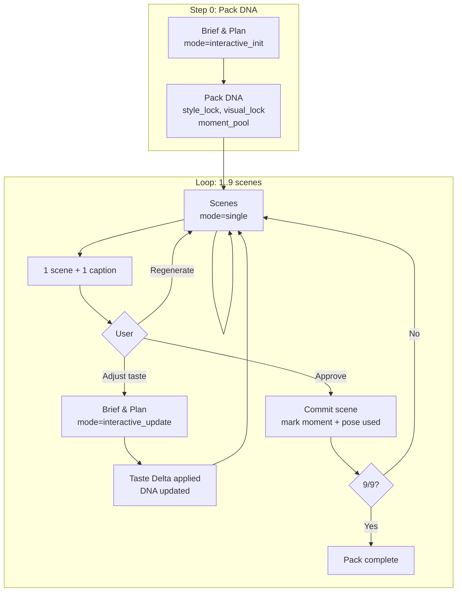

# Интерактивная генерация пака: сцена за сценой (Interactive Scene-by-Scene Mode)

**Дата:** 20.02.2026  
**Тип:** PRODUCT + ARCHITECTURE  
**Контекст:** Существующий пайплайн — Brief & Plan → Captions ∥ Scenes → Critic (batch). Цель — новый режим: стикеры по одному с подтверждением пользователя без потери консистентности стиля.

---

## 1. Цели

| Цель | Описание |
|------|----------|
| **Time to first value** | Первый стикер появляется быстро (<10 сек). |
| **Style consistency** | Один и тот же стиль (одежда, окружение, framing) на весь пак. |
| **User feedback** | Пользователь может влиять на следующие стикеры (одобрить / перегенерить / скорректировать вкус). |
| **Token efficiency** | Минимум токенов, без полных циклов перегенерации всего пака. |
| **Reuse agents** | Не вводить новых креативных агентов; менять поведение через **режим (MODE)**. |

---

## 2. Ключевой принцип

**Агенты те же. Поведение меняется через MODE.**

Вместо новых агентов вводим **режимы генерации** у существующих:

- **Brief & Plan:** `batch` | `interactive_init` | `interactive_update`
- **Scenes:** `batch` | `single`
- **Captions:** в интерактиве — по одной подписи на сцену (тот же агент, вызов на 1 момент).
- **Critic:** в интерактиве не вызывается после каждой сцены; опционально — в конце пака или не используется.

---

## 3. Обзор потоков

### 3.1. Batch Mode (текущий, без изменений)

```
Brief & Plan  →  full plan (9 moments)
       ↓
Captions  ∥  Scenes  →  9 captions, 9 scenes
       ↓
Assembly  →  spec
       ↓
Critic  →  pass/fail → [rework loop]
```

### 3.2. Interactive Mode (новый)

```
Step 0 — Pack DNA (один раз)
   Brief & Plan [interactive_init]
   → style_lock, visual_lock, moment_pool (9)
   → сохраняем Pack DNA, пользователю не показываем

Step 1 — Генерация одной сцены
   Scenes [single]
   Input: Pack DNA + 1 момент из pool + использованные body_patterns
   Output: 1 scene_description (EN + RU при необходимости), 1 caption
   → показываем пользователю

Step 2 — Реакция пользователя
   Approve | Regenerate | Adjust taste ("more awkward", "calmer", …)
   → Taste Delta (структурированно, без LLM): например { awkward_level: "+1", energy: "-1" }

Step 3 — Обновление DNA (при Adjust taste)
   Brief & Plan [interactive_update]
   → обновить только mutable taste-параметры
   → НЕ менять: outfit, environment, subject identity, уже одобренные сцены

Step 4 — Commit сцены
   Одобренная сцена фиксируется.
   Момент + body_pattern помечаются как использованные.
   → следующий шаг (следующая сцена) или конец пака (9/9).
```

Повторяем шаги 1–4 до 9 сцен.

---

## 4. Архитектура (логическая схема)



**Поток данных (минимальный):**

- В Scenes [single] передаём не полный plan, а: **Pack DNA (slim)** + **один выбранный момент** + **список использованных body_patterns** (и при необходимости использованных моментов).
- Между агентами — только минимальный контракт (см. раздел 6), без полного JSON всего пака.

---

## 5. Определение режимов (MODE) по агентам

### 5.1. Brief & Plan

| MODE | Назначение | Вход | Выход |
|------|------------|------|--------|
| `batch` | Текущее поведение | request, subjectType | brief + plan (9 moments) |
| `interactive_init` | Инициализация Pack DNA | request, subjectType | style_lock, visual_lock, moment_pool (9), без полного plan для Captions/Scenes |
| `interactive_update` | Коррекция вкуса по фидбеку | Pack DNA (текущий), Taste Delta | Обновлённый Pack DNA (только mutable поля) |

**Инвариант:** в `interactive_update` не меняются: outfit, environment, subject identity, уже закоммиченные сцены.

### 5.2. Scenes

| MODE | Назначение | Вход | Выход |
|------|------------|------|--------|
| `batch` | Текущее поведение | plan (BossPlan), outfit | 9 scene_descriptions |
| `single` | Одна сцена под интерактивный поток | Pack DNA (slim), one_moment, used_body_patterns[, used_moments] | 1 scene_description (EN), опционально RU |

**Инвариант:** в `single` сцена не может менять outfit, окружение или идентичность субъекта — только поза/действие в рамках DNA.

### 5.3. Captions

| MODE | Назначение | Вход | Выход |
|------|------------|------|--------|
| `batch` | Текущее поведение | plan | 9 labels, 9 labels_en |
| `single` | Одна подпись под одну сцену | Pack DNA (tone и т.д.), one_moment | 1 label (RU), 1 label_en |

Используется тот же агент (те же системные правила), меняется только объём входа/выхода (один момент вместо девяти).

### 5.4. Critic

В интерактивном режиме по умолчанию **не вызывается** после каждой сцены (экономия токенов и времени). Опции:

- Не вызывать вообще.
- Вызвать один раз в конце по собранному spec (9 сцен + 9 подписей) — опциональный gate перед финальным сохранением.

---

## 6. Контракты (вход/выход)

### 6.1. Pack DNA (результат interactive_init)

Минимальная структура для хранения и передачи (не полный JSON всего пака):

```ts
interface PackDNA {
  // Style lock (из brief / plan)
  tone: string;
  awkward_level?: string;   // или number 1–5
  energy?: string;          // calmer / neutral / high
  subject_mode: "single" | "multi";
  outfit: string;            // visual lock, immutable after init
  environment: string;       // visual lock, immutable
  // Moment pool: 9 строк, индексы 0..8
  moment_pool: string[];
  // Мета для пака (имя, описание — для финального spec)
  name_ru: string;
  name_en: string;
  carousel_description_ru?: string;
  carousel_description_en?: string;
  mood: string;
  segment_id: string;
  pack_template_id: string;
  id: string;                // pack id
}
```

**Mutable при interactive_update:** только taste-поля, например `tone`, `awkward_level`, `energy`.  
**Immutable:** outfit, environment, subject identity, moment_pool (состав не меняем, только помечаем использованные).

### 6.2. Single-scene generation (Scenes, mode=single)

**Вход (минимальный):**

- `dna_slim`: { outfit, environment, subject_mode, tone, awkward_level?, energy? }
- `one_moment`: string (один элемент из moment_pool)
- `used_body_patterns`: string[] — короткие описания уже использованных поз/типов кадра (чтобы не повторяться)
- опционально: `used_moments`: string[] — тексты уже использованных моментов

**Выход:**

- `scene_description: string` (EN, с плейсхолдером `{subject}`)
- опционально `scene_description_ru: string`

### 6.3. Single-caption generation (Captions, mode=single)

**Вход:**

- `dna_slim`: { tone, awkward_level?, один момент по смыслу }
- `one_moment`: string

**Выход:**

- `label: string` (RU, 15–20 символов)
- `label_en: string` (EN)

### 6.4. Taste Delta (после пользовательского Adjust taste)

Формируется **системой по правилам**, не LLM. Пример:

```ts
interface TasteDelta {
  awkward_level?: "+1" | "-1" | "0";
  energy?: "+1" | "-1" | "0";
  tone?: string;  // если пользователь явно попросил сдвиг тона
}
```

Маппинг фраз пользователя в Taste Delta — жёсткие правила (ключевые слова) или простой классификатор. Не передаём сырой текст в LLM для «понимания» фидбека.

### 6.5. interactive_update (Brief & Plan)

**Вход:**

- Текущий `PackDNA`
- `TasteDelta`

**Выход:**

- Обновлённый `PackDNA` с применённым TasteDelta только к mutable полям. Остальное без изменений.

---

## 7. Управление состоянием

### 7.1. Pack DNA

- Создаётся один раз в Step 0 (`interactive_init`).
- Хранится в сессии интерактивного пака (например `pack_dna` в JSON или отдельная таблица/колонка).
- При `interactive_update` перезаписываются только разрешённые (mutable) поля.

### 7.2. Used moments

- Массив индексов или текстов моментов из `moment_pool`, уже закоммиченных.
- При выборе сцены для генерации берём **первый неиспользованный** момент из pool (или по порядку).
- Не передаём в агенты полный список сцен — только факт «этот момент уже использован» при необходимости для контекста (в single обычно передаём один момент и список used_* для уникальности).

### 7.3. Used body patterns

- После каждой одобренной сцены из неё извлекается **body pattern** (короткое описание позы/типа кадра: "chest-up frontal", "slight turn left", "hand on face" и т.п.).
- Варианты реализации:
  - Извлекать ключевые слова из scene_description правилами/регулярками.
  - Добавить в контракт Scenes [single] опциональный выход `body_pattern: string` для следующего использования.
- Список used body patterns передаётся в следующий вызов Scenes [single], чтобы модель не повторяла те же позы.

### 7.4. Собранный spec по ходу интерактива

- Массивы: `scene_descriptions[]`, `labels[]`, `labels_en[]` пополняются при каждом Commit scene.
- В конце получаем тот же формат, что и в batch: 9 сцен, 9 подписей — можно отдать в Critic (опционально) или сразу в Assembly и сохранение.

---

## 8. Стратегия rework в интерактиве

| Действие пользователя | Что делаем |
|------------------------|------------|
| **Approve** | Фиксируем сцену и подпись, помечаем момент и body_pattern как использованные, переходим к следующей сцене. |
| **Regenerate** | Вызываем Scenes [single] и Captions [single] с теми же входными данными (тот же момент, тот же DNA). Опционально: добавить в контекст «предыдущая сцена отклонена, сделай иначе» без смены DNA. |
| **Adjust taste** | Формируем Taste Delta, вызываем Brief & Plan [interactive_update], обновляем DNA. Следующий вызов Scenes [single] уже с новым DNA; момент можно оставить тот же или перейти к следующему — по продуктовому решению. |

**Не делаем:**

- Полную перегенерацию всех 9 сцен из-за одной неудачной.
- Изменение outfit/environment через пользовательский фидбек (только taste-параметры).

---

## 9. Критерии успеха

- Первый стикер показывается пользователю **менее чем за 10 секунд** после старта интерактива (после Step 0).
- Пользователь может влиять на стиль (taste) без потери консистентности (одежда, окружение, субъект не меняются).
- Нет полных циклов перегенерации всего пака; rework только одной сцены или обновление taste.
- Средний расход токенов на одну сцену в интерактиве — минимальный (минимальный контракт, без передачи полного spec между агентами).
- Те же агенты, несколько режимов, предсказуемое поведение.

---

## 10. Non-Goals

- Не вводить новых креативных агентов.
- Не использовать vision / распознавание изображений для фидбека.
- Не перегенерировать весь пак из-за одной плохой сцены.
- Не позволять агенту Scenes менять outfit или идентичность субъекта в режиме single.

---

## 11. Связанные документы и код

- Пайплайн: `src/lib/pack-multiagent.ts` (runPackGenerationPipeline, runConceptAndPlan, runScenes, runCaptions, runCritic).
- Существующие режимы rework: runCaptionsForIndices, runScenesForIndices.
- БД/сессии: где хранятся pending_pack_plan, pending_rejected_pack_spec (см. комментарии в pack-multiagent.ts).
- Документация агентов: `docs/26-02-pack-agents-cache-vs-assistants-analysis.md`, `docs/26-02-pack-agents-max-tokens-latency.md`.

---

## 12. Итог для реализации

1. **Архитектура:** один интерактивный поток с Pack DNA и циклом из 4 шагов (генерация одной сцены → фидбек → опциональное обновление DNA → commit).
2. **Режимы агентов:** добавить MODE в вызовы Brief & Plan (interactive_init, interactive_update) и Scenes/Captions (single); системные промпты и формат user message различаются по MODE.
3. **Контракты:** описать и реализовать Pack DNA (slim для передачи), вход/выход single-scene и single-caption, Taste Delta.
4. **Состояние:** Pack DNA, used_moments, used_body_patterns, накопленные arrays для финального spec — хранить в сессии интерактивного пака.
5. **Rework:** только Regenerate (одна сцена) или Adjust taste → interactive_update → следующая генерация с обновлённым DNA.

После утверждения доки можно переходить к изменениям в `pack-multiagent.ts` и к месту вызова (интерактивный UI в боте/админке).
