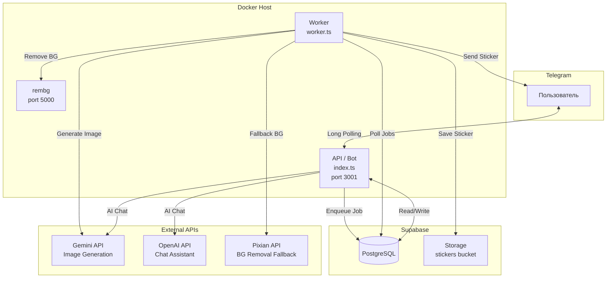

# Photo2Sticker Bot — Обзор архитектуры

## Что делает сервис

Telegram-бот, который превращает фотографии в стикеры с помощью AI (Gemini).
Пользователь загружает фото, выбирает стиль/эмоцию/позу — и получает готовый стикер.

Два режима работы:
- **AI-ассистент** — чат-бот собирает параметры в диалоге
- **Ручной режим** — карусель стилей + кнопки выбора

## Стек технологий

| Компонент | Технология |
|-----------|------------|
| Язык | TypeScript (Node.js 20) |
| Telegram SDK | Telegraf 4 |
| База данных | Supabase (PostgreSQL) |
| AI генерация изображений | Gemini 2.5 Flash Image |
| AI чат-ассистент | OpenAI gpt-4o-mini / Gemini |
| Удаление фона | rembg (self-hosted, isnet-general-use) + Pixian (fallback) |
| Обработка изображений | Sharp |
| Оплата | Telegram Stars |
| Контейнеризация | Docker |
| Хостинг | Docker Host |

## Архитектура



## Компоненты системы

### API / Bot (`src/index.ts`)
Основной процесс. Принимает сообщения от пользователей через long polling.
Управляет всей бизнес-логикой: регистрация, ассистент, выбор стилей, оплата.

→ Подробнее: [01-api-bot.md](./01-api-bot.md)

### Worker (`src/worker.ts`)
Фоновый процесс. Берёт задания из очереди, генерирует стикеры через Gemini,
удаляет фон, отправляет результат пользователю.

→ Подробнее: [02-worker.md](./02-worker.md)

### AI-ассистент (`src/lib/ai-chat.ts` + `src/lib/assistant-db.ts`)
Чат-бот на базе LLM с function calling. Собирает параметры стикера
(стиль, эмоция, поза), управляет trial credits, конвертирует в покупку.

→ Подробнее: [03-ai-assistant.md](./03-ai-assistant.md)

### База данных (Supabase)
19 таблиц (включая app_config), enum'ы, RPC-функции для атомарных операций.

→ Подробнее: [04-database.md](./04-database.md)

### Оплата (Telegram Stars)
Пакеты кредитов, paywall для новых пользователей, автопродолжение генерации. Офлайн-конверсии в **Яндекс.Метрику** (yclid → оплата) для оптимизации Директа — см. раздел «Яндекс Метрика» в [05-payment.md](./05-payment.md).

→ Подробнее: [05-payment.md](./05-payment.md)

## Структура файлов

```
src/
├── index.ts                 # API/Bot — основной процесс
├── worker.ts                # Worker — генерация стикеров
├── config.ts                # Конфигурация (env vars)
├── support-bot.ts           # Бот поддержки (отдельный процесс)
├── broadcast-valentine.ts   # Скрипт рассылки (одноразовый)
└── lib/
    ├── ai-chat.ts           # AI чат с function calling
    ├── app-config.ts        # Конфигурация из app_config (БД)
    ├── assistant-db.ts      # CRUD для assistant_sessions
    ├── gemini-chat.ts       # Legacy Gemini чат (metadata-based)
    ├── image-utils.ts       # Обработка изображений (border, text, trim, resize, safety padding)
    ├── alerts.ts            # Алерты и нотификации в Telegram канал
    ├── texts.ts             # i18n — тексты на RU/EN
    ├── telegram.ts          # Утилиты Telegram API
    └── supabase.ts          # Supabase клиент

sql/                         # Миграции БД (001-071)
docs/architecture/           # Эта документация
```

## Потоки пользователя (высокоуровневый)

```mermaid
flowchart LR
    START[/start] --> GREETING[Приветствие<br/>ассистента]
    GREETING --> PHOTO[Загрузка фото]
    PHOTO --> PARAMS[Сбор параметров<br/>стиль / эмоция / поза]
    PARAMS --> CREDITS{Есть кредиты?}
    CREDITS -->|Да| GEN[Генерация]
    CREDITS -->|Нет| PAY[Оплата Stars]
    PAY --> GEN
    GEN --> RESULT[Стикер готов!]
    RESULT --> MODIFY[Изменить стиль /<br/>эмоцию / позу / текст]
    RESULT --> PACK[Добавить в пак]
    RESULT --> IDEAS[Идеи для пака<br/>assistant_wait_idea]
    MODIFY --> GEN
```

## Окружения

| Окружение | Ветка | Бот | Назначение |
|-----------|-------|-----|------------|
| Production | `main` | @photo2sticker_bot | Продакшн |
| Test | `test` | @photo2sticker_test_bot | Тестирование |

Данные изолированы через колонку `env` (`prod` / `test`) во всех основных таблицах.
