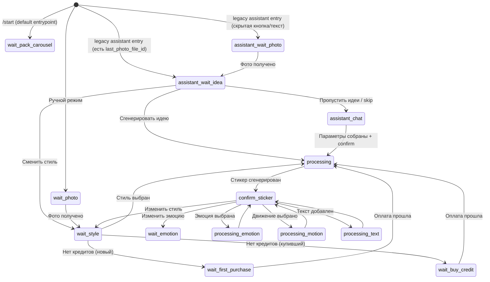
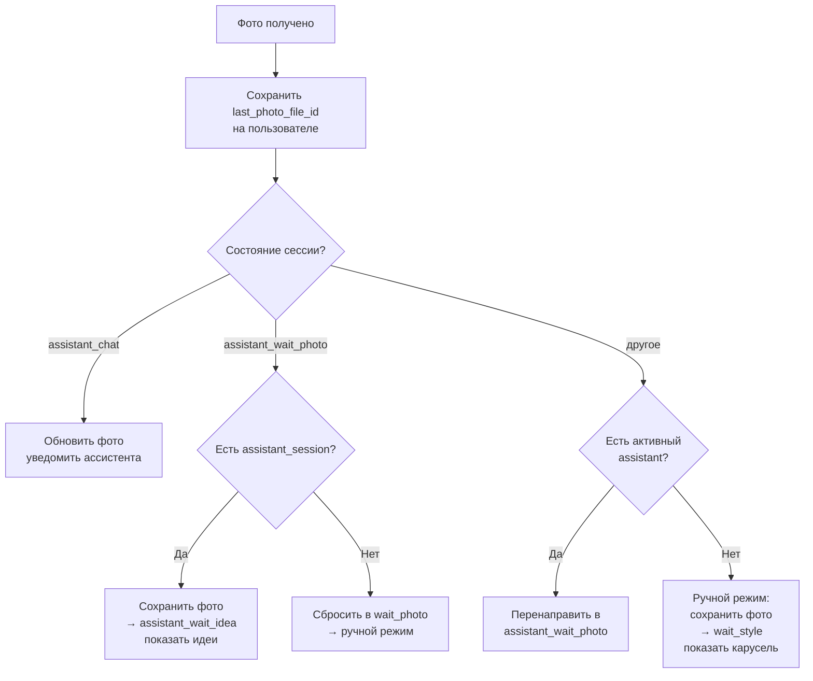

# API / Bot — `src/index.ts`

Основной процесс приложения. Telegram-бот на Telegraf 4 с long polling.
Обрабатывает все входящие сообщения, управляет сессиями, оплатой и UI.

## Состояния сессии (`session_state`)

Сессия — основная сущность, привязанная к пользователю. Состояние определяет,
что бот ожидает от пользователя.

### Полный список состояний

| Состояние | Описание |
|-----------|----------|
| `assistant_wait_photo` | Ассистент ждёт фото от пользователя |
| `assistant_wait_idea` | Показаны идеи стикеров — пользователь может сгенерировать, пропустить или сменить стиль |
| `assistant_chat` | Активный диалог с ассистентом (сбор стиля/эмоции/позы) |
| `wait_photo` | Ручной режим — ждём фото |
| `wait_style` | Фото есть — ждём выбор стиля (карусель) |
| `wait_custom_style_v2` | Ждём текстовое описание своего стиля |
| `wait_emotion` | Ждём выбор эмоции |
| `wait_custom_emotion` | Ждём текстовое описание своей эмоции |
| `wait_custom_motion` | Ждём текстовое описание своего движения |
| `wait_text_overlay` | Ждём текст для наложения на стикер |
| `wait_first_purchase` | Paywall — новый пользователь, первая покупка |
| `wait_buy_credit` | Paywall — нужны кредиты |
| `processing` | Генерация стикера (стиль) |
| `processing_emotion` | Генерация стикера (эмоция) |
| `processing_motion` | Генерация стикера (движение) |
| `processing_text` | Генерация стикера (текст) |
| `confirm_sticker` | Стикер готов — выбор действий |
| `waiting_custom_idea` | Ждём описание идеи для пака |
| `wait_pack_carousel` | Карусель наборов контента (подписи/сцены) для шаблона пака |
| `wait_pack_photo` | Flow "Сделать пак" — ждём фото |
| `wait_pack_preview_payment` | Фото есть — выбор style preset v2 + кнопка превью за 1 кредит |
| `generating_pack_preview` | Генерация превью-листа пака |
| `wait_pack_approval` | Превью показано — одобрение / реген / отмена |
| `processing_pack` | Сборка и публикация Telegram sticker set |
| `canceled` | Сессия отменена |

## Хендлеры бота

### Команды

| Команда | Описание |
|---------|----------|
| `/start` | Регистрация, UTM-трекинг, запуск pack-flow по умолчанию. Поддерживает deep links: `val_STYLE_ID` (приоритетный special-flow), UTM параметры |
| `/balance` | Показать баланс + пакеты кредитов |
| `/support` | Контакт поддержки |

### Меню (Reply Keyboard)

| Кнопка | Описание |
|--------|----------|
| 📦 Создать пак | Запуск flow пакетной генерации (preview + approve) |
| 💰 Ваш баланс | Баланс + пакеты |
| 💬 Поддержка | Справка/контакт поддержки |

`✨ Создать стикер` временно скрыта из `ReplyKeyboard`, но legacy-хендлер сохранен для обратной совместимости.

### Обработка фото (`bot.on("photo")`)

Дополнительно для активных flow:
- `assistant_chat` и `assistant_wait_idea`: новое фото не ломает flow, бот спрашивает "новое или текущее фото" (`assistant_new_photo` / `assistant_keep_photo`).
- `wait_pack_preview_payment` и `wait_pack_approval`: аналогичный выбор для pack flow (`pack_new_photo` / `pack_keep_photo`) с продолжением pack-сценария.

### Обработка текста (`bot.on("text")`)

Маршрутизация по `session.state`:
- `assistant_wait_photo` → AI чат (пользователь может описывать цель до фото)
- `assistant_chat` → AI чат (основной диалог)
- `wait_custom_style_v2` → Приём описания стиля → генерация
- `wait_custom_emotion` → Приём описания эмоции → генерация
- `wait_custom_motion` → Приём описания движения → генерация
- `wait_text_overlay` → Наложение текста на стикер (без AI)
- `waiting_custom_idea` → Генерация кастомной идеи для пака

### Callback-кнопки (inline keyboard)

#### Стили
- `style_carousel_pick:ID` — выбрать стиль из карусели
- `style_carousel_next:PAGE:MSG_IDS` — следующая страница карусели
- `style_v2:ID` — выбрать стиль V2
- `style_group:ID` → `style_v2:ID` — выбор через группы
- `style_custom_v2` — свой стиль (текстом)

#### Модификации стикера (после генерации)
- `change_style` / `change_style:ID` — изменить стиль
- `change_emotion` / `change_emotion:ID[:SESSION_ID[:REV]]` — изменить эмоцию
- `emotion_ID` — выбрать пресет эмоции
- `change_motion` / `change_motion:ID[:SESSION_ID[:REV]]` — изменить движение
- `motion_ID` — выбрать пресет движения
- `add_text:ID` — добавить текст
- `toggle_border:ID` — вкл/выкл белую рамку
- `add_to_pack` / `add_to_pack:ID` — добавить в стикерпак

#### Ассистент
- `assistant_confirm[:SESSION_ID[:REV]]` — подтвердить параметры, запустить генерацию
- `assistant_restart[:SESSION_ID[:REV]]` — начать заново
- `assistant_new_photo[:SESSION_ID[:REV]]` — загрузить новое фото
- `assistant_keep_photo[:SESSION_ID[:REV]]` — оставить текущее фото
- `assistant_style_preview:STYLE_ID[:SESSION_ID[:REV]]` — показать превью стиля
- `assistant_style_preview_ok:STYLE_ID:STICKER_MSG_ID[:SESSION_ID[:REV]]` — применить стиль из превью
- `assistant_pick_style:STYLE_ID[:SESSION_ID[:REV]]` — выбрать стиль из примеров

#### Идеи для пака
- `pack_ideas:ID` — показать идеи для стикера
- `idea_generate:N` — сгенерировать идею №N
- `idea_next` / `idea_back` / `idea_more` / `idea_done` — навигация
- `custom_idea` / `idea_generate_custom` — кастомная идея

#### "Сделать пак"
- `pack_show_carousel:TEMPLATE_ID` — шаг 2: показать карусель наборов контента (после приглашения)
- `pack_carousel_prev` / `pack_carousel_next` / `pack_carousel_noop` — навигация по карусели
- `pack_try:CONTENT_SET_ID` — выбрать набор и перейти к фото/стилю (wait_pack_photo или wait_pack_preview_payment)
- `pack_start:TEMPLATE_ID` — старт flow по выбранному template (fallback, без карусели)
- `pack_style:STYLE_ID` — выбрать style preset v2 перед preview
- `pack_preview_pay:SESSION_ID[:REV]` — оплатить превью (1 кредит)
- `pack_new_photo:SESSION_ID[:REV]` — использовать новое фото и вернуться к шагу выбора стиля
- `pack_keep_photo:SESSION_ID[:REV]` — оставить текущее фото и продолжить текущий шаг pack flow
- `pack_back_to_carousel:SESSION_ID[:REV]` — вернуться к выбору поз
- `pack_approve:SESSION_ID[:REV]` — оплатить сборку (N-1) и запустить assemble
- `pack_regenerate:SESSION_ID[:REV]` — перегенерировать preview (1 кредит)
- `pack_cancel:SESSION_ID[:REV]` — отменить pack flow

#### Идеи стикеров (ассистент, assistant_wait_idea)
- `asst_idea_gen:INDEX[:SESSION_ID[:REV]]` — сгенерировать выбранную идею
- `asst_idea_next:INDEX[:SESSION_ID[:REV]]` — следующая идея
- `asst_idea_restyle:STYLE_ID:INDEX[:SESSION_ID[:REV]]` — сменить стиль
- `asst_idea_restyle_ok:STYLE_ID:INDEX:STICKER_MSG_ID[:SESSION_ID[:REV]]` — подтвердить новый стиль
- `asst_idea_style:INDEX[:SESSION_ID[:REV]]` — выбрать стиль из примеров
- `asst_idea_back:INDEX[:SESSION_ID[:REV]]` — назад
- `asst_idea_holiday:HOLIDAY_ID:INDEX[:SESSION_ID[:REV]]` — включить holiday-режим
- `asst_idea_holiday_off:INDEX[:SESSION_ID[:REV]]` — выключить holiday-режим
- `asst_idea_custom[:SESSION_ID[:REV]]` — своя идея (текстом)
- `asst_idea_skip[:SESSION_ID[:REV]]` — пропустить, перейти в assistant_chat

#### Оплата
- `pack_CREDITS_PRICE` — выбрать пакет кредитов
- `buy_credits` — показать пакеты

#### Другое
- `rate:ID:SCORE` — оценить стикер (1-5)
- `make_example:ID` — пометить как пример стиля (admin)
- `retry_generation:SESSION_ID[:REV]` — повторить генерацию
- `new_photo` — загрузить новое фото
- `single_new_photo:SESSION_ID[:REV]` — использовать новое фото в single flow (переход к выбору стиля)
- `single_keep_photo:SESSION_ID[:REV]` — оставить текущее фото в single flow
- `cancel` — отменить
- `noop` — пустое действие (для неактивных кнопок)

### Unified replacement-photo rule
- Если в текущей session уже есть `current_photo_file_id`, при отправке нового фото бот сначала спрашивает выбор:
  - использовать новое фото,
  - или оставить текущее.
- Это правило применяется для `assistant`, `pack` и `single` flow (кроме hard-processing состояний).
- Источник "рабочего фото" централизован: `session.current_photo_file_id || user.last_photo_file_id`.

### Subject Profile Contract (phase 1)
- Перед генерацией API определяет source по `generation_type`:
  - `style` -> `current_photo_file_id` (photo),
  - `emotion`/`motion`/`text` -> `last_sticker_file_id` (sticker).
- При включенном `subject_profile_enabled` API сохраняет в `sessions` профиль субъекта:
  `subject_mode`, `subject_count`, `subject_confidence`, `subject_source_file_id`, `subject_source_kind`, `subject_detected_at`.
- При включенном `subject_lock_enabled` в финальный prompt добавляется обязательный `Subject Lock Block`.
- Для pack flow добавлена проверка совместимости выбранного `pack_content_set` с `sessions.subject_mode` (если `subject_mode_pack_filter_enabled=true`).

## Ключевые функции

### `startGeneration(ctx, user, session, lang, options)`
Главная точка входа в генерацию. Проверяет кредиты, показывает paywall если нужно,
списывает кредиты атомарно, создаёт job в очереди.
Также здесь применяется Subject Profile Contract: расчет source, (опционально) детект профиля и инъекция subject-lock в prompt.

### `startAssistantDialog(ctx, user, lang)`
Инициализирует AI-ассистента. Закрывает старые сессии, создаёт новую.
Если есть `last_photo_file_id` — создаёт сессию в `assistant_wait_idea` и сразу показывает идеи стикеров. Иначе — `assistant_wait_photo`.
Сейчас не используется как default entrypoint из `/start` (вход по умолчанию переведен в pack flow).

### `handlePackMenuEntry(ctx, options?)`
Единая точка входа в pack flow для `/start`, кнопки меню и broadcast CTA.
Проверяет guard по активным processing-state, не сбрасывает текущий тяжелый процесс,
создает новую pack session и показывает карусель контент-наборов.

### `sendStyleCarousel(ctx, lang, page?)`
Отправляет карусель стилей — по 2 стиля на страницу с примерами и навигацией.
→ Подробнее: [06-style-carousel.md](./06-style-carousel.md)

### `handleAssistantConfirm(ctx, user, sessionId, lang)`
Обработка подтверждения от ассистента — собирает параметры, строит промпт, запускает генерацию.

### `processAssistantResult(result, aSession, messages)`
Обрабатывает ответ AI — извлекает tool calls, обновляет параметры в БД,
определяет action (`confirm`, `show_mirror`, `photo`, `grant_credit`, etc.)

### `getActiveSession(userId)`
Получает активную сессию. Есть fallback: если `is_active = true` не находит,
ищет последнюю "живую" сессию по whitelist состояний:
сначала по `updated_at` (recent window), затем по `created_at` (secondary fallback для окружений,
где `updated_at` может не обновляться/быть `null`).

### Session Router (pack/single/assistant callbacks)
- Для критичных callback-событий pack/single/assistant flow используется резолв сессии по `session_id` из `callback_data`.
- В callback поддерживаются форматы `action:sid` и `action:sid:rev`.
- При `session_router_enabled=true` legacy fallback на "текущую активную сессию" отключается: callback без `sid` отклоняется как `session_not_found`.
- При включенном флаге `strict_session_rev_enabled=true` stale-кнопки отбрасываются с user-facing reason через `answerCbQuery`.
- Для pack callback-reject (`session_not_found`, `wrong_state`, `stale_callback`) используется явный `show_alert=true`, чтобы убрать "тихие" клики.
- На переходах в `generating_pack_preview` и `processing_pack` UI-клавиатура lock-ится до `noop`-кнопки (`⏳ ...`), чтобы снизить повторные/конфликтующие клики.

### `getUserPhotoFileId(user, session)`
Ищет фото: сначала `session.current_photo_file_id`, потом `user.last_photo_file_id`.
Позволяет переиспользовать фото между режимами.

## Кеширование

| Данные | TTL | Функция |
|--------|-----|---------|
| Style presets | 5 мин | `getStylePresets()` |
| Style presets V2 | 5 мин | `getStylePresetsV2()` |
| Emotion presets | 5 мин | `getEmotionPresets()` |
| Motion presets | 5 мин | `getMotionPresets()` |
| Bot texts (i18n) | 5 мин | `getText()` |
