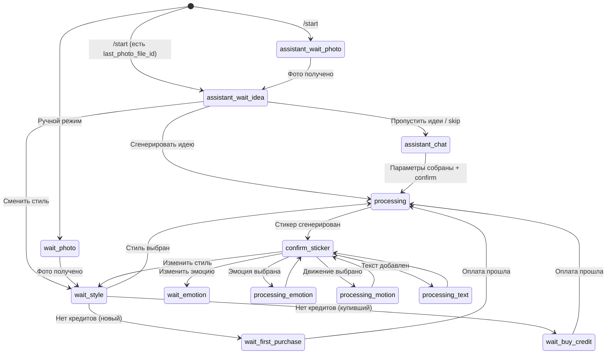
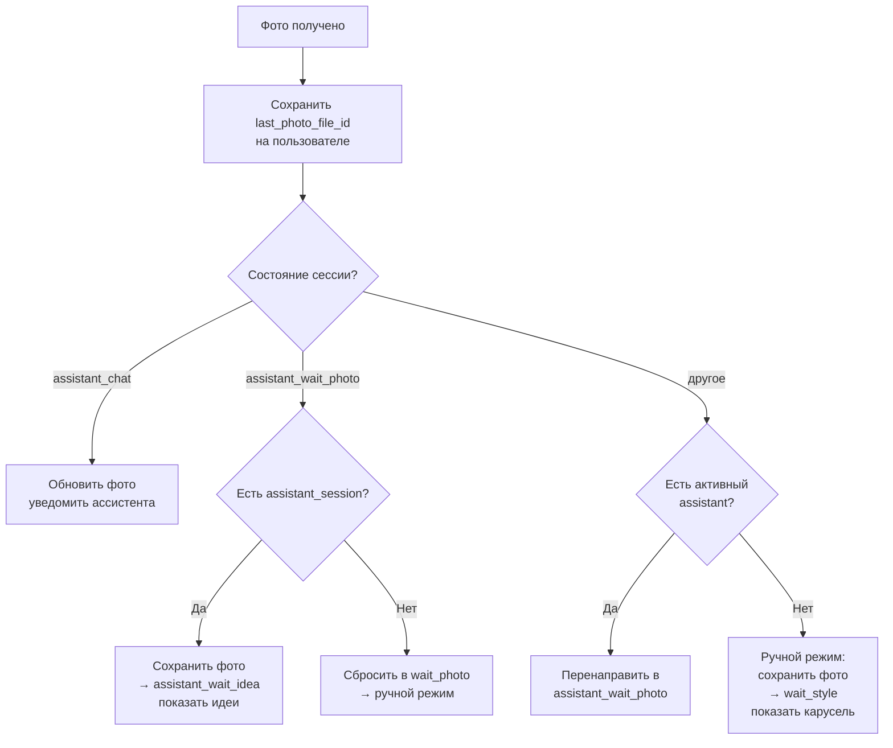

# API / Bot — `src/index.ts`

Основной процесс приложения. Telegram-бот на Telegraf 4 с long polling.
Обрабатывает все входящие сообщения, управляет сессиями, оплатой и UI.

## Состояния сессии (`session_state`)

Сессия — основная сущность, привязанная к пользователю. Состояние определяет,
что бот ожидает от пользователя.

### Полный список состояний

| Состояние | Описание |
|-----------|----------|
| `assistant_wait_photo` | Ассистент ждёт фото от пользователя |
| `assistant_wait_idea` | Показаны идеи стикеров — пользователь может сгенерировать, пропустить или сменить стиль |
| `assistant_chat` | Активный диалог с ассистентом (сбор стиля/эмоции/позы) |
| `wait_photo` | Ручной режим — ждём фото |
| `wait_style` | Фото есть — ждём выбор стиля (карусель) |
| `wait_custom_style_v2` | Ждём текстовое описание своего стиля |
| `wait_emotion` | Ждём выбор эмоции |
| `wait_custom_emotion` | Ждём текстовое описание своей эмоции |
| `wait_custom_motion` | Ждём текстовое описание своего движения |
| `wait_text_overlay` | Ждём текст для наложения на стикер |
| `wait_first_purchase` | Paywall — новый пользователь, первая покупка |
| `wait_buy_credit` | Paywall — нужны кредиты |
| `processing` | Генерация стикера (стиль) |
| `processing_emotion` | Генерация стикера (эмоция) |
| `processing_motion` | Генерация стикера (движение) |
| `processing_text` | Генерация стикера (текст) |
| `confirm_sticker` | Стикер готов — выбор действий |
| `waiting_custom_idea` | Ждём описание идеи для пака |
| `wait_pack_photo` | Flow "Сделать пак" — ждём фото |
| `wait_pack_preview_payment` | Фото есть — выбор style preset v2 + кнопка превью за 1 кредит |
| `generating_pack_preview` | Генерация превью-листа пака |
| `wait_pack_approval` | Превью показано — одобрение / реген / отмена |
| `processing_pack` | Сборка и публикация Telegram sticker set |
| `canceled` | Сессия отменена |

## Хендлеры бота

### Команды

| Команда | Описание |
|---------|----------|
| `/start` | Регистрация, UTM-трекинг, запуск ассистента. Поддерживает deep links: `val_STYLE_ID` (Valentine), UTM параметры |
| `/balance` | Показать баланс + пакеты кредитов |
| `/support` | Контакт поддержки |

### Меню (Reply Keyboard)

| Кнопка | Описание |
|--------|----------|
| 🤖 Помощник | Запустить/продолжить AI-ассистент |
| 🎨 Стили | Переключиться в ручной режим, показать карусель стилей |
| 📦 Сделать пак | Запуск flow пакетной генерации (preview + approve) |
| 💰 Баланс | Баланс + пакеты |
| ❓ Помощь | Справка |

### Обработка фото (`bot.on("photo")`)

### Обработка текста (`bot.on("text")`)

Маршрутизация по `session.state`:
- `assistant_wait_photo` → AI чат (пользователь может описывать цель до фото)
- `assistant_chat` → AI чат (основной диалог)
- `wait_custom_style_v2` → Приём описания стиля → генерация
- `wait_custom_emotion` → Приём описания эмоции → генерация
- `wait_custom_motion` → Приём описания движения → генерация
- `wait_text_overlay` → Наложение текста на стикер (без AI)
- `waiting_custom_idea` → Генерация кастомной идеи для пака

### Callback-кнопки (inline keyboard)

#### Стили
- `style_carousel_pick:ID` — выбрать стиль из карусели
- `style_carousel_next:PAGE:MSG_IDS` — следующая страница карусели
- `style_v2:ID` — выбрать стиль V2
- `style_group:ID` → `style_v2:ID` — выбор через группы
- `style_custom_v2` — свой стиль (текстом)

#### Модификации стикера (после генерации)
- `change_style` / `change_style:ID` — изменить стиль
- `change_emotion` / `change_emotion:ID` — изменить эмоцию
- `emotion_ID` — выбрать пресет эмоции
- `change_motion` / `change_motion:ID` — изменить движение
- `motion_ID` — выбрать пресет движения
- `add_text:ID` — добавить текст
- `toggle_border:ID` — вкл/выкл белую рамку
- `add_to_pack` / `add_to_pack:ID` — добавить в стикерпак

#### Ассистент
- `assistant_confirm` — подтвердить параметры, запустить генерацию
- `assistant_restart` — начать заново
- `assistant_new_photo` — загрузить новое фото
- `assistant_keep_photo` — оставить текущее фото
- `assistant_pick_style:ID` — выбрать стиль из примеров

#### Идеи для пака
- `pack_ideas:ID` — показать идеи для стикера
- `idea_generate:N` — сгенерировать идею №N
- `idea_next` / `idea_back` / `idea_more` / `idea_done` — навигация
- `custom_idea` / `idea_generate_custom` — кастомная идея

#### "Сделать пак"
- `pack_start:TEMPLATE_ID` — старт flow по выбранному template
- `pack_style:STYLE_ID` — выбрать style preset v2 перед preview
- `pack_preview_pay` — оплатить превью (1 кредит)
- `pack_approve` — оплатить сборку (N-1) и запустить assemble
- `pack_regenerate` — перегенерировать preview (1 кредит)
- `pack_cancel` — отменить pack flow

#### Идеи стикеров (ассистент, assistant_wait_idea)
- `asst_idea_gen` — сгенерировать выбранную идею
- `asst_idea_next` — следующая идея
- `asst_idea_restyle` — сменить стиль
- `asst_idea_style` — выбрать стиль из примеров
- `asst_idea_back` — назад
- `asst_idea_custom` — своя идея (текстом)
- `asst_idea_skip` — пропустить, перейти в assistant_chat

#### Оплата
- `pack_CREDITS_PRICE` — выбрать пакет кредитов
- `buy_credits` — показать пакеты

#### Другое
- `rate:ID:SCORE` — оценить стикер (1-5)
- `make_example:ID` — пометить как пример стиля (admin)
- `retry_generation:ID` — повторить генерацию
- `new_photo` — загрузить новое фото
- `cancel` — отменить
- `noop` — пустое действие (для неактивных кнопок)

## Ключевые функции

### `startGeneration(ctx, user, session, lang, options)`
Главная точка входа в генерацию. Проверяет кредиты, показывает paywall если нужно,
списывает кредиты атомарно, создаёт job в очереди.

### `startAssistantDialog(ctx, user, lang)`
Инициализирует AI-ассистента. Закрывает старые сессии, создаёт новую.
Если есть `last_photo_file_id` — создаёт сессию в `assistant_wait_idea` и сразу показывает идеи стикеров. Иначе — `assistant_wait_photo`.

### `sendStyleCarousel(ctx, lang, page?)`
Отправляет карусель стилей — по 2 стиля на страницу с примерами и навигацией.
→ Подробнее: [06-style-carousel.md](./06-style-carousel.md)

### `handleAssistantConfirm(ctx, user, sessionId, lang)`
Обработка подтверждения от ассистента — собирает параметры, строит промпт, запускает генерацию.

### `processAssistantResult(result, aSession, messages)`
Обрабатывает ответ AI — извлекает tool calls, обновляет параметры в БД,
определяет action (`confirm`, `show_mirror`, `photo`, `grant_credit`, etc.)

### `getActiveSession(userId)`
Получает активную сессию. Есть fallback: если `is_active = true` не находит,
ищет последнюю не-canceled сессию (workaround для бага с `is_active`).

### `getUserPhotoFileId(user, session)`
Ищет фото: сначала `session.current_photo_file_id`, потом `user.last_photo_file_id`.
Позволяет переиспользовать фото между режимами.

## Кеширование

| Данные | TTL | Функция |
|--------|-----|---------|
| Style presets | 5 мин | `getStylePresets()` |
| Style presets V2 | 5 мин | `getStylePresetsV2()` |
| Emotion presets | 5 мин | `getEmotionPresets()` |
| Motion presets | 5 мин | `getMotionPresets()` |
| Bot texts (i18n) | 5 мин | `getText()` |
