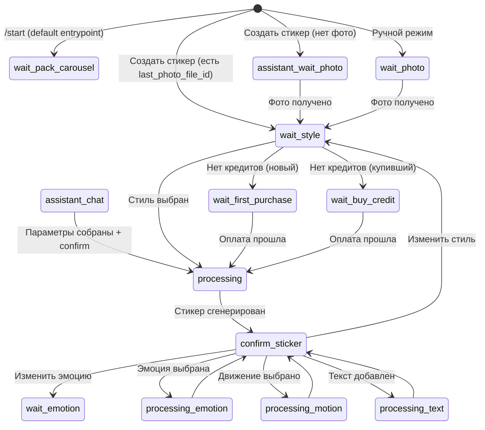
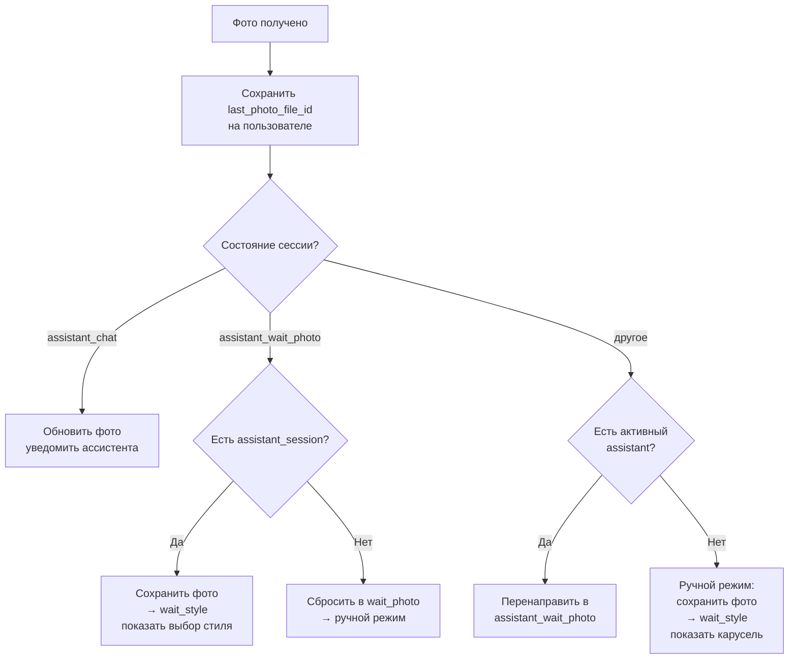

# API / Bot — `src/index.ts`

Основной процесс приложения. Telegram-бот на Telegraf 4 с long polling.
Обрабатывает все входящие сообщения, управляет сессиями, оплатой и UI.

## Состояния сессии (`session_state`)

Сессия — основная сущность, привязанная к пользователю. Состояние определяет,
что бот ожидает от пользователя.

```mermaid
stateDiagram-v2
    [*] --> wait_pack_carousel: /start (default entrypoint)
    [*] --> assistant_wait_photo: Создать стикер (нет фото)
    [*] --> wait_style: Создать стикер (есть last_photo_file_id)
    assistant_wait_photo --> wait_style: Фото получено
    assistant_chat --> processing: Параметры собраны + confirm

    [*] --> wait_photo: Ручной режим
    wait_photo --> wait_style: Фото получено
    wait_style --> processing: Стиль выбран

    processing --> confirm_sticker: Стикер сгенерирован
    confirm_sticker --> wait_style: Изменить стиль
    confirm_sticker --> wait_emotion: Изменить эмоцию
    confirm_sticker --> processing_emotion: Эмоция выбрана
    confirm_sticker --> processing_motion: Движение выбрано
    confirm_sticker --> processing_text: Текст добавлен

    processing_emotion --> confirm_sticker
    processing_motion --> confirm_sticker
    processing_text --> confirm_sticker

    wait_style --> wait_first_purchase: Нет кредитов (новый)
    wait_style --> wait_buy_credit: Нет кредитов (купивший)
    wait_first_purchase --> processing: Оплата прошла
    wait_buy_credit --> processing: Оплата прошла
```

### Полный список состояний

| Состояние | Описание |
|-----------|----------|
| `assistant_wait_photo` | Ассистент ждёт фото от пользователя |
| `assistant_chat` | Активный диалог с ассистентом (сбор стиля/эмоции/позы) |
| `wait_photo` | Ручной режим — ждём фото |
| `wait_style` | Фото есть — ждём выбор стиля (карусель) |
| `wait_emotion` | Ждём выбор эмоции |
| `wait_custom_emotion` | Ждём текстовое описание своей эмоции |
| `wait_custom_motion` | Ждём текстовое описание своего движения |
| `wait_text_overlay` | Ждём текст для наложения на стикер |
| `wait_replace_face` | Unified flow замены лица: ждём фото и/или стикер-референс |
| `wait_first_purchase` | Paywall — новый пользователь, первая покупка |
| `wait_buy_credit` | Paywall — нужны кредиты |
| `processing` | Генерация стикера (стиль) |
| `processing_emotion` | Генерация стикера (эмоция) |
| `processing_motion` | Генерация стикера (движение) |
| `processing_text` | Генерация стикера (текст) |
| `confirm_sticker` | Стикер готов — выбор действий |
| `waiting_custom_idea` | Ждём описание идеи для пака |
| `wait_pack_carousel` | Карусель наборов контента (подписи/сцены) для шаблона пака. При активной записи `holiday_themes.id = march_8` отображается кнопка переключения «С 8 марта: off/on»; состояние хранится в `sessions.pack_holiday_id`. |
| `wait_pack_generate_request` | Admin (test): ждём тему пака одной фразой → запуск пайплайна генерации (Brief & Plan → Captions ∥ Scenes → Critic). Вход: кнопка меню «Сгенерировать пак» или inline под каруселью. |
| `wait_pack_photo` | Flow "Сделать пак" — ждём фото |
| `wait_pack_preview_payment` | Фото есть — выбор style preset v2 + кнопка превью за 1 кредит |
| `generating_pack_preview` | Генерация превью-листа пака |
| `wait_pack_approval` | Превью показано — одобрение / реген / отмена |
| `processing_pack` | Сборка и публикация Telegram sticker set |
| `canceled` | Сессия отменена |

## Subject profile (пол по фото) при смене фото

При любой смене текущего фото в сессии в фоне запускается детекция (subject/object profile, в т.ч. пол). Точки входа: загрузка первого фото в паке (`wait_pack_photo`), загрузка фото в single (`wait_photo` → `wait_style`), первое фото в ассистенте (`assistant_wait_photo`), а также все callback'и «Новое фото» — `pack_new_photo`, `single_new_photo`, `assistant_new_photo` (все ветки). Подробно: [11-subject-profile-and-gender.md](11-subject-profile-and-gender.md).

## Хендлеры бота

### Команды

| Команда | Описание |
|---------|----------|
| `/start` | Регистрация, UTM-трекинг, запуск pack-flow по умолчанию. Поддерживает deep links: `val_STYLE_ID` (приоритетный special-flow), UTM параметры |
| `/balance` | Показать баланс + пакеты кредитов |
| `/support` | Контакт поддержки |

### Меню (Reply Keyboard)

| Кнопка | Описание |
|--------|----------|
| 📦 Создать пак | Запуск flow пакетной генерации (preview + approve) |
| 🔄 Сгенерировать пак | **Только admin, только test.** Прямой вход в генерацию пака по теме (без фото): создаётся сессия `wait_pack_generate_request`, запрос темы → пайплайн Brief & Plan → Captions ∥ Scenes → Assembly → Critic. См. `docs/20-02-admin-generate-pack-menu-button.md`. |
| 💰 Ваш баланс | Баланс + пакеты |
| 💬 Поддержка | Справка/контакт поддержки |

Кнопка «🔄 Сгенерировать пак» показывается только при `config.appEnv === "test"` и `config.adminIds.includes(telegramId)`; клавиатура строится в `getMainMenuKeyboard(lang, telegramId)`.

`✨ Создать стикер` временно скрыта из `ReplyKeyboard`, но legacy-хендлер сохранен для обратной совместимости.

### Обработка фото (`bot.on("photo")`)

```mermaid
flowchart TD
    PHOTO[Фото получено] --> SAVE_LAST[Сохранить last_photo_file_id<br/>на пользователе]
    SAVE_LAST --> CHECK_STATE{Состояние сессии?}

    CHECK_STATE -->|assistant_chat| UPDATE_PHOTO[Обновить фото<br/>уведомить ассистента]
    CHECK_STATE -->|assistant_wait_photo| HAS_ASESSION{Есть assistant_session?}
    HAS_ASESSION -->|Да| ASSISTANT_FLOW[Сохранить фото<br/>→ wait_style<br/>показать выбор стиля]
    HAS_ASESSION -->|Нет| FALLBACK[Сбросить в wait_photo<br/>→ ручной режим]

    CHECK_STATE -->|другое| REROUTE{Есть активный<br/>assistant?}
    REROUTE -->|Да| RE[Перенаправить в<br/>assistant_wait_photo]
    REROUTE -->|Нет| MANUAL[Ручной режим:<br/>сохранить фото<br/>→ wait_style<br/>показать карусель]
```

Дополнительно для активных flow:
- `assistant_chat` и `wait_style`: новое фото не ломает flow, бот спрашивает "новое или текущее фото" (`assistant_new_photo` / `assistant_keep_photo` для assistant_chat; `single_new_photo` / `single_keep_photo` для wait_style).
- `wait_pack_preview_payment` и `wait_pack_approval`: аналогичный выбор для pack flow (`pack_new_photo` / `pack_keep_photo`) с продолжением pack-сценария.

### Обработка текста (`bot.on("text")`)

Маршрутизация по `session.state`:
- `assistant_wait_photo` → AI чат (пользователь может описывать цель до фото)
- `assistant_chat` → AI чат (основной диалог)
- `wait_style` + текст -> текстовый стиль отключён, бот возвращает пользователя к preset-кнопкам выбора стиля
- `wait_custom_emotion` → Приём описания эмоции → генерация
- `wait_custom_motion` → Приём описания движения → генерация
- `wait_text_overlay` → Наложение текста на стикер (без AI)
- `waiting_custom_idea` → Генерация кастомной идеи для пака

### Callback-кнопки (inline keyboard)

#### Стили
- `style_carousel_pick:ID` — выбрать стиль из карусели
- `style_carousel_next:PAGE:MSG_IDS` — следующая страница карусели
- `style_v2:ID` — выбрать стиль V2
- `style_group:ID` → `style_v2:ID` — выбор через группы
- `style_custom_v2` — свой стиль (текстом)

#### Модификации стикера (после генерации)
- `change_style` / `change_style:ID` — изменить стиль
- `change_emotion` / `change_emotion:ID[:SESSION_ID[:REV]]` — изменить эмоцию
- `emotion_ID` — выбрать пресет эмоции
- `change_motion` / `change_motion:ID[:SESSION_ID[:REV]]` — изменить движение
- `motion_ID` — выбрать пресет движения
- `add_text:ID` — добавить текст
- `toggle_border:ID` — вкл/выкл белую рамку
- `add_to_pack` / `add_to_pack:ID` — добавить в стикерпак

#### Ассистент
- `assistant_confirm[:SESSION_ID[:REV]]` — подтвердить параметры, запустить генерацию
- `assistant_restart[:SESSION_ID[:REV]]` — начать заново
- `assistant_new_photo[:SESSION_ID[:REV]]` — загрузить новое фото
- `assistant_keep_photo[:SESSION_ID[:REV]]` — оставить текущее фото
- `assistant_style_preview:STYLE_ID[:SESSION_ID[:REV]]` — показать превью стиля
- `assistant_style_preview_ok:STYLE_ID:STICKER_MSG_ID[:SESSION_ID[:REV]]` — применить стиль из превью
- `assistant_pick_style:STYLE_ID[:SESSION_ID[:REV]]` — выбрать стиль из примеров

#### Идеи для пака
- `pack_ideas:ID` — показать идеи для стикера
- `idea_generate:N` — сгенерировать идею №N
- `idea_next` / `idea_back` / `idea_more` / `idea_done` — навигация
- `custom_idea` / `idea_generate_custom` — кастомная идея

#### "Сделать пак"
- `pack_show_carousel:TEMPLATE_ID` — шаг 2: показать карусель наборов контента (после приглашения)
- `pack_carousel_prev` / `pack_carousel_next` / `pack_carousel_noop` — навигация по карусели
- `pack_holiday:march_8` — включить праздничные наборы (8 марта); карусель переключается на наборы с `pack_template_id = march_8`
- `pack_holiday_off` — выключить праздник, вернуть обычные наборы
- `pack_try:CONTENT_SET_ID` — выбрать набор и перейти к фото/стилю (wait_pack_photo или wait_pack_preview_payment)
- `pack_start:TEMPLATE_ID` — старт flow по выбранному template (fallback, без карусели)
- `pack_style:STYLE_ID` — выбрать style preset v2 перед preview
- `pack_preview_pay:SESSION_ID[:REV]` — оплатить превью (1 кредит)
- `pack_new_photo:SESSION_ID[:REV]` — использовать новое фото и вернуться к шагу выбора стиля
- `pack_keep_photo:SESSION_ID[:REV]` — оставить текущее фото и продолжить текущий шаг pack flow
- `pack_back_to_carousel:SESSION_ID[:REV]` — вернуться к выбору поз
- `pack_approve:SESSION_ID[:REV]` — оплатить сборку (N-1) и запустить assemble
- `pack_regenerate:SESSION_ID[:REV]` — перегенерировать preview (1 кредит)
- `pack_cancel:SESSION_ID[:REV]` — отменить pack flow

#### Идеи стикеров (legacy, assistant_wait_idea — шаг «идея» удалён, flow переведён на выбор стиля)
- `asst_idea_gen:INDEX[:SESSION_ID[:REV]]` — сгенерировать выбранную идею
- `asst_idea_next:INDEX[:SESSION_ID[:REV]]` — следующая идея
- `asst_idea_restyle:STYLE_ID:INDEX[:SESSION_ID[:REV]]` — сменить стиль
- `asst_idea_restyle_ok:STYLE_ID:INDEX:STICKER_MSG_ID[:SESSION_ID[:REV]]` — подтвердить новый стиль
- `asst_idea_style:INDEX[:SESSION_ID[:REV]]` — выбрать стиль из примеров
- `asst_idea_back:INDEX[:SESSION_ID[:REV]]` — назад
- `asst_idea_holiday:HOLIDAY_ID:INDEX[:SESSION_ID[:REV]]` — включить holiday-режим
- `asst_idea_holiday_off:INDEX[:SESSION_ID[:REV]]` — выключить holiday-режим
- `asst_idea_custom[:SESSION_ID[:REV]]` — своя идея (текстом)
- `asst_idea_skip[:SESSION_ID[:REV]]` — пропустить, перейти в assistant_chat

#### Оплата
- `pack_CREDITS_PRICE` — выбрать пакет кредитов
- `buy_credits` — показать пакеты

#### Другое
- `rate:ID:SCORE` — оценить стикер (1-5)
- `make_example:ID` — пометить как пример стиля (admin)
- `retry_generation:SESSION_ID[:REV]` — повторить генерацию
- `new_photo` — загрузить новое фото
- `single_new_photo:SESSION_ID[:REV]` — использовать новое фото в single flow (переход к выбору стиля)
- `single_keep_photo:SESSION_ID[:REV]` — оставить текущее фото в single flow
- `cancel` — отменить
- `noop` — пустое действие (для неактивных кнопок)

### Unified replacement-photo rule
- Если в текущей session уже есть `current_photo_file_id`, при отправке нового фото бот сначала спрашивает выбор:
  - использовать новое фото,
  - или оставить текущее.
- Это правило применяется для `assistant`, `pack` и `single` flow (кроме hard-processing состояний).
- Источник "рабочего фото" централизован: `session.current_photo_file_id || user.last_photo_file_id`.

### Subject/Object Profile Contract (phase 1 -> v2 compatible)
- Перед генерацией API определяет source через общий resolver `resolveGenerationSource(...)`:
  - `style` -> зависит от `sessions.style_source_kind`:
    - `photo` -> `current_photo_file_id`,
    - `sticker` -> `last_sticker_file_id`;
  - `emotion`/`motion`/`text` -> `last_sticker_file_id` (sticker).
- Маршрутизация style-source:
  - стиль из меню действий/по фото -> `style_source_kind=photo`,
  - стиль из карточки готового стикера (`change_style:ID`) -> `style_source_kind=sticker`.
- Для sticker-target callbacks (`change_style|change_emotion|change_motion`) photo-context нормализуется через единый resolver:
  - если `stickers.source_photo_file_id` выглядит как Telegram photo (`AgAC...`) — берём его;
  - иначе берём fallback `users.last_photo_file_id` (или текущий `sessions.current_photo_file_id`);
  - в `sessions.photos` хранится нормализованный список из одного активного фото (`[current_photo_file_id]`), а второе значение допускается только как временный `pending_photo_file_id` во время confirm-сценария "new vs keep photo".
- Для sticker callback с `SESSION_ID:REV` используется strict stale-check (`strict_session_rev_enabled`), чтобы старые inline-кнопки не перезаписывали актуальный photo/sticker context.
- При включенном `subject_profile_enabled` API сохраняет в `sessions` профиль субъекта:
  `subject_mode`, `subject_count`, `subject_confidence`, `subject_source_file_id`, `subject_source_kind`, `subject_detected_at`.
- При наличии object-v2 колонок API делает dual-write в `object_*` с fallback на legacy `subject_*`.
- При включенном `subject_lock_enabled` или `object_lock_enabled` в финальный prompt добавляется обязательный `Subject Lock Block`.
- Для pack flow проверка совместимости выбранного `pack_content_set` использует effective mode: `sessions.object_mode` -> fallback `sessions.subject_mode`.

## Ключевые функции

### `startGeneration(ctx, user, session, lang, options)`
Главная точка входа в генерацию. Проверяет кредиты, показывает paywall если нужно,
списывает кредиты атомарно, создаёт job в очереди.
Также здесь применяется Subject/Object Profile Contract: расчет source, (опционально) детект профиля и инъекция lock-блока в prompt.

### `startAssistantDialog(ctx, user, lang)`
Инициализирует AI-ассистента. Закрывает старые сессии, создаёт новую.
Если есть `last_photo_file_id` — создаёт сессию в `wait_style` и сразу показывает выбор стиля. Иначе — `assistant_wait_photo`.
Сейчас не используется как default entrypoint из `/start` (вход по умолчанию переведен в pack flow).

### `handlePackMenuEntry(ctx, options?)`
Единая точка входа в pack flow для `/start`, кнопки меню и broadcast CTA.
Проверяет guard по активным processing-state, не сбрасывает текущий тяжелый процесс,
создает новую pack session и показывает карусель контент-наборов.

### `sendStyleCarousel(ctx, lang, page?)`
Отправляет карусель стилей — по 2 стиля на страницу с примерами и навигацией.
→ Подробнее: [06-style-carousel.md](./06-style-carousel.md)

### `handleAssistantConfirm(ctx, user, sessionId, lang)`
Обработка подтверждения от ассистента — собирает параметры, строит промпт, запускает генерацию.

### `processAssistantResult(result, aSession, messages)`
Обрабатывает ответ AI — извлекает tool calls, обновляет параметры в БД,
определяет action (`confirm`, `show_mirror`, `photo`, `grant_credit`, etc.)

### `getActiveSession(userId)`
Получает активную сессию. Есть fallback: если `is_active = true` не находит,
ищет последнюю "живую" сессию по whitelist состояний:
сначала по `updated_at` (recent window), затем по `created_at` (secondary fallback для окружений,
где `updated_at` может не обновляться/быть `null`).

### Session Router (pack/single/assistant callbacks)
- Для критичных callback-событий pack/single/assistant flow используется резолв сессии по `session_id` из `callback_data`.
- В callback поддерживаются форматы `action:sid` и `action:sid:rev`.
- Для предотвращения переполнения Telegram `callback_data` (лимит 64 bytes) `sid` кодируется в компактный base64url-токен (22 символа) вместо полного UUID; парсер поддерживает оба формата (новый token и legacy UUID).
- При `session_router_enabled=true` legacy fallback на "текущую активную сессию" отключается: callback без `sid` отклоняется как `session_not_found`.
- При включенном флаге `strict_session_rev_enabled=true` stale-кнопки отбрасываются с user-facing reason через `answerCbQuery`.
- Для `style_preview`/`style_v2` также используется `sid:rev`: stale определяется прежде всего по `session_rev`; для explicit callback на `is_active=false` выполняется дополнительная сверка с текущей style-session (`getSessionForStyleSelection`) и reject происходит только если callback указывает не на актуальную style-session пользователя.
- Во flow `wait_style` (`change_style` / ручной выбор стиля) `style_preview` больше не открывает отдельный экран подтверждения: API обновляет текущую клавиатуру стилей (показывает описание выбранного стиля и кнопку `Try with ...` над списком стилей), отмечает выбранный стиль в кнопках и отправляет пример стикера отдельным сообщением.
- В переходах single-style (`wait_action -> wait_style`, `wait_style -> wait_buy_credit|processing`) обновления `sessions` имеют fallback без `style_source_kind`, если schema cache окружения временно не видит колонку `style_source_kind`.
- Для pack callback-reject (`session_not_found`, `wrong_state`, `stale_callback`) используется явный `show_alert=true`, чтобы убрать "тихие" клики.
- На переходах в `generating_pack_preview` и `processing_pack` UI-клавиатура lock-ится до `noop`-кнопки (`⏳ ...`), чтобы снизить повторные/конфликтующие клики.

### Резолв сессии для текстовых сообщений (pack theme и др.)
Соответствует [16-02-session-architecture-requirements.md](../done/02/16-02-session-architecture-requirements.md) п. 4.1 (flow-aware fallback при отсутствии session_id в событии):

1. **Первичный резолв:** `getActiveSession(userId)` — активная сессия по `is_active = true` или fallback по whitelist состояний.
2. **При `session === null` (test + admin):** flow-aware fallback для ввода темы пака — запрос сессий в состояниях `wait_pack_generate_request`, `wait_pack_rework_feedback`, `wait_pack_carousel` (order by `updated_at` desc, limit 1). Так обрабатывается ввод темы и с карусели, и после нажатия «Сгенерировать пак».
3. **Доп. fallback:** если по п.2 сессия не найдена — `getPackFlowSession(userId)`; подставляем сессию только если `state` ∈ `{wait_pack_carousel, wait_pack_generate_request}` (ожидание темы).
4. **Refinement (test + admin):** если сессия найдена по п.1, но не в pack-theme состоянии, а в БД есть другая сессия в `wait_pack_generate_request` / `wait_pack_carousel` — подставляем её (getActiveSession мог вернуть сессию по `updated_at` из другого flow).
5. **При отсутствии сессии:** ответ «Нажми /start» (без silent-return).

### Вход в pack flow (handlePackMenuEntry) и «stale processing»
При нажатии «📦 Создать пак» или `/start` (pack entry): после `getActiveSession` проверяется, не находится ли пользователь в «активной генерации» (`generating_pack_preview` или `processing_pack`). Если да — показ «подожди, идёт обработка» и **пропуск** создания новой сессии только если эта сессия **не устарела**: `updated_at` в пределах 10 минут. Если `updated_at` старше 10 мин или отсутствует, сессия считается заброшенной — вход разрешён, создаётся новая pack-сессия (существующие деактивируются при insert). Так избегают залипания на старых «processing» без ответа воркера.

### `getUserPhotoFileId(user, session)`
Ищет фото: сначала `session.current_photo_file_id`, потом `user.last_photo_file_id`.
Позволяет переиспользовать фото между режимами.

## Кеширование

| Данные | TTL | Функция |
|--------|-----|---------|
| Style presets | 5 мин | `getStylePresets()` |
| Style presets V2 | 5 мин | `getStylePresetsV2()` |
| Emotion presets | 5 мин | `getEmotionPresets()` |
| Motion presets | 5 мин | `getMotionPresets()` |
| Bot texts (i18n) | 5 мин | `getText()` |

### Gemini route switch (runtime)

- Все Gemini-вызовы в API выбирают base URL через `app_config.gemini_use_proxy` (TTL cache 60s):
  - `true` -> `GEMINI_PROXY_BASE_URL` (proxy route),
  - `false` -> direct Google endpoint `https://generativelanguage.googleapis.com`.
- Лог `[GeminiRoute][API]` показывает фактический runtime-маршрут (`baseUrl`, `host`, `viaProxy`) на старте процесса.

## Edit Sticker Flow (menu: "🎨 Изменить стикер")

- Новый entrypoint из persistent menu: `🎨 Изменить стикер` / `🎨 Edit sticker`.
- API создаёт новую single-session в состоянии `wait_edit_sticker`.
- Отдельный `bot.on("sticker")` handler принимает статичный Telegram sticker, сохраняет его как импортированный record в `stickers` и переводит session в `wait_edit_action`.
- Под импортированным стикером показываются стандартные кнопки (`change_emotion`, `change_motion`, `toggle_border`, `add_text`) + новая `replace_face`.
- Callback `replace_face:<stickerId>` переводит в единый flow `wait_replace_face`:
  - сохраняется `edit_replace_sticker_id` (целевой стикер);
  - бот всегда просит фото identity;
  - после фото generation `replace_subject` запускается сразу (без промежуточных кнопок).

## Replace Face (unified flow)

- Entry A: `action_replace_face` (из меню действий по фото) → `wait_replace_face` → бот просит фото → затем просит стикер.
- Entry B: `replace_face:<stickerId>` (из меню под стикером) → `wait_replace_face` с заполненным `edit_replace_sticker_id` → бот просит фото.
- После получения обоих входов (identity photo + sticker reference) запускается `startGeneration(..., generationType="replace_subject")`.
- Source of truth: одно состояние `wait_replace_face`, без разветвления по `wait_edit_photo`/`wait_replace_face_sticker`.
