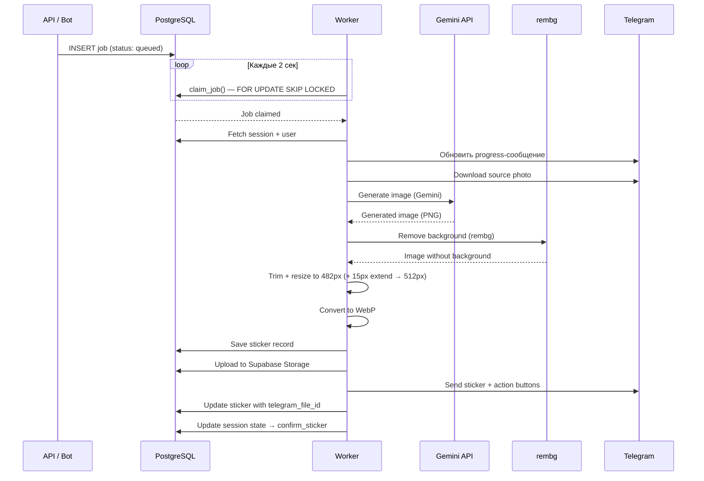
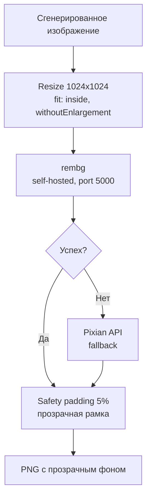

# Worker — `src/worker.ts`

Фоновый процесс, который обрабатывает задания на генерацию стикеров.
Работает отдельным Docker-контейнером, поллит очередь заданий из PostgreSQL.

## Принцип работы



## Пайплайн генерации

### 1. Получение задания
- `claim_job(worker_id, env)` — RPC-функция с `FOR UPDATE SKIP LOCKED`
- Предотвращает двойную обработку при нескольких воркерах
- Worker ID: `photo2sticker-{env}-worker-{N}-{timestamp}`

### 2. Подготовка
- Загрузка сессии и пользователя из БД
- Определение типа генерации (`style`, `emotion`, `motion`, `text`)
- Обновление progress-сообщения: "⏳ Генерирую стикер..."

### 3. Скачивание исходного фото
- Источник: `session.current_photo_file_id` (Telegram file_id)
- Скачивание через Telegram Bot API → Buffer

### 4. Генерация изображения (Gemini)
- Модель: настраивается через `app_config` (по умолчанию: style → `gemini-3-pro-image-preview`, emotion/motion → `gemini-2.5-flash-image`)
- Входные данные: исходное фото + промпт
- Промпт содержит:
  - Инструкцию по стилю (из style preset или кастомный)
  - Требование фона: "flat uniform single color, highly contrasting"
  - Требования к композиции (не обрезать, оставить padding)
  - Требования к качеству (без водяных знаков, текста и т.д.)
- Retry с exponential backoff (3 попытки)

### 5. Модерация контента
- Проверка на blocked content от Gemini
- Если заблокировано — уведомление пользователю + alert

### 6. Удаление фона



**rembg** (основной):
- Self-hosted сервис на `http://p2s-rembg:5000`
- Модель: isnet-general-use (ранее u2net — обновлено 2026-02-13)
- Вход: изображение ресайзится до 1024x1024 (fit: inside, withoutEnlargement) перед отправкой
- 2 попытки
- Health check перед каждым запросом

**Pixian** (fallback):
- Внешний API (pixian.ai)
- Используется если rembg недоступен или упал
- Авторизация через username/password

### 7. Финализация изображения
- Safety padding: после rembg добавляется 5% прозрачная рамка (`safetyPad = Math.round(Math.max(width, height) * 0.05)`)
- Trim пустого пространства (sharp)
- Resize до 482px (вписать, сохранить пропорции), затем extend +15px с каждой стороны → 512x512
- Конвертация в WebP (quality: 95%)

### 8. Сохранение и отправка
- INSERT в `stickers` таблицу
- Upload в Supabase Storage (`stickers` bucket)
- Отправка стикера через Telegram API
- Обновление `telegram_file_id` на записи стикера
- Обновление сессии: `state → confirm_sticker`

### 9. Пост-генерация
- **Онбординг** (первый стикер): специальное CTA-сообщение с идеями
- **Обычная генерация**: кнопки действий (стиль, эмоция, движение, текст, пак)
- Нотификация в алерт-канал (новый стикер)
- Инкремент `total_generations` у пользователя

## Pack flow в Worker (preview + assemble)

- `runPackPreviewJob`:
  - берёт `pack_templates.scene_descriptions` и `style_prompt_base`
  - добавляет выбранный пользователем `sessions.selected_style_id` (`style_presets_v2.prompt_hint`) в промпт
  - включает блок `identity preservation` (сохранение facial identity)
  - генерирует лист NxN и сохраняет `pack_sheet_file_id`

- `runPackAssembleJob`:
  - скачивает `pack_sheet_file_id`, режет на ячейки
  - удаление фона для пака: **rembg-only**
  - накладывает labels (`pack_templates.labels` / `labels_en`)
  - собирает Telegram sticker set (`createNewStickerSet` + `addStickerToSet`)

## Цепочка генерации (бизнес-логика)

```
Фото (AgAC) ──[style]──> Стикер (CAAC)
                               │
                     ┌─────────┼─────────┐
                     ▼         ▼         ▼
               [emotion]   [motion]   [text]
                     │         │         │
                     ▼         ▼         ▼
               Новый стикер (CAAC) ──> [emotion/motion] ──> ...
```

### Правила

- **Style** — ТОЛЬКО из оригинального фото пользователя (AgAC)
- **Emotion / Motion** — ТОЛЬКО из ранее созданного стикера (CAAC), НИКОГДА из фото
- **Text** — оверлей поверх стикера, генерация через Gemini не используется
- Цепочки произвольной длины: style → motion → emotion → motion → ...

### Типы генерации

| Тип | Источник (input) | `source_photo_file_id` в БД | Промпт |
|-----|-----------------|----------------------------|--------|
| `style` | Оригинальное фото (AgAC) | Оригинальное фото (AgAC) | style preset prompt_hint |
| `emotion` | Предыдущий стикер (CAAC) | Этот же стикер (CAAC) | emotion preset + стикер |
| `motion` | Предыдущий стикер (CAAC) | Этот же стикер (CAAC) | motion preset + стикер |
| `text` | Нет генерации | — | текстовый оверлей |

### Код определения источника

```typescript
// worker.ts — определение sourceFileId
const sourceFileId =
  generationType === "emotion" || generationType === "motion" || generationType === "text"
    ? session.last_sticker_file_id    // стикер (CAAC)
    : session.current_photo_file_id;  // оригинальное фото (AgAC)

// source_photo_file_id в БД = всегда sourceFileId
const savedSourcePhotoFileId = sourceFileId;
```

## Конфигурация

| Параметр | Default | Описание |
|----------|---------|----------|
| `JOB_POLL_INTERVAL_MS` | 2000 | Интервал опроса очереди |
| `APP_ENV` | prod | Окружение (фильтр заданий) |
| Gemini model | app_config (style: gemini-3-pro-image-preview, emotion/motion: gemini-2.5-flash-image) | Модель генерации |
| rembg URL | http://p2s-rembg:5000 | Адрес сервиса удаления фона |

## Обработка ошибок

- Retry генерации (3 попытки с backoff)
- Retry rembg (2 попытки)
- Fallback на Pixian при сбое rembg
- Alert в канал при критических ошибках
- Job помечается как `error` при исчерпании попыток
- Сообщение пользователю об ошибке
