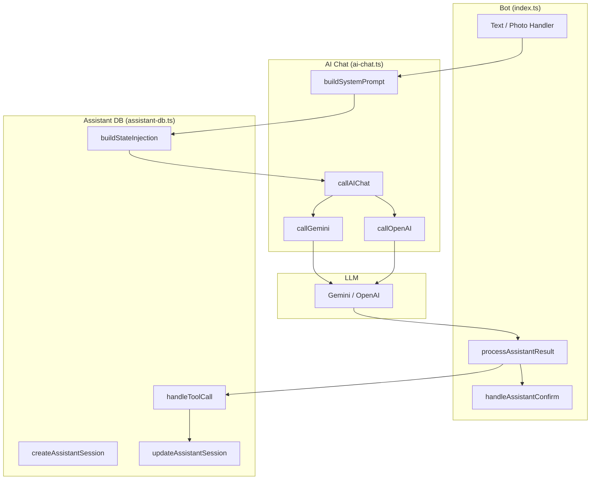

# AI-ассистент — `src/lib/ai-chat.ts` + `src/lib/assistant-db.ts`

Чат-бот на базе LLM с function calling. Ведёт диалог с пользователем,
собирает параметры стикера, управляет trial credits и конвертирует в покупку.

## Архитектура



## Провайдеры AI

| Провайдер | Модель | Настройка |
|-----------|--------|-----------|
| Gemini (default) | gemini-2.0-flash | `AI_CHAT_PROVIDER=gemini` |
| OpenAI | gpt-4o-mini | `AI_CHAT_PROVIDER=openai` |

Переключается через env `AI_CHAT_PROVIDER`. Таймаут: 30 секунд. Retry: 2 попытки.

## Function Calling (Tools)

AI-ассистент использует 6 инструментов:

### `update_sticker_params`
Обновляет параметры стикера. Принимает любую комбинацию:
- `style` — стиль (текст, verbatim от пользователя)
- `emotion` — эмоция
- `pose` — поза/жест

### `confirm_and_generate`
Подтверждает все параметры и запускает генерацию.
**Правила**: вызывается ТОЛЬКО когда все 3 параметра заполнены И пользователь
явно подтвердил (сказал "да", "ок", "подтверждаю").

### `request_photo`
Запрашивает фото у пользователя. Переводит сессию в `assistant_wait_photo`.

### `show_style_examples`
Показывает примеры стикеров по стилям. Опционально принимает `style_id`.

### `grant_trial_credit`
Решение о выдаче бесплатного кредита. Параметры:
- `decision` — "grant" / "deny"
- `confidence` — 1-10
- `reason` — причина (для логов)

### `check_balance`
Получает текущий баланс и доступные пакеты с ценами.

## Системный промпт

Ассистент использует `generatePrompt()` (prompt_generator agent) для **всех** стилей.
`buildAssistantPrompt()` — fallback, если агент недоступен.

### Структура

```
[Persona] → Дружелюбный ассистент по стикерам
[Tools] → Описание 6 инструментов
[User Context] → Имя, язык, кредиты, premium, история
[Language Rules] → Отвечать на языке пользователя
[Dialog Flow] → 8 шагов сбора параметров
[CRITICAL RULES] → Запреты на confirm_and_generate
[Trial Credit Rules] → Когда давать бесплатный кредит
[Sales Techniques] → Investment escalation, loss aversion
[Balance & Pricing] → Работа с балансом
[SYSTEM STATE] → Текущие параметры из БД
```

`buildAssistantPrompt()` включает поддержку multi-person (несколько людей на фото)
и правила generous padding для генерации.

### Ключевые правила

1. **Сбор параметров**: стиль → эмоция → поза (по порядку, или все сразу)
2. **Mirror message**: после сбора всех 3 показать сводку и ждать подтверждения
3. **Запрет confirm_and_generate**:
   - Если любой параметр null
   - В тот же ход, когда собран последний параметр
   - Когда credits=0 и has_purchased=false (нужен grant_trial_credit)
4. **Trial credit**: AI решает давать ли бесплатный кредит на основе engagement, intent, traffic source

### State Injection

В каждый запрос к AI вставляется блок `[SYSTEM STATE]`:

```
[SYSTEM STATE]
- style: "аниме"
- emotion: null ← MISSING
- pose: null ← MISSING
- confirmed: false
- has_photo: true
- credits: 0
- has_purchased: false
- paywall_shown: false
```

Это позволяет LLM точно знать, какие параметры уже собраны.

Дополнительно:
- `has_photo` вычисляется динамически из `sessions.current_photo_file_id` (а не только из первого system prompt в истории).
- Если LLM вызывает `request_photo`, но фото уже есть в текущей session, API-guard не переводит flow в `assistant_wait_photo` и продолжает сбор параметров.

## Таблица `assistant_sessions`

| Поле | Тип | Описание |
|------|-----|----------|
| `id` | uuid | PK |
| `session_id` | uuid | FK → sessions |
| `user_id` | uuid | FK → users |
| `goal` | text | Цель пользователя |
| `style` | text | Выбранный стиль |
| `emotion` | text | Выбранная эмоция |
| `pose` | text | Выбранная поза |
| `sticker_text` | text | Текст на стикере |
| `border` | boolean | Белая рамка |
| `confirmed` | boolean | Параметры подтверждены |
| `messages` | jsonb | История диалога |
| `error_count` | int | Счётчик ошибок AI |
| `paywall_shown` | boolean | Показывался ли paywall |
| `sales_attempts` | int | Количество попыток продажи |
| `status` | text | active / completed / abandoned / error |

## Обработка ошибок AI

```mermaid
flowchart TD
    AI[Вызов AI] --> ERR{Ошибка?}
    ERR -->|Нет| OK[Ответ пользователю]
    ERR -->|1-я ошибка| RETRY[Soft fallback:<br/>"Попробуй ещё раз"]
    ERR -->|2-я ошибка| RETRY
    ERR -->|3-я ошибка| ESCAPE[Escape в ручной режим:<br/>"Помощник недоступен,<br/>нажми 🎨 Стили"]
```

- `error_count` хранится в `assistant_sessions`
- После 3 ошибок — автоматический escape в ручной режим
- Alert в канал при каждой ошибке

## Sticker Ideas After Photo

Когда пользователь отправляет фото (или уже есть фото в сессии), бот показывает
LLM-сгенерированные идеи стикеров через `generateStickerIdeasFromPhoto()` (GPT-4o-mini).

Пользователь может: сгенерировать, сменить стиль, посмотреть следующую идею или перейти в чат.

- **Состояние**: `assistant_wait_idea`
- **Хранение**: `sessions.sticker_ideas_state` (JSONB)

## Race Condition Guard

При параллельных действиях (пользователь нажимает "Стили" пока ассистент думает):
1. После получения ответа от AI — перечитываем сессию из БД
2. Если `session.state !== "assistant_chat"` — не отправляем ответ
3. Предотвращает путающие сообщения от ассистента в ручном режиме

## Legacy: `src/lib/gemini-chat.ts`

Старая реализация чата через HTML-комментарии в ответе:
```
Привет! Какой стиль хочешь?
<!-- PARAMS: style=null, emotion=null, pose=null -->
```

Заменена на `ai-chat.ts` с нативным function calling.
Файл остаётся в кодовой базе, но основная логика использует `ai-chat.ts`.
