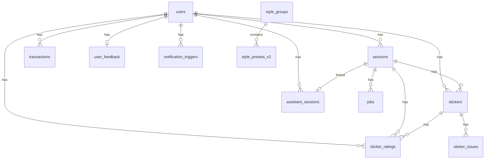

# База данных — Supabase (PostgreSQL)

## ER-диаграмма (основные таблицы)



## Таблицы

### `users` — Пользователи

| Колонка | Тип | Default | Описание |
|---------|-----|---------|----------|
| `id` | uuid | gen_random_uuid() | PK |
| `telegram_id` | bigint | — | Telegram ID |
| `username` | text | — | Telegram username |
| `credits` | int | — | Баланс кредитов |
| `has_purchased` | boolean | false | Покупал ли кредиты |
| `total_generations` | integer | 0 | Всего генераций |
| `onboarding_step` | int | 0 | Шаг онбординга (0→1→2→99) |
| `sticker_set_name` | text | — | Имя стикерпака |
| `language_code` | text | — | Язык Telegram-клиента |
| `last_photo_file_id` | text | — | Последнее загруженное фото |
| `start_payload` | text | — | Payload из /start |
| `utm_source` | text | — | UTM source |
| `utm_medium` | text | — | UTM medium |
| `utm_campaign` | text | — | UTM campaign |
| `utm_content` | text | — | UTM content |
| `env` | text | 'prod' | Окружение |
| `created_at` | timestamptz | now() | — |
| `updated_at` | timestamptz | now() | — |

### `sessions` — Сессии

| Колонка | Тип | Default | Описание |
|---------|-----|---------|----------|
| `id` | uuid | gen_random_uuid() | PK |
| `user_id` | uuid | — | FK → users |
| `state` | session_state | — | Текущее состояние |
| `is_active` | boolean | — | Активна ли сессия |
| `current_photo_file_id` | text | — | Текущее фото |
| `last_sticker_file_id` | text | — | Последний стикер |
| `last_sticker_storage_path` | text | — | Путь в Storage |
| `selected_style_id` | text | — | Выбранный стиль |
| `selected_emotion` | text | — | Выбранная эмоция |
| `emotion_prompt` | text | — | Промпт эмоции |
| `selected_motion` | text | — | Выбранное движение |
| `motion_prompt` | text | — | Промпт движения |
| `generation_type` | text | — | Тип генерации |
| `credits_spent` | int | 1 | Потрачено кредитов |
| `pending_generation_type` | text | — | Отложенный тип (paywall) |
| `text_prompt` | text | — | Текстовый промпт |
| `prompt_final` | text | — | Финальный промпт |
| `user_input` | text | — | Ввод пользователя |
| `progress_message_id` | bigint | — | ID progress-сообщения |
| `progress_chat_id` | bigint | — | Chat ID для progress |
| `ui_message_id` | bigint | — | Message ID текущего UI-экрана flow (для fallback edit) |
| `ui_chat_id` | bigint | — | Chat ID текущего UI-экрана flow |
| `pack_ideas` | jsonb | — | Идеи для пака |
| `current_idea_index` | int | 0 | Текущая идея |
| `custom_idea` | jsonb | — | Кастомная идея |
| `waiting_custom_idea` | boolean | false | Ждём описание идеи |
| `photos` | jsonb | — | Фото сессии |
| `sticker_ideas_state` | jsonb | — | Состояние идей стикеров (Sticker Ideas After Photo) |
| `selected_style_group` | text | — | Выбранная группа стилей |
| `pack_template_id` | text | — | FK → pack_templates (flow «Сделать пак») |
| `pack_content_set_id` | text | — | FK → pack_content_sets (выбранный набор подписей/сцен) |
| `pack_carousel_index` | int | — | Индекс текущей карточки в карусели наборов |
| `pack_sheet_file_id` | text | — | file_id сгенерированного листа превью |
| `flow_kind` | text | — | Вид потока (`single`/`assistant`/`pack`) |
| `session_rev` | int | 1 | Ревизия сессии для stale-callback защиты |
| `env` | text | 'prod' | Окружение |

### `pack_content_sets` — Наборы подписей и сцен для пака

Привязаны к шаблону пака. Пользователь выбирает набор в карусели (состояние `wait_pack_carousel`); при генерации превью и сборке используются `scene_descriptions` и `labels`/`labels_en` из набора.

| Колонка | Тип | Описание |
|---------|-----|----------|
| `id` | text | PK (например couple_v1_romance) |
| `pack_template_id` | text | FK → pack_templates |
| `name_ru` / `name_en` | text | Название набора для пользователя |
| `carousel_description_ru` / `carousel_description_en` | text | Описание в карточке карусели |
| `labels` / `labels_en` | jsonb | Массивы подписей (порядок = порядок стикеров в сетке) |
| `scene_descriptions` | jsonb | Массив описаний сцен для Gemini (EN) |
| `sort_order` | int | Порядок в карусели |
| `is_active` | boolean | Активен ли набор |
| `mood` | text | Опционально: для автоподбора (romance, everyday, humor, …) |

### `jobs` — Очередь заданий

| Колонка | Тип | Default | Описание |
|---------|-----|---------|----------|
| `id` | uuid | gen_random_uuid() | PK |
| `session_id` | uuid | — | FK → sessions |
| `user_id` | uuid | — | FK → users |
| `status` | text | 'queued' | queued / processing / done / error |
| `attempts` | int | 0 | Количество попыток |
| `error` | text | — | Текст ошибки |
| `worker_id` | text | — | ID воркера |
| `is_first_free` | boolean | false | Бесплатная генерация |
| `env` | text | 'prod' | Окружение |

### `stickers` — Сгенерированные стикеры

| Колонка | Тип | Default | Описание |
|---------|-----|---------|----------|
| `id` | uuid | gen_random_uuid() | PK |
| `user_id` | uuid | — | FK → users |
| `session_id` | uuid | — | FK → sessions |
| `source_photo_file_id` | text | — | Исходное фото |
| `user_input` | text | — | Ввод пользователя |
| `generated_prompt` | text | — | Сгенерированный промпт |
| `result_storage_path` | text | — | Путь в Supabase Storage |
| `telegram_file_id` | text | — | Telegram file_id стикера |
| `sticker_set_name` | text | — | Стикерпак |
| `is_example` | boolean | false | Пример для стиля |
| `style_preset_id` | text | — | ID пресета стиля |
| `idea_source` | text | — | Источник идеи |
| `env` | text | 'prod' | Окружение |

### `transactions` — Платежи

| Колонка | Тип | Default | Описание |
|---------|-----|---------|----------|
| `id` | uuid | gen_random_uuid() | PK |
| `user_id` | uuid | — | FK → users |
| `amount` | int | — | Количество кредитов |
| `price` | int | 0 | Цена в Stars |
| `state` | text | 'created' | created / done / cancelled |
| `telegram_payment_charge_id` | text | — | ID платежа Telegram |
| `provider_payment_charge_id` | text | — | ID платежа провайдера |
| `reminder_sent` | boolean | false | Напоминание отправлено |
| `alert_sent` | boolean | false | Алерт отправлен |
| `env` | text | 'prod' | Окружение |

### `assistant_sessions` — Сессии ассистента

→ Подробнее: [03-ai-assistant.md](./03-ai-assistant.md)

### `style_groups` — Группы стилей

| Колонка | Тип | Описание |
|---------|-----|----------|
| `id` | text | PK (anime, meme, cute, love, cartoon...) |
| `emoji` | text | Эмодзи |
| `name_ru` / `name_en` | text | Название |
| `sort_order` | int | Порядок |
| `is_active` | boolean | Активна |

### `style_presets_v2` — Пресеты стилей

| Колонка | Тип | Описание |
|---------|-----|----------|
| `id` | text | PK (anime_classic, anime_dark...) |
| `group_id` | text | FK → style_groups |
| `prompt_hint` | text | Промпт для генерации |
| `name_ru` / `name_en` | text | Название |
| `sort_order` | int | Порядок |
| `is_active` | boolean | Активен |

### `emotion_presets` — Пресеты эмоций

Presets: happy, excited, sad, angry, surprised, love, sly, embarrassed, sleeping, cringe, custom (10 активных + custom). "warm" удалён.

### `motion_presets` — Пресеты движений

Presets: waving, thumbs_up, facepalm, praying, flexing, shrugging, peace, heart_hands, covering_eyes, celebrating, coffee, phone, custom (12 активных + custom). "running" и "dancing" отключены.

### `app_config` — Runtime-конфигурация

| Колонка | Тип | Описание |
|---------|-----|----------|
| `key` | text | PK |
| `value` | text | Значение |
| `description` | text | Описание |
| `updated_at` | timestamptz | Время обновления |

Используется для имён моделей Gemini и другой конфигурации без передеплоя.

Ключи для Session Router rollout:
- `session_router_enabled` — включение роутера резолва сессий
- `strict_session_rev_enabled` — строгая проверка `callback rev` vs `sessions.session_rev`

### Вспомогательные таблицы

| Таблица | Описание |
|---------|----------|
| `sticker_ratings` | Оценки стикеров (1-5) |
| `sticker_issues` | Баг-репорты от пользователей |
| `user_feedback` | Обратная связь |
| `notification_triggers` | Триггеры отложенных уведомлений |
| `prompt_templates` | Шаблоны промптов (emotion, motion, text) |
| `bot_texts_new` | i18n тексты (lang + key → text) |
| `agents` | Конфиг AI-агентов (prompt_generator) |
| `sticker_sets` | Стикерпаки пользователей |

## Enum `session_state`

```sql
-- Базовые (из initial migration)
wait_photo, wait_style, processing, canceled

-- Из миграций
confirm_sticker, wait_emotion, wait_custom_emotion, processing_emotion,
wait_custom_style, wait_text, processing_text, wait_text_overlay,
assistant_wait_photo, assistant_wait_idea, assistant_chat, wait_assistant_confirm,
wait_first_purchase, wait_buy_credit
```

## RPC-функции

### `claim_job(p_worker_id, p_env)`
Атомарно захватывает задание из очереди.
```sql
FOR UPDATE SKIP LOCKED — предотвращает двойную обработку
```

### `deduct_credits(p_user_id, p_amount)`
Атомарно списывает кредиты. Возвращает `false` если недостаточно.

### `claim_first_free_generation(p_user_id)`
Атомарно помечает первую бесплатную генерацию.

### `increment_generations(p_user_id)`
Увеличивает счётчик `total_generations`.

### `claim_onboarding_step_1(p_user_id)` / `claim_onboarding_step_2(p_user_id)`
Атомарно продвигают онбординг (первый стикер → эмоция).

### `skip_onboarding(p_user_id)`
Пропустить онбординг (`onboarding_step = 99`).

## Изоляция окружений

Все основные таблицы имеют колонку `env` (default `'prod'`).
Тестовый бот работает с `env = 'test'`, продакшн — с `env = 'prod'`.
Данные полностью изолированы в одной БД.
