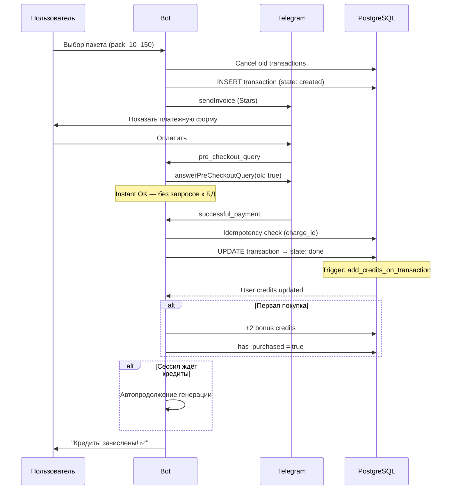

# Оплата — Telegram Stars

## Пакеты кредитов

| ID | Название | Кредиты | Цена (Stars) | За стикер | Условия |
|----|----------|---------|--------------|-----------|---------|
| test | 🔧 Test | 1 | 1⭐ | 1⭐ | Только admin |
| try | Try | 2 | 20⭐ | 10⭐ | Только первая покупка |
| start | Start | 10 | 150⭐ | 15⭐ | — |
| pop | Pop | 30 | 300⭐ | 10⭐ | — |
| pro | Pro | 100 | 700⭐ | 7⭐ | — |
| max | Max | 250 | 1500⭐ | 6⭐ | — |

Также есть скрытые пакеты со скидкой (-10%, -15%, -25%) для промо и admin-дисконтов.

## Флоу оплаты



## Paywall

### Когда показывается

```mermaid
flowchart TD
    START[startGeneration] --> CHECK{credits >= needed?}
    CHECK -->|Да| DEDUCT[Списать кредиты<br/>→ генерация]
    CHECK -->|Нет| PURCHASED{has_purchased?}
    PURCHASED -->|Нет| FIRST[wait_first_purchase<br/>Специальное сообщение:<br/>"Первый стикер бесплатный<br/>не получился? Купи пакет!"]
    PURCHASED -->|Да| BUY[wait_buy_credit<br/>"Кредиты закончились,<br/>выбери пакет"]
    FIRST --> PACKS[Показать пакеты]
    BUY --> PACKS
```

### Автопродолжение после оплаты

Если сессия была в `wait_first_purchase` или `wait_buy_credit`:
1. Проверяем `session.prompt_final` — есть ли готовый промпт
2. Если да — автоматически запускаем генерацию
3. Если нет — показываем сообщение "Кредиты зачислены, выбери стиль"

Это работает и для ручного режима, и для ассистента.

## Идемпотентность

Защита от двойного зачисления:
1. `telegram_payment_charge_id` проверяется перед обработкой
2. UPDATE с условием `state = 'created'` — только первый запрос сработает
3. Если charge_id уже есть — пропускаем

## Trial Credits (AI-ассистент)

AI-ассистент может давать бесплатный кредит через `grant_trial_credit`:

- **Лимит**: 20 trial credits в день (глобально)
- **Условия**: `credits = 0`, `has_purchased = false`
- **Факторы решения**: engagement, intent quality, traffic source
- **Traffic source бонус**: yandex, google и другие платные каналы получают более лёгкое одобрение

## Abandoned Cart

Транзакции в `state: created` более N минут — abandoned cart:
- Отправляется reminder пользователю
- Alert в канал для мониторинга
- Индексы: `idx_transactions_abandoned_cart`, `idx_transactions_abandoned_cart_alert`
