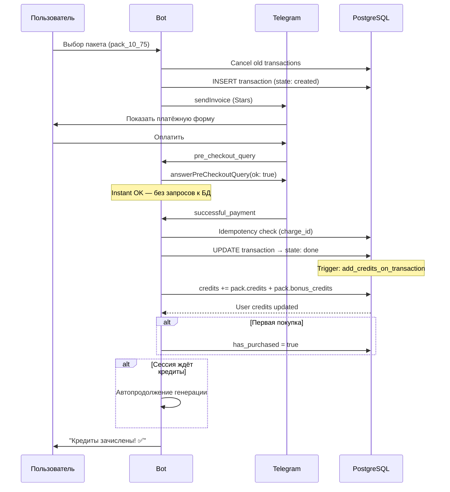

# Оплата — Telegram Stars

## Экономика

### Курсы и себестоимость

| Параметр | Значение |
|---|---|
| 100 Telegram Stars | $1.30 |
| 1 Star | $0.013 ≈ 1.04 ₽ |
| Курс ₽/$ | 80 ₽ за $1 |
| 1 пак стикеров | 10 кредитов (10 генераций) |
| Себестоимость 1 пака | **15 ₽** |
| Себестоимость 1 генерации | ~1.5 ₽ |

### Формула маржи

```
Маржа % = (Выручка ₽ − Себестоимость ₽) / Себестоимость ₽ × 100

Выручка ₽ = Stars × 1.04
Себестоимость ₽ = (Кредиты / 10) × 15₽
```

Для trial-пакета себестоимость считается от **итого кредитов** (оплаченных + бонусных),
потому что генерации расходуют ресурсы независимо от того, оплачены они или нет.

---

## Пакеты кредитов

### Основные пакеты

| ID | Название | Кредиты | Бонус | Итого | Цена Stars | ~₽ | Stars/ген | Маржа % | Условие |
|---|---|---|---|---|---|---|---|---|---|
| test | 🔧 Тест | 1 | — | 1 | 1⭐ | 1₽ | 1.0 | — | adminOnly |
| try | 🎁 Попробуй | 5 | +4 | **9** | 49⭐ | 51₽ | 5.4 | 278% | trialOnly (1я покупка) |
| start | ⭐ Старт | 10 | — | 10 | 75⭐ | 78₽ | 7.5 | 420% | — |
| pop | 💎 Поп | 30 | — | 30 | 175⭐ | 182₽ | 5.8 | 304% | — |
| pro | 👑 Про | 100 | — | 100 | 500⭐ | 520₽ | 5.0 | 247% | — |
| max | 🚀 Макс | 250 | — | 250 | 1125⭐ | 1170₽ | 4.5 | 212% | — |

### Скидочные пакеты (hidden)

Не показываются в UI. Используются для промо, abandoned cart, admin-дисконтов.

| Скидка | Попробуй | Старт | Поп | Про | Макс |
|---|---|---|---|---|---|
| Базовая | 49⭐ | 75⭐ | 175⭐ | 500⭐ | 1125⭐ |
| -10% | 44⭐ | 68⭐ | 158⭐ | 450⭐ | 1013⭐ |
| -15% | 42⭐ | 64⭐ | 149⭐ | 425⭐ | 956⭐ |
| -25% | 37⭐ | 56⭐ | 131⭐ | 375⭐ | 844⭐ |

### Trial-пакет: bonus_credits

Пакет `🎁 Попробуй` использует `bonus_credits`:
- Пользователь платит за 5 кредитов, получает 9 (5 + 4 бонус).
- В `successful_payment` начисляется `credits + bonus_credits`.
- Скрывается после `has_purchased = true`.

---

## Флоу оплаты



## Paywall

### Когда показывается

```mermaid
flowchart TD
    START[startGeneration] --> CHECK{credits >= needed?}
    CHECK -->|Да| DEDUCT[Списать кредиты<br/>→ генерация]
    CHECK -->|Нет| PURCHASED{has_purchased?}
    PURCHASED -->|Нет| FIRST[wait_first_purchase<br/>Специальное сообщение:<br/>"Первый стикер бесплатный<br/>не получился? Купи пакет!"]
    PURCHASED -->|Да| BUY[wait_buy_credit<br/>"Кредиты закончились,<br/>выбери пакет"]
    FIRST --> PACKS[Показать пакеты]
    BUY --> PACKS
```

### Автопродолжение после оплаты

Если сессия была в `wait_first_purchase` или `wait_buy_credit`:
1. Проверяем `session.prompt_final` — есть ли готовый промпт
2. Если да — автоматически запускаем генерацию
3. Если нет — показываем сообщение "Кредиты зачислены, выбери стиль"

Это работает и для ручного режима, и для ассистента.

## Идемпотентность

Защита от двойного зачисления:
1. `telegram_payment_charge_id` проверяется перед обработкой
2. UPDATE с условием `state = 'created'` — только первый запрос сработает
3. Если charge_id уже есть — пропускаем

## Trial Credits (AI-ассистент)

AI-ассистент может давать бесплатный кредит через `grant_trial_credit`:

- **Лимит**: 20 trial credits в день (глобально)
- **Условия**: `credits = 0`, `has_purchased = false`
- **Факторы решения**: engagement, intent quality, traffic source
- **Traffic source бонус**: yandex, google и другие платные каналы получают более лёгкое одобрение

## Abandoned Cart

Транзакции в `state: created` более N минут — abandoned cart:
- Отправляется reminder пользователю
- Alert в канал для мониторинга
- Индексы: `idx_transactions_abandoned_cart`, `idx_transactions_abandoned_cart_alert`
