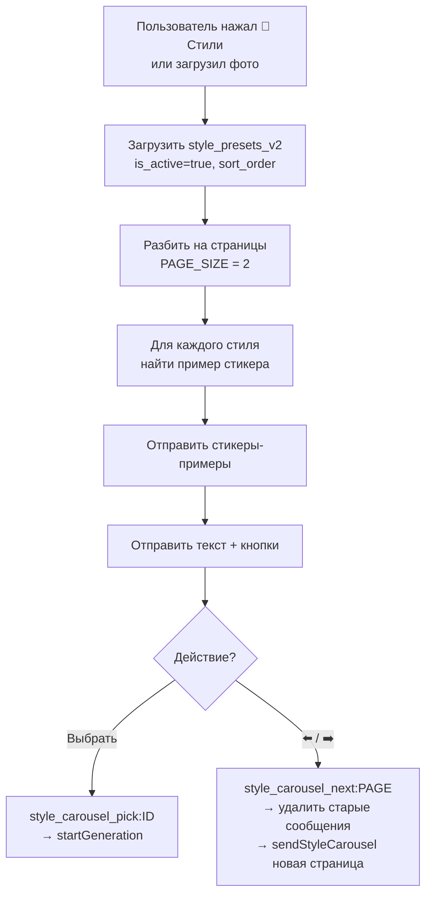

# Карусель стилей — `sendStyleCarousel()`

## Обзор

Интерактивное меню выбора стилей с визуальными примерами.
Показывает по 2 стиля на страницу с навигацией влево/вправо.

## Внешний вид

```
[Стикер-пример стиля 1]
[Стикер-пример стиля 2]

📌 Выбери стиль:
1. 🎌 Аниме классика
2. 🌑 Тёмное аниме

[Выбрать 1] [Выбрать 2]
[⬅️] [1/5] [➡️]
```

## Логика работы



## Поиск примеров стикеров

Функция `getStyleStickerFileId(styleId)`:

1. Ищет стикер с `is_example = true` и `env` = текущее окружение
2. Если нет — берёт последний стикер для этого стиля в текущем `env`
3. Возвращает `telegram_file_id` (бот-специфичный)

**Важно**: `telegram_file_id` привязан к конкретному боту.
Стикер, загруженный через test-бота, не работает в prod-боте.
Поэтому фильтр по `env` обязателен.

## Навигация

| Кнопка | Callback | Описание |
|--------|----------|----------|
| Выбрать 1 | `style_carousel_pick:STYLE_ID` | Выбрать первый стиль |
| Выбрать 2 | `style_carousel_pick:STYLE_ID` | Выбрать второй стиль |
| ⬅️ | `style_carousel_next:PREV_PAGE:MSG_IDS` | Предыдущая страница |
| 1/5 | `noop` | Счётчик страниц (неактивная) |
| ➡️ | `style_carousel_next:NEXT_PAGE:MSG_IDS` | Следующая страница |

Навигация **циклическая**: после последней страницы → первая, и наоборот.

## Переключение страниц

При нажатии ⬅️ / ➡️:
1. Удаляются предыдущие сообщения (стикеры + текст) по `MSG_IDS`
2. Вызывается `sendStyleCarousel(ctx, lang, nextPage)`
3. Новые сообщения отправляются с новыми `MSG_IDS`

`MSG_IDS` передаются через callback_data в формате `style_carousel_next:PAGE:ID1,ID2,ID3`.

## Выбор стиля

При нажатии "Выбрать":
1. Получаем `session` и проверяем `state === wait_style`
2. Проверяем наличие фото (`getUserPhotoFileId`)
3. Если фото из `user.last_photo_file_id` — копируем в сессию
4. Получаем `prompt_hint` пресета
5. Генерируем промпт через `generatePrompt()`
6. Запускаем `startGeneration()`
