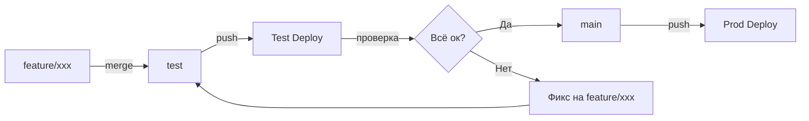

# Деплой и инфраструктура

## Docker-контейнеры

Сервис состоит из 3 контейнеров:

| Контейнер | Dockerfile | Entrypoint | Порт |
|-----------|------------|------------|------|
| API / Bot | `Dockerfile.api` | `node dist/index.js` | 3001 |
| Worker | `Dockerfile.worker` | `node dist/worker.js` | — |
| rembg | (внешний образ) | — | 5000 |

### Dockerfile.api / Dockerfile.worker

```dockerfile
FROM node:20-alpine
WORKDIR /app
COPY package*.json ./
RUN npm ci
COPY tsconfig.json ./
COPY src ./src
RUN npm run build
# Копирование шрифта для addTextToSticker
RUN mkdir -p dist/assets && cp src/assets/Inter-Bold.otf dist/assets/Inter-Bold.otf
```

Оба Dockerfile идентичны, отличается только CMD:
- API: `node dist/index.js`
- Worker: `node dist/worker.js`

## Git Workflow

### Ветки

| Ветка | Назначение | Деплой |
|-------|------------|--------|
| `main` | Продакшн | Автодеплой при push |
| `test` | Тестирование | Автодеплой при push |
| `feature/*` | Фичи | Мержится в test/main |

### Процесс деплоя



### Команды деплоя

```bash
# Деплой на test
git checkout test
git merge feature/xxx --no-edit
git push origin test

# Деплой на prod
git checkout main
git merge feature/xxx --no-edit
git push origin main

# Вернуться на фичу
git checkout feature/xxx
```

## Переменные окружения

### Обязательные

| Переменная | Описание |
|------------|----------|
| `TELEGRAM_BOT_TOKEN` | Токен Telegram-бота |
| `SUPABASE_SUPABASE_PUBLIC_URL` | URL Supabase |
| `SUPABASE_SERVICE_ROLE_KEY` | Service role key |
| `GEMINI_API_KEY` | API ключ Gemini |
| `REMBG_URL` | URL rembg-сервиса (worker, напр. `http://p2s-rembg:5000`) |
| `PIXIAN_USERNAME` | Pixian API логин |
| `PIXIAN_PASSWORD` | Pixian API пароль |

### Опциональные

| Переменная | Default | Описание |
|------------|---------|----------|
| `APP_ENV` | `prod` | Окружение: `prod` / `test` |
| `AI_CHAT_PROVIDER` | `gemini` | Провайдер AI чата: `gemini` / `openai` |
| `AI_CHAT_MODEL` | (auto) | Модель AI чата |
| `OPENAI_API_KEY` | — | API ключ OpenAI (если provider=openai) |
| `PORT` | `3001` | Порт API |
| `JOB_POLL_INTERVAL_MS` | `2000` | Интервал поллинга заданий |
| `ALERT_CHANNEL_ID` | — | Telegram ID канала алертов |
| `SUPPORT_BOT_TOKEN` | — | Токен бота поддержки |
| `SUPPORT_CHANNEL_ID` | — | ID канала поддержки |
| `ADMIN_IDS` | — | Telegram ID админов (через запятую) |
| `SUPABASE_STORAGE_BUCKET` | `stickers` | Бакет в Supabase Storage |

Модели Gemini настраиваются через таблицу `app_config` в Supabase, не через env vars.

## Скрипты

```bash
# Локальная разработка
npm run dev:api          # Запуск API (tsx, hot reload)
npm run dev:worker       # Запуск Worker

# Тестовое окружение (отдельный .env)
npm run dev:test:api
npm run dev:test:worker

# Сборка
npm run build            # tsc → dist/

# Продакшн
npm run start:api        # node dist/index.js
npm run start:worker     # node dist/worker.js

# Рассылка
npm run broadcast:valentine        # Valentine рассылка
npm run broadcast:valentine:test   # Тест рассылки
```

## Миграции БД

SQL-миграции в папке `sql/` (001-063).
Применяются вручную через Supabase SQL Editor.

```bash
sql/
├── 001_jobs.sql
├── 002_sticker_sets.sql
├── ...
└── 063_users_last_photo_file_id.sql
```

Нумерация последовательная. Каждая миграция идемпотентна
(`IF NOT EXISTS`, `ON CONFLICT DO UPDATE`).
