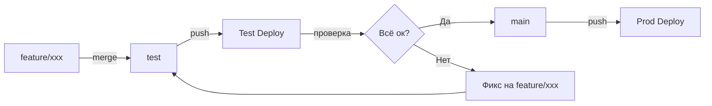

# Деплой и инфраструктура

## Docker-контейнеры

Сервис состоит из 3 контейнеров:

| Контейнер | Dockerfile | Entrypoint | Порт |
|-----------|------------|------------|------|
| API / Bot | `Dockerfile.api` | `node dist/index.js` | 3001 |
| Worker | `Dockerfile.worker` | `node dist/worker.js` | — |
| rembg | (внешний образ) | — | 5000 |

**Режим бота:** если не задан `PUBLIC_BASE_URL`, бот работает в **long polling** (getUpdates). В этом случае с одним токеном может работать **только один** инстанс API; иначе Telegram вернёт 409 Conflict. Либо одна реплика, либо задать `PUBLIC_BASE_URL` для режима webhook. Подробнее: `09-known-issues.md` → «409: Conflict».

### Dockerfile.api / Dockerfile.worker

```dockerfile
FROM node:20-alpine
WORKDIR /app
COPY package*.json ./
RUN npm ci
COPY tsconfig.json ./
COPY src ./src
RUN npm run build
# Копирование шрифта для addTextToSticker
RUN mkdir -p dist/assets && cp src/assets/Inter-Bold.otf dist/assets/Inter-Bold.otf
```

Оба Dockerfile идентичны, отличается только CMD:
- API: `node dist/index.js`
- Worker: `node dist/worker.js`

## Git Workflow

### Ветки

| Ветка | Назначение | Деплой |
|-------|------------|--------|
| `main` | Продакшн | Автодеплой при push |
| `test` | Тестирование | Автодеплой при push |
| `feature/*` | Фичи | Мержится в test/main |

### Процесс деплоя



### Команды деплоя

```bash
# Деплой на test
git checkout test
git merge feature/xxx --no-edit
git push origin test

# Деплой на prod
git checkout main
git merge feature/xxx --no-edit
git push origin main

# Вернуться на фичу
git checkout feature/xxx
```

## Переменные окружения

### Обязательные

| Переменная | Описание |
|------------|----------|
| `TELEGRAM_BOT_TOKEN` | Токен Telegram-бота |
| `SUPABASE_SUPABASE_PUBLIC_URL` | URL Supabase |
| `SUPABASE_SERVICE_ROLE_KEY` | Service role key |
| `GEMINI_API_KEY` | API ключ Gemini |
| `REMBG_URL` | URL rembg-сервиса (worker, напр. `http://p2s-rembg:5000`) |
| `PIXIAN_USERNAME` | Pixian API логин |
| `PIXIAN_PASSWORD` | Pixian API пароль |

### Опциональные

| Переменная | Default | Описание |
|------------|---------|----------|
| `APP_ENV` | `prod` | Окружение: `prod` / `test` |
| `AI_CHAT_PROVIDER` | `gemini` | Провайдер AI чата: `gemini` / `openai` |
| `AI_CHAT_MODEL` | (auto) | Модель AI чата |
| `OPENAI_API_KEY` | — | API ключ OpenAI (если provider=openai) |
| `PORT` | `3001` | Порт API |
| `PUBLIC_BASE_URL` | — | Публичный URL сервера (например `https://bot.example.com`). Если задан — бот в режиме **webhook** (нет конфликта 409 при нескольких репликах). Без него — long polling, допустима только одна реплика на токен. |
| `WEBHOOK_PATH` | `/telegram/webhook` | Путь для webhook (используется при заданном `PUBLIC_BASE_URL`). |
| `JOB_POLL_INTERVAL_MS` | `2000` | Интервал поллинга заданий |
| `ALERT_CHANNEL_ID` | — | Telegram ID канала алертов |
| `PROD_ALERT_CHANNEL_ID` | — | Только для **test**: если задан, алерты с теста уходят в этот канал (обычно продовый). Иначе используется `ALERT_CHANNEL_ID`. |
| `SUPPORT_BOT_TOKEN` | — | Токен бота поддержки |
| `SUPPORT_CHANNEL_ID` | — | ID канала поддержки |
| `ADMIN_IDS` | — | Telegram ID админов (через запятую) |
| `SUPABASE_STORAGE_BUCKET` | `stickers` | Бакет в Supabase Storage (создать в Dashboard: Storage → New bucket; имя = значение переменной). Используется для стикеров и для листов пака (`pack_sheets/`). |
| `SUPABASE_STORAGE_BUCKET_EXAMPLES` | `stickers-examples` | Публичный бакет для примеров. Создать в Storage, включить **Public**. Пути см. ниже («Storage: примеры»). |
| `YANDEX_METRIKA_COUNTER_ID` | — | ID счётчика Яндекс.Метрики для офлайн-конверсий (оплаты). См. `docs/architecture/05-payment.md` → Яндекс Метрика. |
| `YANDEX_METRIKA_TOKEN` | — | OAuth **access token** Метрики (права `metrika:write` или `metrika:offline_data`). Не путать с Client ID / Client secret. |

### Storage: примеры (бакет `stickers-examples`)

| Путь | Назначение | Кто пишет | Кто читает |
|------|------------|-----------|------------|
| `emotion-examples/{emotion_preset_id}.webp` | Пример для карусели эмоций (одно изображение 1024×1024). | Worker/API: алерт «Сохранить пример для эмоции» (`emotion_make_example`). | Бот: карусель эмоций (первый пресет с файлом). |
| `sticker_pack_example/{pack_content_set_id}/example.webp` | Пример набора пака для карусели выбора пака (сетка 1024×1024 из стикеров). | API: админ «Сделать примером» из меню → выбор набора из pack_content_sets → ссылка на стикерпак → скачивание до 9 стикеров → `assembleGridTo1024` → загрузка одного файла. | Бот: карточка карусели паков (`getPackContentSetExamplePublicUrl`, `showPackCarouselCard`). |
| `pack/content/{content_set_id}/1.webp` … `9.webp` | Пилюли для лендинга (Hero). Отдельно от бота. | Ручная загрузка или админ «На лендинг» из алерта (копирование из готовых стикеров пака). | Лендинг: `GET /api/packs/content-sets`. |

**Важно:** в «Сделать примером» из меню сохраняем в `sticker_pack_example/`, а не в `pack/content/`, чтобы не смешивать с контентом лендинга.

Модели Gemini настраиваются через таблицу `app_config` в Supabase, не через env vars. Ключи и корректные названия моделей — см. `04-database.md` → app_config → «Ключи моделей Gemini».

### Dockhost: свой Supabase (supabase-www, Storage)

Если API и Worker крутятся на Dockhost рядом с контейнером **supabase-storage**:

- **URL для приложения** — использовать домен **supabase-www** (Kong), а не облачный `https://xxx.supabase.co`. Kong является основным API Supabase и сам роутит запросы к Storage в контейнер `supabase-storage`.
- В env задать: `SUPABASE_SUPABASE_PUBLIC_URL` = URL supabase-www (внутренний, например `http://supabase-www:8000`, если бот в том же проекте; или внутренний IP/DNS другого проекта, если разрешён трафик между проектами — см. ниже).
- Обращаться напрямую к `http://supabase-storage:5000` в env **не нужно**: клиент Supabase ожидает полный API (REST + Storage), его даёт Kong.
- **Бакеты** создаются в Supabase/MinIO (админка MinIO — порт 9001; для доступа снаружи в Dockhost нужны домен и маршрут на 9001). См. [Dockhost: домен](https://docs.dockhost.ru/manual/network/domain/create), [маршрут](https://docs.dockhost.ru/manual/network/route/create).

### Dockhost: база и бот в разных проектах

Поддержка Dockhost **не рекомендует** складывать всё в один проект. Вместо этого: оставить базу (Supabase) и бот (API, Worker) в разных проектах и **разрешить трафик между проектами** — Настройки → DNS и сеть. Контейнеры из проекта бота смогут обращаться к Supabase по внутреннему IP сервиса или по DNS-имени на этот IP.

**Важно:** поддержка может дать адрес вида `http://{IP сервиса supabase-storage}:5000`. Это адрес **только контейнера Storage** (порт 5000). Наш бот использует один Supabase-клиент для БД и для Storage — ему нужен адрес **API-шлюза (Kong / supabase-www)**, который отдаёт и REST (таблицы), и Storage. В типичном развёртывании Dockhost Kong слушает порт **80** (как на скриншоте supabase-kong: 80/TCP); в других схемах может быть 8000 или 443. Если дали только `supabase-storage:5000`, стоит уточнить у поддержки: «Нужен URL для приложения, которое ходит и в БД (REST), и в Storage. Это адрес supabase-kong и порт (часто 80), а не только storage:5000?»

### Пошаговая настройка связи (бот в одном проекте, Supabase в другом)

1. **В проекте с Supabase** — узнать внутренний IP сервиса **supabase-kong** (Kong). В панели Dockhost: карточка сервиса «supabase-kong» → параметры/сеть — внутренний IP. Порт у Kong в Dockhost обычно **80** (см. блок «Порты» в параметрах сервиса). Не путать с supabase-storage:5000 — это другой сервис.

2. **Разрешить трафик между проектами** — в Dockhost: **Настройки** → **DNS и сеть**. Включить/настроить доступ между проектом бота и проектом с Supabase (по инструкции Dockhost). После этого контейнеры бота смогут достучаться до IP из п.1.

3. **(Опционально) DNS-имя** — в разделе DNS и сеть можно задать имя на внутренний IP (например, чтобы не держать в env «сырой» IP). Тогда в п.5 использовать это имя вместо IP.

4. **Бакеты** — в проекте с Supabase создать бакеты `stickers` и `stickers-examples` (через админку MinIO, порт 9001, или через API Supabase после того как связь заработает). Для `stickers-examples` включить Public, если нужны публичные URL для лендинга.

5. **В проекте с ботом** — в переменных окружения контейнеров API и Worker выставить:
   - `SUPABASE_SUPABASE_PUBLIC_URL` = `http://{IP supabase-kong}:80` (порт 80 — как в параметрах Kong; подставить IP или DNS из п.1/п.3; если Kong отдаёт HTTPS на 443 — использовать `https://...:443`).
   - `SUPABASE_SERVICE_ROLE_KEY` = service role key **этого же** инстанса Supabase (из проекта с БД).
   - При необходимости: `SUPABASE_STORAGE_BUCKET` = `stickers`, `SUPABASE_STORAGE_BUCKET_EXAMPLES` = `stickers-examples`.

6. **Перезапустить** контейнеры API и Worker. Проверить логи: запросы к БД и к Storage должны идти без 500 / «fetch failed».

### Dockhost: перенос между проектами

Перенести контейнеры из одного проекта в другой «как есть» нельзя: в целевом проекте заново создают контейнеры и диски; данные с дисков переносят вручную (FTP/бэкапы). В нашем проекте **все важные данные — в БД**; API и Worker не хранят состояние на дисках. Если всё же переносить только бота — мигрировать нечего, только пересоздать контейнеры и env.

## Скрипты

```bash
# Локальная разработка
npm run dev:api          # Запуск API (tsx, hot reload)
npm run dev:worker       # Запуск Worker

# Тестовое окружение (отдельный .env)
npm run dev:test:api
npm run dev:test:worker

# Сборка
npm run build            # tsc → dist/

# Продакшн
npm run start:api        # node dist/index.js
npm run start:worker     # node dist/worker.js

# Рассылка
npm run broadcast:valentine        # Valentine рассылка
npm run broadcast:valentine:test   # Тест рассылки
```

## Миграции БД

SQL-миграции в папке `sql/` (001-063).
Применяются вручную через Supabase SQL Editor.

```bash
sql/
├── 001_jobs.sql
├── 002_sticker_sets.sql
├── ...
└── 063_users_last_photo_file_id.sql
```

Нумерация последовательная. Каждая миграция идемпотентна
(`IF NOT EXISTS`, `ON CONFLICT DO UPDATE`).
