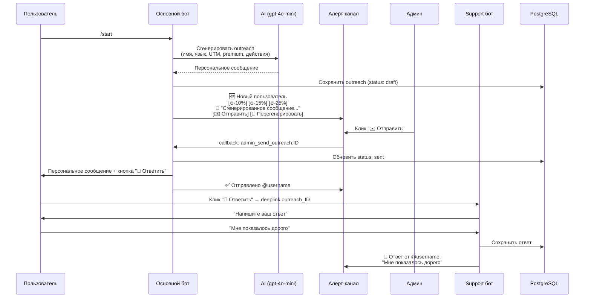

# Outreach — персонализированное сообщение пользователю из алертов

## Проблема

Когда новый пользователь приходит и не покупает кредиты — мы не знаем почему.
Хотим написать ему личное персонализированное сообщение и узнать причину.

## Решение

**Полуавтоматический outreach**:
1. AI генерирует персонализированное сообщение на основе контекста пользователя
2. Сообщение показывается админу в алерт-канале
3. Админ нажимает кнопку "Отправить" — сообщение уходит пользователю
4. Ответ пользователя собирается через support бот и сохраняется в БД

## Поток



## Детали реализации

### 1. Генерация персонального сообщения (AI)

**Когда**: сразу при регистрации нового пользователя (async, не блокирует /start).

**Входные данные для AI**:
- Имя пользователя (`first_name`)
- Язык (`language_code`)
- UTM-источник (yandex, google, organic и т.д.)
- Premium статус
- Username (есть/нет)

**Системный промпт** (хранится в `bot_texts_new`, ключ `outreach.system_prompt`):
```
Ты — Макс, основатель бота @Photo_2_StickerBot.
Напиши короткое (2-3 предложения) персональное сообщение новому пользователю.
Цель — узнать почему он не купил кредиты и что можно улучшить.
Тон: дружелюбный, неформальный, без давления.
Язык: {lang}.
НЕ упоминай AI, нейросети, модели.
НЕ предлагай скидки.
Обращайся по имени если есть.
```

**Модель**: `gpt-4o-mini` (быстро, дёшево).

**Результат**: текст сообщения сохраняется в БД.

### 2. Хранение outreach в БД

**Новая таблица `user_outreach`**:

```sql
CREATE TABLE IF NOT EXISTS user_outreach (
  id uuid PRIMARY KEY DEFAULT gen_random_uuid(),
  user_id uuid NOT NULL REFERENCES users(id),
  telegram_id bigint NOT NULL,
  message_text text NOT NULL,
  status text NOT NULL DEFAULT 'draft',  -- draft / sent / replied / expired
  reply_text text,
  replied_at timestamptz,
  sent_at timestamptz,
  alert_message_id bigint,               -- ID сообщения в алерт-канале (для editMessage)
  env text DEFAULT 'prod',
  created_at timestamptz DEFAULT now()
);

CREATE INDEX idx_outreach_user ON user_outreach(user_id);
CREATE INDEX idx_outreach_status ON user_outreach(status) WHERE status = 'draft';
```

### 3. Алерт нового пользователя с превью сообщения

**Файл**: `src/index.ts` — блок `sendNotification` при создании нового юзера

Формат алерта:
```
🆕 Новый пользователь

👤 @username (123456789)
🌐 Язык: ru
📢 Источник: yandex/cpc

✉️ Outreach:
"Привет, Анар! Заметил что ты попробовал бота —
как тебе результат? Что бы ты хотел улучшить? 🙏"

[🔥 -10%] [🔥 -15%] [🔥 -25%]
[✉️ Отправить] [🔄 Заново]
```

Кнопки:
- `admin_discount:TG_ID:10/15/25` — скидки (уже есть)
- `admin_send_outreach:OUTREACH_ID` — отправить сгенерированное сообщение
- `admin_regen_outreach:OUTREACH_ID` — перегенерировать сообщение

### 4. Обработчик `admin_send_outreach`

**Файл**: `src/index.ts` — новый callback handler

Логика:
1. Проверить что кликнувший — admin
2. Загрузить outreach из БД по ID, проверить `status = 'draft'`
3. Отправить `message_text` пользователю через Telegram API
4. Добавить inline-кнопку "💬 Ответить" → `https://t.me/{SUPPORT_BOT_USERNAME}?start=outreach_{OUTREACH_ID}`
5. Обновить outreach: `status = 'sent'`, `sent_at = now()`
6. Обновить алерт → `✅ Отправлено @username`
7. При ошибке → `❌ Бот заблокирован @username`

### 5. Обработчик `admin_regen_outreach`

**Файл**: `src/index.ts` — новый callback handler

Логика:
1. Проверить admin
2. Вызвать AI заново с теми же данными пользователя
3. Обновить `message_text` в БД
4. Обновить текст алерта с новым превью
5. Кнопки остаются прежними

### 6. Deeplink в support боте

**Файл**: `src/support-bot.ts` — обработка payload `outreach_`

В `bot.start`:
```
if (payload?.startsWith("outreach_")) {
  const outreachId = payload.replace("outreach_", "");
  pendingOutreach.set(ctx.from.id, outreachId);
  // "Спасибо что ответили! Напишите — мы обязательно прочитаем 🙏"
}
```

В `bot.on("text")`:
```
if (pendingOutreach.has(telegramId)) {
  const outreachId = pendingOutreach.get(telegramId);
  // UPDATE user_outreach SET reply_text = ..., status = 'replied', replied_at = now()
  // Отправить в ALERT_CHANNEL_ID: "💬 Ответ от @username: ..."
  // "Спасибо за ответ! 🙏"
}
```

### 7. Пересылка ответа в алерт-канал

Ответ отправляется в `ALERT_CHANNEL_ID` (через основной бот, т.к. он уже в канале).
Support бот вызывает HTTP API с `config.telegramBotToken`.

Формат:
```
💬 Ответ на outreach

👤 @username (123456789)
📨 Было: "Привет, Анар! Заметил что..."
💬 Ответ: "Мне показалось дорого за стикеры"
```

### 8. Тексты в БД

**SQL миграция**:
```sql
INSERT INTO bot_texts_new (lang, key, text) VALUES
  ('ru', 'outreach.system_prompt',
   'Ты — Макс, основатель бота @Photo_2_StickerBot который делает стикеры из фото. Напиши короткое (2-3 предложения) персональное сообщение новому пользователю. Цель — узнать почему он не купил кредиты и что можно улучшить. Тон: дружелюбный, неформальный, без давления. НЕ упоминай AI, нейросети, модели. НЕ предлагай скидки. Обращайся по имени если есть.'),
  ('en', 'outreach.system_prompt',
   'You are Max, founder of @Photo_2_StickerBot that turns photos into stickers. Write a short (2-3 sentences) personal message to a new user. Goal: find out why they didn''t buy credits and what can be improved. Tone: friendly, informal, no pressure. Do NOT mention AI, neural networks, models. Do NOT offer discounts. Use their name if available.'),
  ('ru', 'outreach.reply_prompt',
   'Спасибо что ответили! Напишите — мы обязательно прочитаем 🙏'),
  ('en', 'outreach.reply_prompt',
   'Thanks for replying! Write your thoughts — we will definitely read them 🙏')
ON CONFLICT (lang, key) DO UPDATE SET text = EXCLUDED.text;
```

## Затрагиваемые файлы

| Файл | Изменения |
|------|-----------|
| `src/index.ts` | AI генерация outreach при /start, кнопки в алерте, callback handlers `admin_send_outreach` и `admin_regen_outreach` |
| `src/support-bot.ts` | Deeplink `outreach_ID`, сбор ответа, пересылка в алерт-канал, сохранение в БД |
| SQL миграция | Таблица `user_outreach`, тексты в `bot_texts_new` |

## Зависимости

- `gpt-4o-mini` или `gemini-2.0-flash` для генерации сообщений
- Support бот (`SUPPORT_BOT_TOKEN`, `SUPPORT_BOT_USERNAME`) — уже настроен
- `ALERT_CHANNEL_ID` — уже настроен

## Подводные камни

1. **Бот заблокирован** — try/catch + "❌ Бот заблокирован" в алерте
2. **AI генерация при /start замедлит регистрацию** — делать async (не блокирует /start). Если AI не успел — кнопка "Написать" без превью, генерация по клику
3. **Пользователь не нажал "Ответить"** — нормально, outreach остаётся в `status: sent`
4. **pendingOutreach теряется при рестарте support бота** — для MVP in-memory ок. Можно по `outreach_ID` проверять в БД (`status: sent`)
5. **Перегенерация** — не менять ID, просто UPDATE `message_text`
6. **Дубли** — один outreach на пользователя. При повторном /start не создавать новый

## Checklist

- [ ] SQL миграция: таблица `user_outreach`
- [ ] SQL миграция: тексты `outreach.system_prompt` и `outreach.reply_prompt`
- [ ] AI генерация outreach при регистрации нового пользователя
- [ ] Превью outreach в алерте нового пользователя
- [ ] Callback handler `admin_send_outreach:ID`
- [ ] Callback handler `admin_regen_outreach:ID`
- [ ] Deeplink `outreach_ID` в support боте
- [ ] Сохранение ответа в `user_outreach`
- [ ] Пересылка ответа в алерт-канал
- [ ] Обработка ошибки "бот заблокирован"
- [ ] Тест на test-окружении
